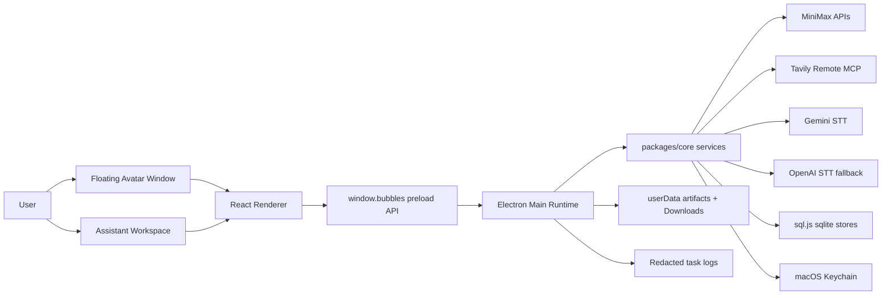

# Bubbles MVP

Bubbles is a macOS desktop assistant with a floating animated avatar, an expandable workspace, voice input/output, live cited research, MiniMax-backed generation, local memory, approval-gated actions, and downloadable artifacts.

It is built as an Electron/Vite desktop app plus a shared TypeScript core package. The MVP is intentionally provider-backed for live runtime paths: MiniMax powers text, JSON, media, and TTS; Tavily Remote MCP powers web research; Gemini and OpenAI power speech-to-text; sqlite-backed stores keep local state; and macOS Keychain stores secrets.

## Table of Contents

- [What Bubbles Can Do](#what-bubbles-can-do)
- [Product Experience](#product-experience)
- [Architecture](#architecture)
- [Repository Layout](#repository-layout)
- [Requirements](#requirements)
- [Quick Start](#quick-start)
- [Provider Setup](#provider-setup)
- [Development Commands](#development-commands)
- [Runtime Workflows](#runtime-workflows)
- [Security and Safety Model](#security-and-safety-model)
- [Testing and Quality Gates](#testing-and-quality-gates)
- [Feature Flags](#feature-flags)
- [Known Limitations](#known-limitations)
- [Documentation Map](#documentation-map)

## What Bubbles Can Do

| Capability | Status | Provider / Storage |
| --- | --- | --- |
| Floating avatar and expandable workspace | Live | Electron, React, Pixi |
| Typed chat and general planning | Live | MiniMax Token Plan |
| Voice input, captions, playback, and barge-in | Live | Gemini STT, OpenAI fallback, MiniMax TTS |
| Deterministic voice introduction | Live | Local router shortcut |
| Cited live web research | Live | Tavily Remote MCP + MiniMax synthesis |
| Image generation | Live | MiniMax image API |
| Music generation | Live | MiniMax music API |
| Video generation | Live | MiniMax video API |
| Approval-gated landing page generation | Live | MiniMax JSON + local sandbox + Vite |
| Custom agent creation | Live | MiniMax JSON + approval-gated file writes |
| Agent switching | Live | Filesystem-backed agent registry |
| Explicit and extracted memories | Live | sql.js sqlite |
| Timeline events | Live | sql.js sqlite |
| Approval lifecycle | Live | sql.js sqlite |
| Artifact open/download | Live | Electron shell + Downloads |
| Redacted logs and trace events | Live | Local task logs |
| Capability and fixture audits | Live | `tools/dev` scripts |

Try the voice phrase:

```text
Bubbles Introduce Yourself
```

Bubbles always responds with the same short summary:

```text
I'm Bubbles. I can plan, remember context, research with Tavily, create images, music, and video, build approved landing pages, create agents, manage approvals, and speak with voice.
```

## Product Experience

Bubbles has two primary surfaces:

- **Floating avatar window**: a compact, always-on-top animated avatar with state-aware captions.
- **Assistant workspace**: an expanded panel with chat, setup, connectors, agents, voice controls, approvals, task events, memory, timeline, and artifacts.

The experience is designed around a small but capable desktop companion:

1. Ask a typed or spoken request.
2. Bubbles classifies it locally.
3. Specialized flows handle research, media, landing pages, agent birth, memory, and approvals.
4. General requests fall back to MiniMax text task execution.
5. App state is broadcast back to the avatar and panel so the UI stays synchronized.

## Architecture



### Core Boundaries

- `packages/core` owns portable application logic: typed contracts, agents, approvals, connectors, coding sandbox helpers, memory, MiniMax/Tavily/Gemini/OpenAI adapters, orchestration, security, tasks, timeline, and voice policy.
- `apps/desktop` owns Electron main/preload IPC, runtime composition, windows, app state hydration, React UI, Pixi avatar rendering, and desktop tests.
- `apps/desktop/src/main/main.ts` is the composition root. It wires providers, key storage, sqlite stores, windows, IPC, task execution, voice, approvals, connectors, and artifacts.
- The renderer consumes `window.bubbles`, never raw main-process APIs.

## Repository Layout

```text
.
|-- AGENTS.md                         # Agent instructions and project guardrails
|-- FRD.md                            # Functional requirements snapshot
|-- IntegratedFlows.md                # Capability flow analysis
|-- Technical.md                      # Technical architecture analysis
|-- docs/
|   `-- setup_guide.md                # Provider setup notes
|-- agents/
|   |-- general-assistant/
|   |-- qa-agent/
|   |-- reaserch-agent/
|   `-- ...                           # User-created agents may appear here
|-- apps/
|   `-- desktop/
|       |-- src/main/                 # Electron main, IPC, provider wiring
|       |-- src/renderer/             # React workspace and avatar UI
|       |-- src/avatar/               # Sprite assets and metadata
|       |-- electron.vite.config.ts
|       `-- electron-builder.yml
|-- packages/
|   `-- core/
|       `-- src/                      # Shared services, types, orchestration
|-- tools/
|   `-- dev/                          # Capability and fixture audits
|-- package.json
|-- pnpm-workspace.yaml
|-- pnpm-lock.yaml
`-- tsconfig.base.json
```

## Requirements

- macOS target runtime.
- Node.js compatible with the project toolchain.
- Corepack enabled so `pnpm@9.15.4` can be used from `packageManager`.
- Network access for live provider features.
- Provider keys for the flows you want to run:
  - MiniMax Token Plan key for chat, text/JSON generation, research synthesis, media, TTS, agent birth, and landing pages.
  - Tavily API key for live research.
  - Gemini API key for primary speech-to-text.
  - OpenAI API key for optional speech-to-text fallback.

Secrets should be entered through the app setup UI. Do not commit keys to repo files.

## Quick Start

Install dependencies:

```bash
corepack enable
corepack pnpm install
```

Start the desktop development app:

```bash
npm run dev
```

Run the main quality gates:

```bash
npm test
npm run typecheck
```

Build the desktop app:

```bash
npm run build
```

## Provider Setup

Open the Bubbles setup screen in the desktop app and configure providers there.

### MiniMax

MiniMax is the primary readiness gate. Bubbles verifies the Token Plan key through direct MiniMax HTTPS APIs, stores it in macOS Keychain, and marks setup ready only after verification succeeds.

Used for:

- General task synthesis.
- Intent-supporting JSON generation.
- Tavily research report synthesis.
- Agent birth drafts.
- Landing page code generation.
- Image, music, video, and TTS generation.

### Tavily

Tavily powers live cited research. Save a Tavily API key, enable the `Tavily Research` connector, and run a health check.

The app uses Tavily Remote MCP at:

```text
https://mcp.tavily.com/mcp/
```

### Voice

Voice input uses Gemini STT first and OpenAI STT as an optional fallback. Voice playback uses MiniMax TTS. Bubbles can also resolve pending approvals from spoken approve, deny, and cancel phrases.

## Development Commands

| Command | Purpose |
| --- | --- |
| `npm run dev` | Start the Electron/Vite desktop development runtime. |
| `npm run build` | Build the desktop app. |
| `npm test` | Run all workspace Vitest suites. |
| `npm run test:core` | Run only `@bubbles/core` tests. |
| `npm run test:desktop` | Run only `@bubbles/desktop` tests. |
| `npm run typecheck` | Run TypeScript checks across workspaces. |
| `npm run typecheck:core` | Typecheck only `packages/core`. |
| `npm run typecheck:desktop` | Typecheck only `apps/desktop`. |
| `npm run audit:capabilities` | Print root scripts, IPC, preload calls, task types, connectors, voice types, and agents. |
| `npm run audit:fixtures` | Find fixture/static/stub signals and declared task events without production emitters. |
| `npm run doctor` | Run capability and fixture audits together. |

## Runtime Workflows

### Message Routing

```text
User text or voice transcript
-> app:send-message
-> explicit remember command check
-> deterministic capability routing
-> specialized flow or generic MiniMax task runner
-> appState update
-> avatar/panel broadcast
```

Specialized routing currently handles:

- `research.web`
- `creative.image`
- `creative.music`
- `creative.video`
- `coding.landing_page`
- `agent.create`
- deterministic introduction prompts

Everything else falls through to the MiniMax-backed general task runner.

### Research

```text
Research prompt
-> Tavily MCP search
-> Tavily MCP extract
-> MiniMax report synthesis
-> cited chat response
-> memory/timeline persistence
```

Research requires both Tavily and MiniMax readiness.

### Media

```text
Image/music/video prompt
-> MiniMax media API
-> local artifact under userData
-> chat artifact card
-> open/download actions
```

Feature flags can disable specific media types.

### Landing Pages

```text
Landing page prompt
-> approval request
-> MiniMax code generation
-> sandbox file validation
-> accessibility check
-> Vite build
-> copy to Downloads
-> local static preview
```

Revisions reuse the active landing page session when available.

### Agent Birth

```text
Agent creation prompt
-> MiniMax draft
-> approval request
-> write agent.json, agent.md, skills.md
-> optional activation prompt
```

Agent birth rejects visual/avatar customization instructions. New agents are behavioral profiles, not new bodies.

### Memory and Timeline

Bubbles supports explicit memory commands:

```text
remember that I prefer concise answers
```

When MiniMax setup is ready, Bubbles can also extract durable memories opportunistically from normal user messages. Task results, research reports, approvals, agent actions, and memories can create timeline events.

## Security and Safety Model

- Secrets are stored in macOS Keychain.
- Provider errors and persisted content are redacted before storage or display where relevant.
- Sensitive actions use approvals before execution.
- Agent creation writes files only after approval.
- Landing page generation runs through an allowlisted sandbox workflow.
- Generated artifacts are opened/downloaded only through approved artifact paths.
- Live product paths should use real providers or show clear unavailable states.
- Fixture media is reserved for tests/CI through explicit `BUBBLES_MINIMAX_MEDIA_FIXTURE`.
- Removed connector paths should stay removed: Web Search, Local Files, Gmail, Calendar, Google Workspace, generic command MCP, local MCP fixture connectors, and MiniMax CLI flows.

## Testing and Quality Gates

Use the narrowest relevant command during development:

```bash
npm run test:core -- <pattern>
npm run test:desktop -- <pattern>
npm run typecheck:core
npm run typecheck:desktop
```

Before claiming a broad change is complete:

```bash
npm test
npm run typecheck
```

For capability or fixture reviews:

```bash
npm run audit:capabilities
npm run audit:fixtures
npm run doctor
```

The test suite covers core service behavior, provider adapters, IPC controllers, renderer components, voice flows, landing-page sandboxing, capability mapping, and fixture auditing.

## Feature Flags

| Flag | Purpose |
| --- | --- |
| `BUBBLES_AGENT_BIRTH_TIMEOUT_MS` | Override agent birth draft timeout. |
| `BUBBLES_CODING_LANDING_PAGE` | Enable/disable landing page generation. |
| `BUBBLES_CREATIVE_IMAGE` | Enable/disable MiniMax image generation. |
| `BUBBLES_CREATIVE_MUSIC` | Enable/disable MiniMax music generation. |
| `BUBBLES_CREATIVE_VIDEO` | Enable/disable MiniMax video generation. |
| `BUBBLES_MINIMAX_MEDIA_FIXTURE` | Use deterministic media artifacts for tests/CI only. |
| `BUBBLES_QA_TASK_DELAY_MS` | Test/development delay control for QA flows. |
| `BUBBLES_VOICE_APPROVALS_ENABLED` | Enable/disable spoken approval resolution. |
| `BUBBLES_VOICE_ENABLED` | Enable/disable voice sessions. |
| `ELECTRON_RENDERER_URL` | Point Electron at a development renderer URL. |

## Known Limitations

- This MVP targets macOS; cross-platform secret storage is not implemented.
- The main process holds a large `appState` snapshot and broadcasts it to renderer windows.
- Some renderer/global types duplicate core contracts.
- Conversation history is still static UI rather than persisted multi-conversation history.
- Generic `coding.project` tasks are MiniMax text tasks, not autonomous repo-editing flows.
- Tavily is the only live connector-backed research integration.
- Some task event contract values are future-facing and may not have production emitters.
- Research follow-up context is in-memory and does not persist across restarts.
- Fixture and static fallback surfaces exist for tests, CI, or controlled development, not live product behavior.

## Documentation Map

| File | Purpose |
| --- | --- |
| `AGENTS.md` | Repository-specific instructions, stack map, skills, and guardrails. |
| `FRD.md` | Functional requirements and acceptance-oriented product analysis. |
| `IntegratedFlows.md` | End-to-end capability flow analysis by runtime path. |
| `Technical.md` | Architecture, module, stack, and risk analysis. |
| `docs/setup_guide.md` | Provider setup guide and removed connector notes. |
| `ProductionTestChecklist.md` | Manual production validation checklist. |
| `codex-production-test-prompt.md` | Production test prompt for agent-assisted verification. |

## Contributing Notes

- Prefer small, typed, testable changes in `packages/core` for business logic.
- Keep Electron IPC changes synchronized across main, preload, renderer global types, and tests.
- Do not build live features on canned outputs or fixture artifacts.
- Keep provider keys, task logs, memory, timeline data, and screenshots secret-safe.
- Add tests beside the changed behavior and choose the lowest responsible boundary.
- Use `rg` for code search and `npm run audit:capabilities` when current wiring is unclear.

