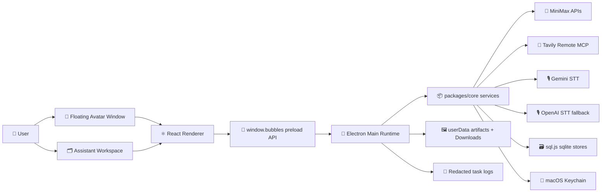
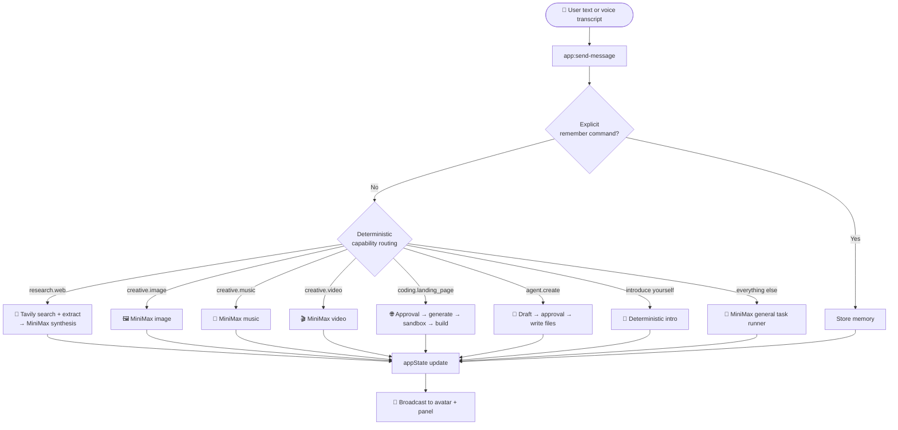
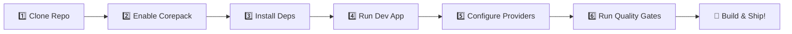

<div align="center">
  <h1>🫧 Bubbles — Your Floating Desktop AI Companion</h1>

  ### 🤖 macOS Electron Assistant with Voice, Live Research & Generative Media

  **A small but capable desktop companion**
  *Animated Avatar • Voice In/Out • Cited Web Research • Image / Music / Video • Approval‑Gated Actions*


<br>

  
  
  
  

  ### 🎬 [Watch the Demo Video](https://www.youtube.com/watch?v=KYcrJRxbLl0) &nbsp;•&nbsp; 🌐 [Visit the Landing Page](https://v0-bubbles-landing-page-sand.vercel.app/)
</div>

---

## 🎯 Project Overview

**Bubbles** is a macOS desktop assistant that lives on your screen as a **floating animated avatar** and expands into a full **assistant workspace** on demand. It listens, plans, remembers, researches the live web with citations, generates media, builds approved landing pages, spawns custom agents, and speaks back — all from one compact companion.

The project is built as a **pnpm monorepo**: a portable, strongly‑typed **core package** of services plus an **Electron/Vite desktop app** that composes them into a real product. Live runtime paths are intentionally **provider‑backed** (no canned demos): MiniMax powers text/JSON/media/TTS, Tavily Remote MCP powers web research, and Gemini/OpenAI power speech‑to‑text.

> 💡 Try the voice phrase **“Bubbles Introduce Yourself”** to hear the deterministic introduction.

<div align="center">

| 🧠 Thinks | 🎙️ Speaks | 🔎 Researches | 🎨 Creates | 🔐 Asks First |
|:---:|:---:|:---:|:---:|:---:|
| Local intent routing | Voice in & out | Cited Tavily reports | Image / Music / Video | Approval‑gated actions |

</div>

---

## ✨ Key Features & Capabilities

### 🫧 **Floating Avatar + Expandable Workspace**
A compact, always‑on‑top animated Pixi.js avatar with state‑aware captions, paired with a full panel for chat, setup, connectors, agents, voice, approvals, memory, timeline, and artifacts.

### 🧭 **Deterministic Intent Routing**
Every typed or spoken request is classified **locally first**, then dispatched to a specialized flow — research, media, landing pages, agent birth, memory — falling back to a MiniMax general task runner for everything else.

### 🔎 **Cited Live Web Research**
Real research, not a mock: Tavily Remote MCP performs search + extract, then MiniMax synthesizes a **cited report** that is persisted to memory and the timeline.

### 🎨 **Generative Media**
On‑prompt **image, music, and video** generation via MiniMax media APIs, saved as local artifacts with open/download actions and per‑type feature flags.

### 🎙️ **Voice Input/Output with Barge‑In**
Speech‑to‑text via Gemini (OpenAI fallback), playback via MiniMax TTS, live captions, barge‑in, and even **spoken approval resolution** (approve / deny / cancel).

### 🔐 **Approval‑Gated, Redaction‑First Safety**
Sensitive actions (landing‑page generation, agent creation, file writes) require explicit approval. Secrets live in macOS Keychain, and provider errors/content are redacted before storage or display.

### 🧬 **Custom Agent Birth & Switching**
Describe an agent and Bubbles drafts a behavioral profile (`agent.json`, `agent.md`, `skills.md`) — written only after approval — then lets you switch between agents from a filesystem‑backed registry.

### 🧠 **Local Memory & Timeline**
Explicit `remember that …` commands plus opportunistic memory extraction, all persisted in sqlite (`sql.js`), with timeline events for tasks, research, approvals, and agent actions.

---

## 🛠️ Tech Stack

<div align="center">

| **Layer** | **Technology** | **Role** |
|-----------|----------------|----------|
| **Desktop Shell** | Electron 33 | Windows, main/preload IPC, native integration |
| **Build/Dev** | Electron Vite + Vite 5 | Dev runtime & production builds |
| **UI** | React 18 + lucide-react | Renderer workspace & components |
| **Avatar** | Pixi.js 8 | Animated floating avatar stage |
| **Core Logic** | TypeScript 5.7 (strict) | Portable, typed services |
| **AI Generation** | MiniMax Token Plan APIs | Text, JSON, image, music, video, TTS |
| **Web Research** | Tavily Remote MCP | Live search + extract |
| **Speech‑to‑Text** | Gemini STT (OpenAI fallback) | Voice transcription |
| **Persistence** | sql.js (sqlite) | Memory, timeline, approvals |
| **Secrets** | macOS Keychain | Provider key storage |
| **Testing** | Vitest + RTL + jsdom | Core & renderer test suites |
| **Packaging** | electron-builder | macOS dmg/zip |

</div>

---

## 🏗️ System Architecture



### Core Boundaries

- **`packages/core`** owns portable application logic: typed contracts, agents, approvals, connectors, coding sandbox helpers, memory, MiniMax/Tavily/Gemini/OpenAI adapters, orchestration, security, tasks, timeline, and voice policy.
- **`apps/desktop`** owns Electron main/preload IPC, runtime composition, windows, app‑state hydration, the React UI, the Pixi avatar, and desktop tests.
- **`apps/desktop/src/main/main.ts`** is the composition root — it wires providers, key storage, sqlite stores, windows, IPC, task execution, voice, approvals, connectors, and artifacts.
- The renderer **only** consumes `window.bubbles`, never raw main‑process APIs.

---

## 🧠 How a Message Flows



---

## 🚀 Getting Started

### Quick Start Guide



### Step 1: Clone the Repository

```bash
git clone https://github.com/Cursor-Buildathon/Project-Bubbles.git
cd Project-Bubbles
```

### Step 2: Enable Corepack

Bubbles pins `pnpm@9.15.4` via the `packageManager` field, so enable Corepack first:

```bash
corepack enable
```

### Step 3: Install Dependencies

```bash
corepack pnpm install
```

### Step 4: Run the Desktop Development App

```bash
npm run dev
```

This starts the Electron/Vite desktop runtime with the floating avatar and workspace.

### Step 5: Configure Providers

Open the in‑app **Setup screen** and add your provider keys (see [Provider Setup](#-provider-setup)). Keys are stored in macOS Keychain — never commit them.

### Step 6: Run the Quality Gates

```bash
npm test
npm run typecheck
```

### Step 7: Build & Package

```bash
npm run build          # Build the desktop app
npm run package:mac    # Produce a macOS dmg/zip
```

---

## 🔑 Provider Setup

All keys are entered through the in‑app **Setup screen** and stored in macOS Keychain.

<div align="center">

| **Provider** | **Required For** | **Notes** |
|--------------|------------------|-----------|
| **MiniMax** | Chat, JSON, research synthesis, agent birth, landing pages, image/music/video, TTS | Primary readiness gate; verified via direct HTTPS before setup is marked ready |
| **Tavily** | Live cited web research | Save key, enable the `Tavily Research` connector, run a health check |
| **Gemini** | Primary speech‑to‑text | Used first for voice input |
| **OpenAI** | Speech‑to‑text fallback | Optional STT fallback |

</div>

Tavily research uses the Remote MCP endpoint:

```text
https://mcp.tavily.com/mcp/
```

> ⚠️ **Security:** Never commit provider keys. Treat task logs, keychain values, and provider errors as sensitive — the codebase ships redaction helpers for exactly this reason.

---

## ⚙️ Development Commands

<div align="center">

| **Command** | **Purpose** |
|-------------|-------------|
| `npm run dev` | Start the Electron/Vite desktop development runtime |
| `npm run build` | Build the desktop app |
| `npm run package:mac` | Build and package a macOS dmg/zip |
| `npm test` | Run all workspace Vitest suites |
| `npm run test:core` | Run only `@bubbles/core` tests |
| `npm run test:desktop` | Run only `@bubbles/desktop` tests |
| `npm run typecheck` | TypeScript checks across all workspaces |
| `npm run typecheck:core` | Typecheck only `packages/core` |
| `npm run typecheck:desktop` | Typecheck only `apps/desktop` |
| `npm run audit:capabilities` | Print IPC, preload calls, task types, connectors, voice types, agents |
| `npm run audit:fixtures` | Find fixture/static/stub signals and unimplemented task events |
| `npm run doctor` | Run capability + fixture audits together |

</div>

> 💡 **Tip:** During development, prefer the narrowest command (e.g. `npm run test:core -- <pattern>`) and only run the full gates before claiming a broad change is complete.

---

## 🔄 Runtime Workflows

### 🔎 Research

```text
Research prompt
 → Tavily MCP search
 → Tavily MCP extract
 → MiniMax report synthesis
 → cited chat response
 → memory + timeline persistence
```

Requires **both** Tavily and MiniMax readiness.

### 🎨 Media (Image / Music / Video)

```text
Media prompt
 → MiniMax media API
 → local artifact under userData
 → chat artifact card
 → open / download actions
```

Per‑type feature flags can disable any media capability.

### 🌐 Landing Pages

```text
Landing page prompt
 → approval request
 → MiniMax code generation
 → sandbox file validation
 → accessibility check
 → Vite build
 → copy to Downloads
 → local static preview
```

Revisions reuse the active landing‑page session when available.

### 🧬 Agent Birth

```text
Agent creation prompt
 → MiniMax draft
 → approval request
 → write agent.json, agent.md, skills.md
 → optional activation prompt
```

> Agent birth rejects visual/avatar customization — new agents are **behavioral profiles**, not new bodies.

### 🧠 Memory & Timeline

```text
remember that I prefer concise answers
```

When MiniMax is ready, Bubbles also extracts durable memories opportunistically from normal messages. Tasks, research, approvals, agent actions, and memories can create timeline events.

---

## 🔐 Security & Safety Model

- 🔑 Secrets are stored in **macOS Keychain**.
- 🧼 Provider errors and persisted content are **redacted** before storage/display where relevant.
- ✋ Sensitive actions require **approvals** before execution.
- 📝 Agent creation writes files **only after approval**.
- 🏗️ Landing‑page generation runs through an **allowlisted sandbox** workflow.
- 🖼️ Artifacts are opened/downloaded only through approved artifact paths.
- 🚫 Live product paths use **real providers or clear unavailable states** — no canned outputs.
- 🧪 Fixture media is reserved for tests/CI via `BUBBLES_MINIMAX_MEDIA_FIXTURE`.
- 🗑️ Removed connectors stay removed: Web Search, Local Files, Gmail, Calendar, Google Workspace, generic command MCP, local MCP fixtures, and MiniMax CLI flows.

---

## 📁 Project Structure

```text
Project-Bubbles/
├── 📄 README.md                          # This file
├── 📄 AGENTS.md                          # Agent instructions & project guardrails
├── 📄 package.json                       # Root scripts (delegate to corepack pnpm)
├── 📄 pnpm-workspace.yaml                # Workspace definition
├── 📄 tsconfig.base.json                 # Shared TS config
│
├── 📂 packages/
│   └── core/                             # 📦 Portable, typed application logic
│       └── src/
│           ├── agents/                   # Agent birth, registry, schema
│           ├── approvals/                # Approval service, risk + voice resolution
│           ├── coding/                   # Landing page sandbox runner
│           ├── connectors/               # Tavily MCP client, setup, research connector
│           ├── memory/                   # Memory store + extractor (sqlite)
│           ├── minimax/                  # API client, setup, creative, TTS, task runner
│           ├── observability/            # Tracing
│           ├── orchestration/            # Orchestrator, flow router, intent classifier
│           ├── research/                 # Research service
│           ├── security/                 # Secret redaction, secure key store
│           ├── shared/                   # Types, command runner, sqlite database
│           ├── tasks/                    # Task events + packet builder
│           ├── timeline/                 # Timeline store (sqlite)
│           └── voice/                    # STT, affect, spoken response, approvals
│
├── 📂 apps/
│   └── desktop/                          # 🖥️ Electron/Vite desktop app
│       └── src/
│           ├── main/                     # Electron main, IPC, provider wiring
│           │   └── main.ts               # 🧩 Composition root
│           ├── renderer/                 # React workspace + components + screens
│           ├── avatar/                   # Pixi avatar stage, catalogs, sprites
│           └── test/                     # Test setup
│
├── 📂 agents/                            # Filesystem-backed agent profiles
│   ├── general-assistant/
│   ├── qa-agent/
│   └── reaserch-agent/
│
├── 📂 docs/                              # FRD, Technical, flows, setup guides
│
├── 📂 tools/
│   └── dev/                              # Capability & fixture audit scripts
│
└── 📂 .codex/skills/                     # Project-local agent skills
```

---

## 🧪 Testing & Quality Gates

Use the narrowest relevant command during development:

```bash
npm run test:core -- <pattern>
npm run test:desktop -- <pattern>
npm run typecheck:core
npm run typecheck:desktop
```

Before claiming a broad change is complete:

```bash
npm test
npm run typecheck
```

For capability or fixture reviews:

```bash
npm run audit:capabilities
npm run audit:fixtures
npm run doctor
```

The suite covers core service behavior, provider adapters, IPC controllers, renderer components, voice flows, landing‑page sandboxing, capability mapping, and fixture auditing.

---

## 🚩 Feature Flags

<div align="center">

| **Flag** | **Purpose** |
|----------|-------------|
| `BUBBLES_AGENT_BIRTH_TIMEOUT_MS` | Override agent birth draft timeout |
| `BUBBLES_CODING_LANDING_PAGE` | Enable/disable landing page generation |
| `BUBBLES_CREATIVE_IMAGE` | Enable/disable MiniMax image generation |
| `BUBBLES_CREATIVE_MUSIC` | Enable/disable MiniMax music generation |
| `BUBBLES_CREATIVE_VIDEO` | Enable/disable MiniMax video generation |
| `BUBBLES_MINIMAX_MEDIA_FIXTURE` | Use deterministic media artifacts for tests/CI only |
| `BUBBLES_QA_TASK_DELAY_MS` | Test/development delay control for QA flows |
| `BUBBLES_VOICE_APPROVALS_ENABLED` | Enable/disable spoken approval resolution |
| `BUBBLES_VOICE_ENABLED` | Enable/disable voice sessions |
| `ELECTRON_RENDERER_URL` | Point Electron at a development renderer URL |

</div>

---

## 🐛 Troubleshooting

<div align="center">

| **Problem** | **Possible Cause** | **Solution** |
|-------------|--------------------|--------------|
| `pnpm` not found / wrong version | Corepack not enabled | Run `corepack enable`, then `corepack pnpm install` |
| Setup never marks "ready" | MiniMax key invalid | Re‑enter the MiniMax Token Plan key; it is verified via live HTTPS |
| Research returns nothing | Tavily not enabled/ready | Save Tavily key, enable connector, run health check; ensure MiniMax is also ready |
| Voice input does nothing | Voice disabled or no STT key | Set `BUBBLES_VOICE_ENABLED`, add Gemini (or OpenAI) key |
| Media prompt is ignored | Media feature flag off | Enable the relevant `BUBBLES_CREATIVE_*` flag |
| Landing page never builds | Approval not granted | Approve the request; check sandbox/accessibility output |
| Unclear IPC/agent wiring | — | Run `npm run audit:capabilities` |
| Suspect fixture/static behavior | — | Run `npm run audit:fixtures` or `npm run doctor` |
| Tests/typecheck fail after edits | Out‑of‑sync IPC contract | Sync main, preload, renderer global types, and tests together |

</div>

---

## ⚠️ Known Limitations

- 🍎 Targets **macOS**; cross‑platform secret storage is not implemented.
- 📦 The main process holds a large `appState` snapshot broadcast to renderer windows.
- 🔁 Some renderer/global types duplicate core contracts.
- 💬 Conversation history is static UI rather than persisted multi‑conversation history.
- 🧱 Generic `coding.project` tasks are MiniMax text tasks, **not** autonomous repo‑editing flows.
- 🔎 Tavily is the **only** live connector‑backed research integration.
- 🧭 Some task event contract values are future‑facing and may lack production emitters.
- ⏳ Research follow‑up context is in‑memory and does not persist across restarts.

---

## 🤝 Contributing

Contributions are welcome! Please keep changes small, typed, and testable.

### Contributing Notes

- Prefer small, typed changes in `packages/core` for business logic.
- Keep Electron IPC changes synchronized across **main, preload, renderer global types, and tests**.
- Do **not** build live features on canned outputs or fixture artifacts.
- Keep provider keys, task logs, memory, timeline data, and screenshots secret‑safe.
- Add tests beside the changed behavior at the lowest responsible boundary.
- Use `rg` for code search and `npm run audit:capabilities` when wiring is unclear.

### How to Contribute

1. Fork the repository
2. Create a feature branch (`git checkout -b feature/MyFeature`)
3. Commit your changes (`git commit -m 'Add MyFeature'`)
4. Push to the branch (`git push origin feature/MyFeature`)
5. Open a Pull Request

---

## 📚 Documentation Map

<div align="center">

| **File** | **Purpose** |
|----------|-------------|
| `AGENTS.md` | Repository instructions, stack map, skills, and guardrails |
| `docs/FRD.md` | Functional requirements & acceptance‑oriented analysis |
| `docs/IntegratedFlows.md` | End‑to‑end capability flow analysis by runtime path |
| `docs/Technical.md` | Architecture, module, stack, and risk analysis |
| `docs/setup_guide.md` | Provider setup guide and removed‑connector notes |
| `docs/how-to-setup.md` | Hands‑on setup walkthrough |
| `docs/ProductionTestChecklist.md` | Manual production validation checklist |
| `docs/codex-production-test-prompt.md` | Agent‑assisted verification prompt |

</div>

---

## 📄 License

This project is licensed under the [Apache License 2.0](./LICENSE).

---

<div align="center">

  ### 🫧 **From Prompt to Presence** 🫧
  ### 🌟 **Where a Desktop Companion Meets Real Providers** 🌟

  ⭐ **Star this repository if you found it helpful!** ⭐

  **Built with ❤️ for the Cursor Buildathon**

</div>
