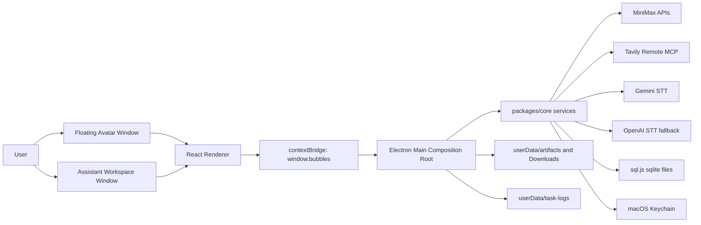
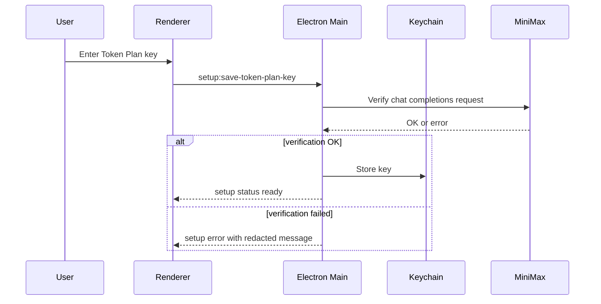
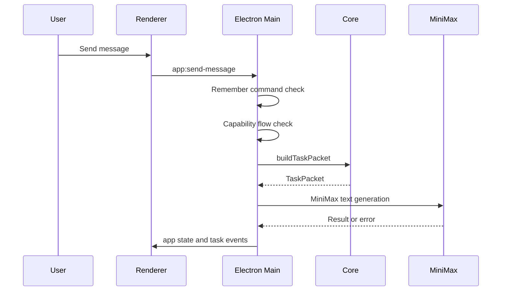
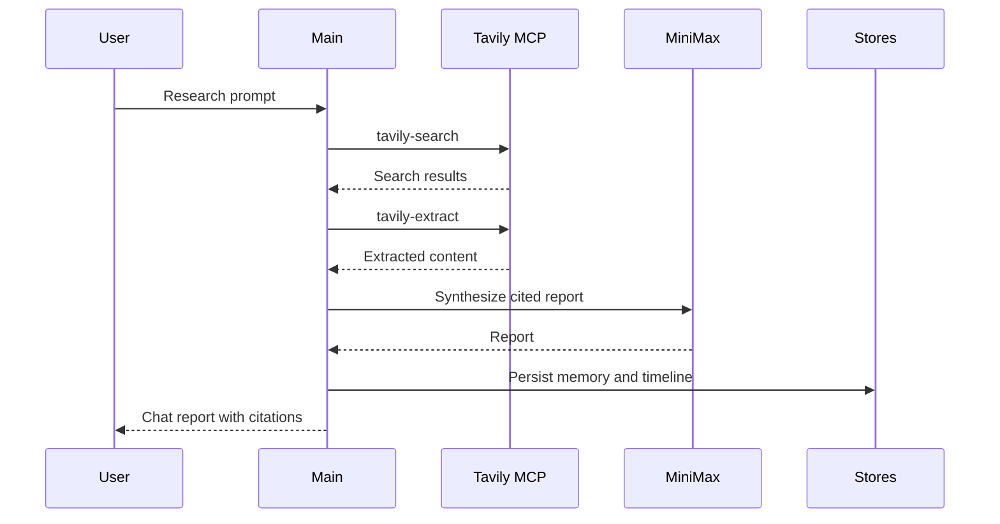
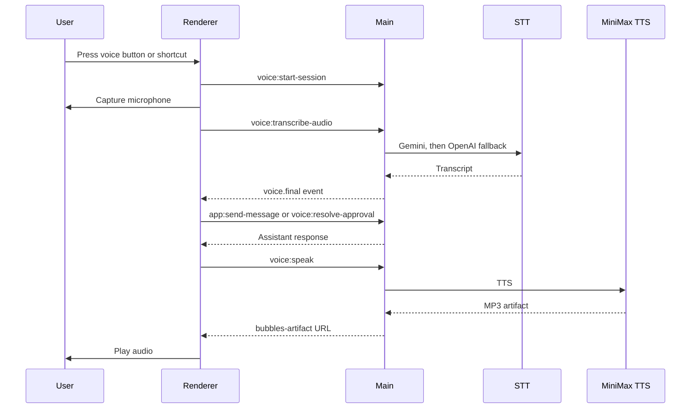

# Bubbles MVP Technical Analysis

Analysis date: 2026-05-17

## 1. Executive Summary

Bubbles MVP is a macOS Electron desktop assistant implemented as a pnpm workspace with two first-class packages:

- `packages/core`: strict TypeScript application logic, typed contracts, service adapters, persistence, orchestration, providers, approvals, memory, timeline, and testable business logic.
- `apps/desktop`: Electron main/preload IPC, React renderer, Pixi avatar stage, setup and workspace UI, and renderer/main integration tests.

The product is a floating desktop companion with a compact avatar window and an expanded assistant workspace. It can route typed or voice requests to MiniMax text tasks, Tavily-backed research, MiniMax media generation, approval-gated agent creation, approval-gated landing-page generation, memory persistence, and voice playback.

The architecture is service-oriented and largely dependency-injected in `packages/core`, while `apps/desktop/src/main/main.ts` acts as the runtime composition root. Runtime state is held in the Electron main process and broadcast to renderer windows over IPC. Sensitive credentials are stored in macOS Keychain. Durable product data uses `sql.js`-backed sqlite database files under Electron `userData`.

The repository also includes strong regression coverage for core services, IPC controllers, renderer components, voice flows, landing-page sandboxing, fixture auditing, and capability mapping. The main risks are main-process concentration, some contract duplication between core and renderer global types, several declared task event types without production emitters, static demo remnants, and a few documentation/code inconsistencies around voice spoken-response length.

## 2. Repository Shape

```text
.
|-- package.json
|-- pnpm-workspace.yaml
|-- tsconfig.base.json
|-- AGENTS.md
|-- docs/
|   `-- setup_guide.md
|-- agents/
|   |-- general-assistant/
|   |-- qa-agent/
|   `-- reaserch-agent/
|-- packages/
|   `-- core/
|       `-- src/
|-- apps/
|   `-- desktop/
|       |-- src/main/
|       |-- src/renderer/
|       |-- src/avatar/
|       |-- electron.vite.config.ts
|       |-- vite.config.ts
|       `-- electron-builder.yml
|-- tools/
|   `-- dev/
|-- output/
|   `-- bubbles-sprite-run-v2/
`-- pnpm-lock.yaml
```

Root scripts:

| Script | Purpose |
| --- | --- |
| `npm run dev` | Starts Electron/Vite desktop development runtime through `corepack pnpm --filter @bubbles/desktop dev`. |
| `npm run build` | Builds the desktop app through Electron Vite. |
| `npm test` | Runs all workspace Vitest suites. |
| `npm run test:core` | Runs only `@bubbles/core` tests. |
| `npm run test:desktop` | Runs only `@bubbles/desktop` tests. |
| `npm run typecheck` | Runs TypeScript checks across packages. |
| `npm run audit:capabilities` | Prints scripts, IPC, task types, connectors, voice contracts, and agents. |
| `npm run audit:fixtures` | Finds fixture/static/stub signals and missing production emitters. |
| `npm run doctor` | Runs capability and fixture audits. |

## 3. Technology Stack

| Layer | Technology |
| --- | --- |
| Package manager | pnpm via Corepack, pinned as `pnpm@9.15.4`. |
| Language | TypeScript 5.7 with strict mode, ES2022 target. |
| Desktop shell | Electron 33 with Electron Vite. |
| Renderer | React 18, Vite 5, Testing Library, jsdom. |
| UI icons | `lucide-react`. |
| Avatar runtime | Pixi.js 8 animated sprite sheet. |
| Persistence | `sql.js` sqlite databases persisted to disk. |
| Tests | Vitest 2.1, Testing Library for renderer. |
| AI text | Direct MiniMax OpenAI-compatible chat completions. |
| AI media | Direct MiniMax image, music, video, and TTS APIs. |
| Research | Tavily Remote MCP over HTTP JSON-RPC/SSE-style responses. |
| STT | Gemini audio transcription first, OpenAI audio translation fallback. |
| Secret storage | macOS Keychain via `/usr/bin/security`. |
| Packaging | `electron-builder` DMG and ZIP targets for macOS. |

## 4. High-Level Architecture



### Core Principles

- The core package owns typed services and portable behavior.
- Electron main owns process capabilities, provider wiring, persistent runtime state, windows, app paths, shell operations, and IPC registration.
- Preload exposes a constrained `window.bubbles` API to the renderer.
- Renderer components consume state snapshots and event streams rather than directly importing main-process code.
- Provider calls are direct HTTPS API calls, not local fixture or CLI connector paths.
- Tests are colocated beside the behavior they protect.

## 5. Runtime Composition

`apps/desktop/src/main/main.ts` is the main composition root. On `app.whenReady()` it:

1. Registers app ID and media permission handler.
2. Registers window IPC handlers.
3. Resolves Electron `userData` paths for logs and artifacts.
4. Creates the command runner used by Keychain storage.
5. Creates the Tavily Remote MCP client.
6. Creates the secure key store.
7. Registers MiniMax setup IPC.
8. Creates and registers Tavily setup IPC.
9. Registers voice setup and microphone permission IPC.
10. Registers voice session IPC with STT and TTS adapters.
11. Resolves the project root and creates the agent registry.
12. Hydrates agent, memory, approval, and connector state.
13. Registers log, artifact, capability, task, approval, approval voice, and connector IPC.
14. Creates the floating avatar window.
15. Registers the global voice shortcut.

Important globals in main:

| Runtime State | Purpose |
| --- | --- |
| `appState` | Single in-memory state snapshot broadcast to both renderer windows. |
| `avatarWindow` | Always-on-top compact transparent avatar window. |
| `panelWindow` | Expanded assistant workspace window. |
| `setupService` | MiniMax Token Plan setup and health service. |
| `voiceSetupService` | Voice provider readiness service. |
| `taskController` | General MiniMax task runner IPC controller. |
| `agentRegistry` | Filesystem-backed agent profile registry. |
| `approvalService` | sqlite-backed approval lifecycle service. |
| `connectorRegistry` | sqlite-backed Tavily connector configuration. |
| `memoryStore` | sqlite-backed durable memory store. |
| `timelineStore` | sqlite-backed event timeline. |
| `miniMaxKeyStore` | macOS Keychain-backed credential store. |
| `tavilySetupService` | Tavily API key verification service. |
| `latestResearchReport` | In-memory context for read-aloud and follow-up research prompts. |
| `pendingAgentDrafts` | Approval ID to agent draft map. |
| `pendingLandingPageActions` | Approval ID to landing-page request/revision map. |
| `activeLandingPageSession` | Current generated site, files, output directory, preview URL, and server stop callback. |
| `staticSiteServers` | Running static preview servers to stop before quit. |

## 6. Workspace Packages

### 6.1 `packages/core`

`packages/core` is the reusable domain layer. It exports services from `src/index.ts`, including:

- agents
- approvals
- connectors
- coding/landing-page runner
- memory
- MiniMax API clients
- observability
- orchestration
- research
- security
- shared command/types/sqlite helpers
- tasks
- timeline
- voice

The package is ESM and points `main` and `types` to `src/index.ts`. It depends directly on `sql.js` and otherwise keeps provider calls injectable for tests.

### 6.2 `apps/desktop`

`apps/desktop` owns:

- Electron main process and window lifecycle.
- Preload bridge.
- React renderer.
- Pixi avatar runtime.
- IPC controllers and their tests.
- Electron Vite and Vite configs.
- Electron Builder packaging.

The renderer imports `@bubbles/core` types and some core helpers such as the spoken-response policy. Preload exposes IPC calls as `window.bubbles`.

## 7. Core Module Analysis

### 7.1 Shared Types

File: `packages/core/src/shared/types.ts`

This file defines the central contracts:

- `AvatarState`: `idle`, `listening`, `thinking`, `working`, `waiting_approval`, `confused`, `concerned`, `celebrating`, `sleeping`.
- `TaskType`: general, research, coding, agent creation, and creative task variants.
- `ArtifactMetadata`: image, audio, site, or video artifacts with local path or URL.
- `ConnectorConfig`: Tavily-only connector configuration.
- `AgentProfile` and `AgentBirthDraft`.
- `TaskPacket` and `TaskEvent`.
- `ApprovalRequest`.
- `MemoryItem`, `MemoryQuery`.
- `TimelineEvent`.

These contracts are the backbone for app state, IPC payloads, persistence, task routing, and renderer display.

### 7.2 Agents

Files:

- `packages/core/src/agents/agentRegistry.ts`
- `packages/core/src/agents/agentBirthService.ts`
- `packages/core/src/agents/agentSchema.ts`
- `agents/*`

Current seeded agents:

| Agent ID | Name | Role | Tools |
| --- | --- | --- | --- |
| `general-assistant` | Bubbles | General desktop assistant | `minimax.text` |
| `qa-agent` | QA Agent | QA Agent assistant | `minimax.text` |
| `reaserch-agent` | Reaserch Agent | Reaserch Agent assistant | `minimax.text` |

Note: `reaserch-agent` is misspelled in source and should be treated as the current persisted contract unless migrated.

Agent registry behavior:

- Reads profiles from `agents/<id>/agent.json`.
- Validates profiles through `validateAgentProfile`.
- Lists non-archived agents sorted by name.
- Maintains an in-memory active agent ID.
- Creates approved agents by writing `agent.json`, `agent.md`, and `skills.md`.
- Archives non-default agents by setting `archivedAt`.
- Falls back to the default agent if active loading fails.

Agent birth behavior:

- Uses MiniMax JSON generation to create an `AgentBirthDraft`.
- Normalizes missing or malformed profile fields.
- Enforces `skillsPath` under `agents/<id>/skills.md`.
- Rejects visual customization fields and terms so new agents cannot alter the Bubbles body/avatar.
- Provides a safe recommended fallback draft when MiniMax output is unavailable in the chat-driven flow.
- Requires approval before writing files.

### 7.3 Approvals

Files:

- `packages/core/src/approvals/approvalService.ts`
- `packages/core/src/approvals/riskClassifier.ts`
- `packages/core/src/approvals/voiceApprovalResolver.ts`
- `apps/desktop/src/main/ipc/approvalIpc.ts`
- `apps/desktop/src/main/ipc/approvalVoiceIpc.ts`
- `apps/desktop/src/renderer/components/ApprovalModal.tsx`

Approval lifecycle:

1. Create an approval request with title, explanation, action type, preview, task ID, and agent ID.
2. Classify risk:
   - `agent_file_create`: medium.
   - `tavily_research` and `local_file_read`: low.
   - file writes, shell commands, external data sends: high by default.
3. Redact preview fields before persistence.
4. Store approval in sqlite.
5. Renderer shows pending approvals.
6. User approves, denies, or cancels with buttons or voice.
7. Approval resolution writes approval history to timeline and memory.
8. Main process runs follow-up behavior for approved agent creation and landing-page generation.

Voice approval behavior:

- Recognizes natural spoken approve, deny, and cancel phrases.
- Reprompts once on unclear speech.
- Falls back to chat buttons after the second unclear attempt.
- Can be disabled independently with `BUBBLES_VOICE_APPROVALS_ENABLED=false`.

### 7.4 Connectors and Tavily Research

Files:

- `packages/core/src/connectors/connectorRegistry.ts`
- `packages/core/src/connectors/tavilySetupService.ts`
- `packages/core/src/connectors/tavilyMcpClient.ts`
- `packages/core/src/connectors/tavilyResearchConnector.ts`
- `packages/core/src/research/researchService.ts`
- `apps/desktop/src/main/ipc/connectorIpc.ts`
- `apps/desktop/src/main/ipc/tavilySetupIpc.ts`

The connector system currently supports only one live connector:

```text
tavily-research
```

Default connector configuration:

- type: `tavily_research`
- mode: `real`
- enabled: false
- auth status: `not_configured`
- health status: `unknown`
- allowed agents: `general-assistant`
- required approval: `none`
- remote URL: `https://mcp.tavily.com/mcp/`
- max results: 8
- search depth: `advanced`

Tavily setup:

- Stores API key in Keychain.
- Verifies with `tavily-search` health check.
- Updates connector auth and health status after setup changes.
- Redacts setup errors.

Tavily Remote MCP client:

- Initializes JSON-RPC session with protocol version `2025-06-18`.
- Sends `Authorization: Bearer <apiKey>`.
- Also appends `tavilyApiKey` query param when absent.
- Supports `tools/call`.
- Parses plain JSON and SSE `data:` responses.
- Provides friendly auth, quota, and protocol/session errors.

Research workflow:

1. Intent classifier detects research phrases.
2. Main routes request to `createFlowRouter`.
3. `runTavilyResearch` requires both MiniMax and Tavily keys.
4. Tavily connector calls `tavily-search`.
5. Top HTTP(S) result URLs are passed to `tavily-extract`.
6. MiniMax synthesizes the report from result snippets and extracted content.
7. Report sections are requested as:
   - Executive Summary
   - Key Findings
   - Detailed Analysis
   - Sources
   - Suggested Follow-Up Questions
8. Citations are shown in chat.
9. Report summary is stored in memory and timeline.
10. Follow-up questions reuse `latestResearchReport` in memory.

### 7.5 MiniMax Integration

Files:

- `packages/core/src/minimax/minimaxApiClient.ts`
- `packages/core/src/minimax/setupService.ts`
- `packages/core/src/minimax/minimaxTaskRunner.ts`
- `packages/core/src/minimax/creativeService.ts`
- `packages/core/src/minimax/ttsService.ts`
- `apps/desktop/src/main/ipc/setupIpc.ts`

MiniMax setup:

- Uses direct HTTPS verification through chat completions.
- Stores Token Plan key in Keychain.
- Persists sanitized setup status to `userData/minimax-setup-status.json`.
- Does not trust legacy CLI-shaped stored statuses.
- Supports reset of Token Plan key and reset all MiniMax keys, including legacy general API cleanup.

Text generation:

- Endpoint: `https://api.minimax.io/v1/chat/completions`.
- Default model: `MiniMax-M2.7`.
- JSON generation supports response format fallback.
- Strips `<think>...</think>` blocks.
- Extracts JSON from fenced content or balanced JSON embedded in text.
- Categorizes errors as network, auth, quota, or unknown.

Task runner:

- Builds `TaskPacket` with active agent, task type, memory context, skills markdown, allowed tools, and output preference.
- Writes redacted task logs.
- Emits `task.received`, `task.status`, `task.result`, `task.error`, or `task.cancelled`.
- Uses `AbortController` for cancellation.

Media generation:

| Kind | Endpoint | Model/Settings | Output |
| --- | --- | --- | --- |
| Image | `/v1/image_generation` | `image-01`, base64 response | PNG artifact |
| Music | `/v1/music_generation` | `music-2.6`, MP3 settings, hex output | MP3 artifact |
| Video | `/v1/video_generation` plus query and file retrieve endpoints | `MiniMax-Hailuo-2.3`, 6s, 768P | MP4 artifact |
| TTS | `/v1/t2a_v2` | `speech-2.8-hd`, `English_expressive_narrator`, English boost | MP3 artifact |

Fixture media:

- Disabled by default.
- Enabled only by `BUBBLES_MINIMAX_MEDIA_FIXTURE` true-like value.
- Intended for tests and CI only.
- Writes deterministic image/audio/video placeholder artifacts.

### 7.6 Voice

Files:

- `packages/core/src/voice/voiceTypes.ts`
- `packages/core/src/voice/transcriptionService.ts`
- `packages/core/src/voice/voiceSetupService.ts`
- `packages/core/src/voice/affectDetector.ts`
- `packages/core/src/voice/approvalVoiceDecision.ts`
- `packages/core/src/voice/spokenResponsePolicy.ts`
- `apps/desktop/src/main/ipc/voiceIpc.ts`
- `apps/desktop/src/main/voiceShortcut.ts`
- `apps/desktop/src/renderer/voice/useVoiceSession.ts`
- `apps/desktop/src/renderer/components/VoiceControls.tsx`

Voice capability areas:

- Push-to-talk voice session state.
- Global shortcut: `CommandOrControl+Shift+Space`.
- Microphone permission request.
- Browser `MediaRecorder` capture.
- Voice activity detection.
- WAV conversion before STT.
- Gemini STT primary provider.
- OpenAI translation STT fallback.
- MiniMax TTS playback.
- Barge-in while speaking.
- Voice approval resolution.
- Affect classification for urgency/confusion/frustration/satisfaction.

Voice STT:

- Gemini endpoint: `gemini-2.5-flash:generateContent`.
- Gemini request embeds inline audio and asks for English-only transcription or translation.
- OpenAI endpoint: `/v1/audio/translations`.
- OpenAI model: `whisper-1`.
- Timeout: 15 seconds by default.
- Failure reasons: auth, network, not_configured, provider, quota, rate_limit.
- Gemini quota exhaustion without OpenAI fallback is a terminal voice error.

Renderer voice capture:

- Requires `navigator.mediaDevices.getUserMedia` and `MediaRecorder`.
- Selects `audio/webm;codecs=opus`, `audio/webm`, or `audio/mp4`.
- Converts to WAV when Web Audio is available.
- Avoids STT spend on noise-only captures.
- Stops after 15 seconds, or after detected speech plus silence.
- Wake phrase normalization accepts `Hey Bubbles` and `Hi Bubbles`.
- Wake-only transcript in always-listening mode starts command capture.

Spoken response policy:

- Code uses a default maximum of 200 normalized characters before speaking "Please look in the chat panel for the response."
- `docs/setup_guide.md` currently says 50 normalized characters. This is a documentation/code mismatch.

### 7.7 Memory and Timeline

Files:

- `packages/core/src/memory/memoryStore.ts`
- `packages/core/src/memory/memoryExtractor.ts`
- `packages/core/src/timeline/timelineStore.ts`
- `apps/desktop/src/renderer/screens/MemoryTimeline.tsx`

Memory behavior:

- Explicit command: `remember that ...` or `remember ...`.
- Auto-extraction: after general task submission, MiniMax can return durable memory candidates.
- Memory records include type, content, source task ID, agent ID, tags, importance, timestamps.
- Content is redacted before persistence.
- Existing persisted memory is redacted again during store initialization.
- Recent memories are shown in the workspace status rail.
- Users can clear all memory.

Timeline behavior:

- Tracks agent creation, activation, memory creation/clearing, task lifecycle, and approval decisions.
- Summaries are redacted before persistence.
- Existing summaries are redacted during store initialization.
- Latest timeline events are shown in the workspace status rail.

### 7.8 Task Orchestration and Routing

Files:

- `packages/core/src/orchestration/intentClassifier.ts`
- `packages/core/src/orchestration/flowRouter.ts`
- `packages/core/src/orchestration/orchestrator.ts`
- `packages/core/src/orchestration/responsePresenter.ts`
- `packages/core/src/tasks/taskPacketBuilder.ts`
- `packages/core/src/tasks/taskEvents.ts`
- `apps/desktop/src/main/ipc/taskIpc.ts`

Intent classifier routes:

| Pattern | Task Type |
| --- | --- |
| create/build/make/birth agent | `agent.create` |
| generate/make/create/draw/render image/poster/logo/etc. | `creative.image` |
| generate/make/create/render video/clip/animation/etc. | `creative.video` |
| generate/make/create music/song/track/audio/etc. | `creative.music` |
| build/make/create/generate landing page/site | `coding.landing_page` |
| voice/TTS/audio/image/vision/music/video/generate | `creative.minimax` |
| research/search/sources/look up/investigate | `research.web` |
| code/coding/build/implement/fix/project/feature/repo | `coding.project` |
| otherwise | `general.plan` |

Routing split:

- Capability router handles research, media, landing-page approval initiation, creative MiniMax availability copy, and agent creation guidance.
- General tasks fall through to the MiniMax text task runner.
- `routeCapabilityFlow` in main adds special handling for research follow-ups, research read-aloud requests, pending agent-switch confirmations, landing-page revisions, and chat-driven agent birth.

Avatar mapping:

| Task Event | Avatar State |
| --- | --- |
| `task.received` | `thinking` |
| `task.status` | `working` |
| `task.status` with `missing_info` | `confused` |
| `task.partial_output` | `working` |
| `approval.required` | `waiting_approval` |
| `task.error` | `concerned` |
| `task.result` | `celebrating` |
| `task.cancelled` | `idle` |
| fallback | `working` |

### 7.9 Landing-Page Sandbox

Files:

- `packages/core/src/coding/landingPageRunner.ts`
- `apps/desktop/src/main/landingPageWorkflow.ts`
- `apps/desktop/src/main/main.ts`

Workflow:

1. User asks for a landing page.
2. Flow router creates a shell-command approval.
3. Main stores pending landing-page action by approval ID.
4. On approval, main verifies landing-page feature flag and MiniMax key.
5. Allowed commands are checked:
   - `node scripts/accessibility-check.mjs`
   - `vite build`
6. MiniMax is asked for static Vite files.
7. If MiniMax times out or returns malformed output, fallback code is generated.
8. Generated files are normalized, repaired, and checked.
9. Only `index.html`, `src.css`, `src.js`, and `package.json` are allowed.
10. Files are written inside `userData/artifacts/landing-pages/<hash>`.
11. Accessibility check runs.
12. Vite build runs.
13. Project is copied to Downloads under `Bubbles Landing Pages`.
14. Static preview server starts on available port beginning at 4173.
15. Browser opens the local preview.
16. The active session stores generated files for revision prompts.

Sandbox protections:

- Path containment via `assertSandboxPath`.
- File path allowlist.
- Remote scripts and remote fonts are stripped/rejected.
- Package JSON must only include approved Vite scripts and one `vite` dev dependency.
- Generated HTML is repaired to include `lang`, viewport, stylesheet, primary heading, image alt text, and labeled form field.
- Static server path containment prevents directory traversal.

### 7.10 Observability

Files:

- `packages/core/src/observability/trace.ts`
- `apps/desktop/src/main/main.ts`
- `packages/core/src/minimax/minimaxTaskRunner.ts`

Observability data:

- Task logs per task: `userData/task-logs/<taskId>.log`.
- Structured trace log: `userData/task-logs/observability.ndjson`.
- Trace fields are recursively redacted.
- Events include task lifecycle, voice lifecycle, TTS requests, approval resolution, and landing-page sandbox command steps.
- Renderer offers "Export redacted logs", which opens the log directory.

## 8. Desktop Runtime Analysis

### 8.1 Windows

Floating avatar window:

- Transparent, frameless, always-on-top.
- Size: 340 x 390.
- Non-resizable.
- Visible on all workspaces.
- Loads renderer with `?window=avatar`.

Assistant panel window:

- Frameless, always-on-top, resizable workspace.
- Default size: 1120 x 760.
- Minimum size: 760 x 560.
- Created next to the avatar.
- Loads renderer with `?window=panel`.

Both windows:

- `nodeIntegration: false`.
- `contextIsolation: true`.
- `sandbox: false`.
- External window opens are redirected to `shell.openExternal`.

### 8.2 Preload API

File: `apps/desktop/src/main/preload.ts`

Preload exposes:

- App state: `getState`, `onStateChange`, `sendMessage`, `setAvatarState`.
- Panel/window: `togglePanel`, `closePanel`, `moveWindowBy`, panel state subscription.
- Agents: list, activate, preview birth, create from preview.
- Approvals: list, create, approve, deny, cancel.
- Connectors: list, update, health check, disconnect.
- Capabilities: open/download artifact.
- Memory: list, timeline, clear.
- Logs: export redacted logs.
- Voice: state, events, shortcut event, session controls, microphone permissions, STT, TTS, approval resolution.
- Setup: MiniMax, Tavily, voice setup actions.
- Tasks: start, cancel, get events, subscribe to events.

All renderer access flows through IPC, not Node APIs.

### 8.3 IPC Surface

Capability audit reports the following handler groups:

- `app:*`: state, message sending, avatar state.
- `panel:*`: panel toggle/close.
- `window:*`: window movement.
- `agents:*`: list, activate, preview/create agent.
- `approvals:*`: list, create, resolve approvals.
- `voice:*`: session, STT, TTS, shortcut, approvals, microphone permissions.
- `voice-setup:*`: voice provider key lifecycle.
- `setup:*`: MiniMax key lifecycle.
- `tavily:*`: Tavily key lifecycle.
- `connectors:*`: connector lifecycle.
- `tasks:*`: task lifecycle.
- `memory:*`: memory and timeline.
- `capabilities:*`: artifact open/download.
- `logs:*`: log export.

The audit found all preload invokes wired to handlers.

### 8.4 Renderer

Entry point:

- `apps/desktop/src/renderer/main.tsx`

Top-level component:

- `apps/desktop/src/renderer/App.tsx`

Major renderer surfaces:

| Component | Purpose |
| --- | --- |
| `FloatingAvatarWindow` | Compact draggable avatar and speech bubble. |
| `AvatarStage` | Pixi sprite animation stage. |
| `AssistantPanel` | Expanded workspace layout. |
| `WorkspaceHeader` | Drag handle, status, close button. |
| `IntegrationStatusBar` | MiniMax, connector, memory, and voice readiness. |
| `ConversationRail` | Conversation history and agent switcher. |
| `ChatSurface` | Chat log, composer, citations, artifacts. |
| `VoiceControls` | Push-to-talk button and captions. |
| `TaskDrawer` | Live task event log and cancellation. |
| `ApprovalModal` | Pending approval review and decisions. |
| `WorkspaceStatusRail` | Setup, connectors, memory, logs, degraded-state copy. |
| `SetupScreen` | MiniMax, Tavily, Gemini, OpenAI key setup. |
| `ConnectorSettings` | Tavily connector health and enable/disable controls. |
| `MemoryTimeline` | Saved memory and timeline display. |
| `AgentBirthPreview` | Preview/create flow for agents, currently not mounted in the main panel. |

Renderer state:

- Starts with safe local defaults.
- Hydrates from `window.bubbles.getState()`.
- Subscribes to `app:state`, `tasks:event`, setup status, Tavily status, voice setup status, and voice events.
- Panel role runs voice side effects; avatar role mirrors state.
- Without `window.bubbles`, the renderer falls back to local demo-like behavior for browser tests.

## 9. Persistence and Storage

### 9.1 Electron `userData`

Runtime files are stored under `app.getPath('userData')`:

| Path | Contents |
| --- | --- |
| `minimax-setup-status.json` | Sanitized MiniMax setup status. |
| `data/memory.sqlite` | Durable memories. |
| `data/timeline.sqlite` | Timeline events. |
| `data/approvals.sqlite` | Approval requests and decisions. |
| `data/connectors.sqlite` | Connector config and health. |
| `task-logs/*.log` | Redacted task logs. |
| `task-logs/observability.ndjson` | Redacted structured trace events. |
| `artifacts/` | Generated TTS, media, landing pages, and sandbox files. |

### 9.2 Keychain

Keychain service names:

| Secret | Service Name |
| --- | --- |
| MiniMax Token Plan key | `com.bubbles.minimax.token-plan-key` |
| Legacy MiniMax General API key cleanup | `com.bubbles.minimax.general-api-key` |
| Gemini voice key | `com.bubbles.voice.gemini-api-key` |
| OpenAI voice key | `com.bubbles.voice.openai-api-key` |
| Tavily API key | `com.bubbles.tavily.api-key` |

Default account name:

```text
minimax
```

The secure key store currently requires macOS (`darwin`), because it shells out to `/usr/bin/security`.

### 9.3 Artifact Protocol

The `bubbles-artifact://` protocol is registered as privileged, secure, standard, streaming, and fetch-capable.

Artifact serving behavior:

- Decodes the target path from URL pathname.
- Resolves the artifact root.
- Rejects paths outside artifact root.
- Serves local files with `net.fetch(file://...)`.

Artifact IPC protections:

- Opening local artifacts requires path containment inside artifact root.
- Downloading artifacts also requires containment.
- HTTP(S) URLs may be opened externally, but downloads require local paths.
- Download filenames are sanitized.

## 10. Security and Privacy Analysis

Strengths:

- Credentials are stored in macOS Keychain, not repo files.
- Redaction is applied to logs, memory, timeline summaries, approval previews, connector errors, provider errors, and trace fields.
- Renderer does not have Node integration.
- Context isolation is enabled.
- External links are opened through the system browser and denied inside Electron windows.
- App permission handler only grants `media` requests.
- Approvals gate file creation and landing-page shell command workflows.
- Landing-page sandbox restricts generated files and allowed commands.
- Artifact protocol and download IPC enforce path containment.
- Tavily is the only live connector-backed research integration.

Risks and limitations:

- Electron renderer `sandbox` is set to false even though context isolation is enabled.
- Main process composition is large and stateful, increasing blast radius of regressions.
- `global.d.ts` duplicates several core contracts, creating drift risk.
- `AgentBirthPreview` exists but is not currently mounted in the panel, while chat-driven agent birth is implemented.
- `approval.accepted`, `task.partial_output`, and `tool.requested` are declared but currently have no production emitter per fixture audit.
- The voice spoken-response length in code differs from the setup guide.
- `ConversationHistory` still contains static entries: `New chat`, `Phase 1 demo`, `Sprite states`.
- Some unavailable/not-ready copy remains for flows that depend on setup or approvals.
- Keychain implementation is macOS-only.
- Research follow-up context is in memory only and resets on app restart.

## 11. Environment Flags

Capability audit found:

| Flag | Behavior |
| --- | --- |
| `BUBBLES_AGENT_BIRTH_TIMEOUT_MS` | Overrides MiniMax JSON timeout for chat-driven agent birth. |
| `BUBBLES_CODING_LANDING_PAGE` | Set to `false` to disable landing-page generation. |
| `BUBBLES_CREATIVE_IMAGE` | Set to `false` to disable image generation. |
| `BUBBLES_CREATIVE_MUSIC` | Set to `false` to disable music generation. |
| `BUBBLES_CREATIVE_VIDEO` | Set to `false` to disable video generation. |
| `BUBBLES_MINIMAX_MEDIA_FIXTURE` | Enables deterministic media fixtures only when explicitly true-like. |
| `BUBBLES_QA_TASK_DELAY_MS` | Adds a preflight delay for QA task behavior. |
| `BUBBLES_VOICE_APPROVALS_ENABLED` | Set to `false` to disable voice approval decisions. |
| `BUBBLES_VOICE_ENABLED` | Set to `false` to disable voice. |
| `ELECTRON_RENDERER_URL` | Development renderer URL loaded by Electron. |

## 12. Capability Workflows

### 12.1 First-Run Setup



The same setup screen also handles Tavily, Gemini, and OpenAI keys.

### 12.2 Typed General Task



### 12.3 Tavily Research



### 12.4 Media Generation

Media tasks are routed before the general task runner. The UI immediately shows a working message and task events, then replaces the working message with a result. Generated artifacts are stored under `userData/artifacts/<kind>-<timestamp>` and displayed in chat.

### 12.5 Voice Command



### 12.6 Agent Birth

Agent birth is approval-gated. Chat-driven flow:

1. Detect `agent.create`.
2. Emit task drawer events for drafting.
3. Require MiniMax Token Plan key.
4. Generate or fallback to an agent draft.
5. Create approval with agent files in preview.
6. On approval, write files to `agents/<id>/`.
7. Ask whether to switch to the new agent.
8. Activate on confirmation.

### 12.7 Landing-Page Generation and Revision

Landing-page generation is approval-gated because it writes files and runs commands. Revisions are detected only when an active landing-page session exists and the prompt looks like a modification rather than a new research/media/agent/code request.

## 13. Testing and Quality Gates

The repository contains extensive Vitest coverage:

- Core service tests for agents, approvals, connectors, coding runner, memory, MiniMax, orchestration, research, security, timeline, tasks, and voice.
- Desktop main IPC tests for approvals, connectors, capability artifacts, tasks, voice, setup, window messaging, landing-page workflow, fixture mode, and shortcuts.
- Renderer tests for app shell, chat, voice controls, voice session hook, approvals, task drawer, setup screen, connector settings, memory timeline, agent switcher, agent birth preview, and avatar catalog.

Recommended commands before release:

```bash
npm run audit:capabilities
npm run audit:fixtures
npm run typecheck
npm test
```

Narrow commands during development:

```bash
npm run test:core
npm run test:desktop
npm run typecheck:core
npm run typecheck:desktop
```

For renderer/runtime changes:

```bash
npm run dev
```

Then verify the local renderer or Electron app manually.

## 14. Build and Packaging

Electron Vite:

- Main input: `src/main/main.ts`.
- Preload input: `src/main/preload.ts`.
- Renderer input: `index.html`.
- `sql.js` is marked external in main build.

Electron Builder:

- app ID: `com.bubbles.mvp`.
- product name: `Bubbles MVP`.
- output directory: `dist`.
- macOS category: productivity.
- targets: DMG and ZIP.
- ASAR enabled.
- Hardened runtime and Gatekeeper assessment are currently disabled.

Packaging risk:

- With hardened runtime disabled, this is suitable for MVP/local testing but not final distribution.
- Notarization and entitlements are not configured here.

## 15. Tooling

`tools/dev/capability-map.mjs`:

- Reads package scripts, IPC handlers, preload invokes, env flags, task types, task events, connector IDs, voice exported contracts, and agent profiles.
- Reports whether preload invokes are wired to handlers.

`tools/dev/fixture-audit.mjs`:

- Scans production sources for fixture switches, static demo UI, stub/unavailable copy, and removed legacy path mentions.
- Reports declared agent tools with weak executor evidence.
- Reports declared task events with no production emitter.

Current audit highlights:

- Fixture media switch is explicit and present.
- Static demo UI remnants remain in `ConversationHistory` and some readiness copy.
- Stub/unavailable copy remains for disabled or unready capabilities.
- Removed legacy connector path mentions were not found in default production scope.
- Declared task events without production emitters: `task.partial_output`, `tool.requested`, `approval.accepted`.

## 16. Known Technical Gaps and Recommendations

### 16.1 Main Process Size

`apps/desktop/src/main/main.ts` is more than 2,200 lines and owns many workflows. This is workable for an MVP but should be decomposed before adding many more capabilities.

Recommended split:

- app state store and broadcaster
- setup composition
- voice composition
- capability router adapter
- research runtime
- media runtime
- landing-page runtime
- agent-birth runtime
- window manager

### 16.2 Contract Duplication

`apps/desktop/src/renderer/global.d.ts` duplicates contracts from `packages/core/src/shared/types.ts` and voice/setup modules.

Recommendation:

- Export renderer-safe API types from core or a small shared contract module.
- Make `Window['bubbles']` compose imported types instead of copy-pasting them.

### 16.3 Unmounted Agent Birth Preview

`AgentBirthPreview` exists and is tested, but the main assistant panel does not render it. Chat-driven agent birth exists and is likely the active path.

Recommendation:

- Either mount `AgentBirthPreview` intentionally in the agent panel area or remove it if chat-driven agent birth is the only MVP surface.

### 16.4 Task Event Contract Drift

Declared but unemitted production events create expectations for UI or future integrations.

Recommendation:

- Emit `approval.accepted` after approval if the UI needs it, or remove it from `TaskEvent`.
- Emit `task.partial_output` only if streaming MiniMax output is implemented.
- Emit `tool.requested` only if explicit tool request events are implemented.

### 16.5 Voice Documentation Mismatch

Code uses a 200-character spoken response threshold. `docs/setup_guide.md` says 50.

Recommendation:

- Align docs and tests with the intended product policy.

### 16.6 Static Demo Remnants

`ConversationHistory` contains static entries that do not reflect persisted conversations.

Recommendation:

- Replace with actual conversation/session data or remove until history persistence exists.

### 16.7 macOS-Only Keychain

The secure key store throws outside macOS.

Recommendation:

- Keep macOS-only as an explicit product constraint, or add platform-specific secure storage adapters.

### 16.8 Research Persistence

Research reports are summarized into memory and timeline, but `latestResearchReport` is in-memory only.

Recommendation:

- Persist full report context if follow-up continuity across restarts is a requirement.

### 16.9 Packaging Hardening

The current builder config disables hardened runtime and Gatekeeper assessment.

Recommendation:

- Add signing, entitlements, hardened runtime, and notarization before external distribution.

## 17. Traceability Matrix

| Capability | Primary Files |
| --- | --- |
| App composition | `apps/desktop/src/main/main.ts` |
| Preload bridge | `apps/desktop/src/main/preload.ts` |
| Renderer shell | `apps/desktop/src/renderer/App.tsx` |
| Floating avatar | `apps/desktop/src/renderer/components/FloatingAvatarWindow.tsx` |
| Sprite animation | `apps/desktop/src/avatar/AvatarStage.tsx`, `apps/desktop/src/avatar/animationCatalog.ts` |
| Setup UI | `apps/desktop/src/renderer/screens/SetupScreen.tsx` |
| MiniMax setup | `packages/core/src/minimax/setupService.ts`, `apps/desktop/src/main/ipc/setupIpc.ts` |
| MiniMax text | `packages/core/src/minimax/minimaxApiClient.ts`, `packages/core/src/minimax/minimaxTaskRunner.ts` |
| MiniMax media | `packages/core/src/minimax/creativeService.ts` |
| MiniMax TTS | `packages/core/src/minimax/ttsService.ts` |
| Voice STT | `packages/core/src/voice/transcriptionService.ts` |
| Voice renderer | `apps/desktop/src/renderer/voice/useVoiceSession.ts` |
| Voice IPC | `apps/desktop/src/main/ipc/voiceIpc.ts` |
| Voice shortcut | `apps/desktop/src/main/voiceShortcut.ts` |
| Approvals | `packages/core/src/approvals/approvalService.ts`, `apps/desktop/src/renderer/components/ApprovalModal.tsx` |
| Voice approvals | `packages/core/src/approvals/voiceApprovalResolver.ts`, `packages/core/src/voice/approvalVoiceDecision.ts` |
| Agents | `packages/core/src/agents/*`, `agents/*` |
| Agent birth | `packages/core/src/agents/agentBirthService.ts`, `apps/desktop/src/main/main.ts` |
| Connectors | `packages/core/src/connectors/connectorRegistry.ts`, `apps/desktop/src/renderer/screens/ConnectorSettings.tsx` |
| Tavily setup | `packages/core/src/connectors/tavilySetupService.ts`, `apps/desktop/src/main/ipc/tavilySetupIpc.ts` |
| Tavily MCP | `packages/core/src/connectors/tavilyMcpClient.ts` |
| Research reports | `packages/core/src/research/researchService.ts` |
| Memory | `packages/core/src/memory/*`, `apps/desktop/src/renderer/screens/MemoryTimeline.tsx` |
| Timeline | `packages/core/src/timeline/timelineStore.ts` |
| Landing-page generation | `packages/core/src/coding/landingPageRunner.ts`, `apps/desktop/src/main/landingPageWorkflow.ts` |
| Artifact open/download | `apps/desktop/src/main/ipc/capabilityIpc.ts` |
| Observability | `packages/core/src/observability/trace.ts` |
| Capability audit | `tools/dev/capability-map.mjs` |
| Fixture audit | `tools/dev/fixture-audit.mjs` |

## 18. Operational Checklist

For local development:

1. Install dependencies with pnpm/Corepack.
2. Run `npm run typecheck`.
3. Run `npm test`.
4. Run `npm run dev`.
5. Add MiniMax Token Plan key in setup.
6. Add Tavily API key if testing research.
7. Add Gemini and optional OpenAI keys if testing voice STT.
8. Use `Export redacted logs` when diagnosing runtime issues.

For release readiness:

1. `npm run audit:capabilities` has no missing preload handlers.
2. `npm run audit:fixtures` has no unintended production fixture/static signals.
3. `npm run typecheck` passes.
4. `npm test` passes.
5. Manual smoke test covers setup, chat, research, media, approvals, voice, artifacts, memory, and panel/window behavior.
6. Packaging config is updated for signing, hardened runtime, and notarization if distributing externally.

