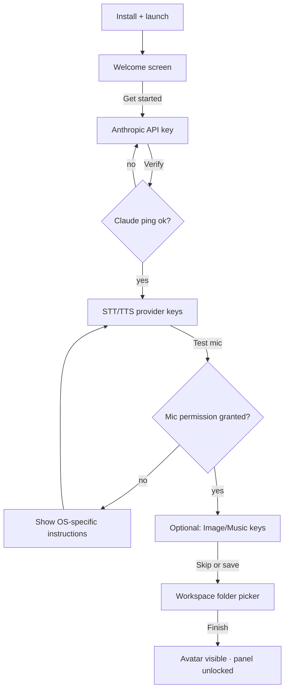
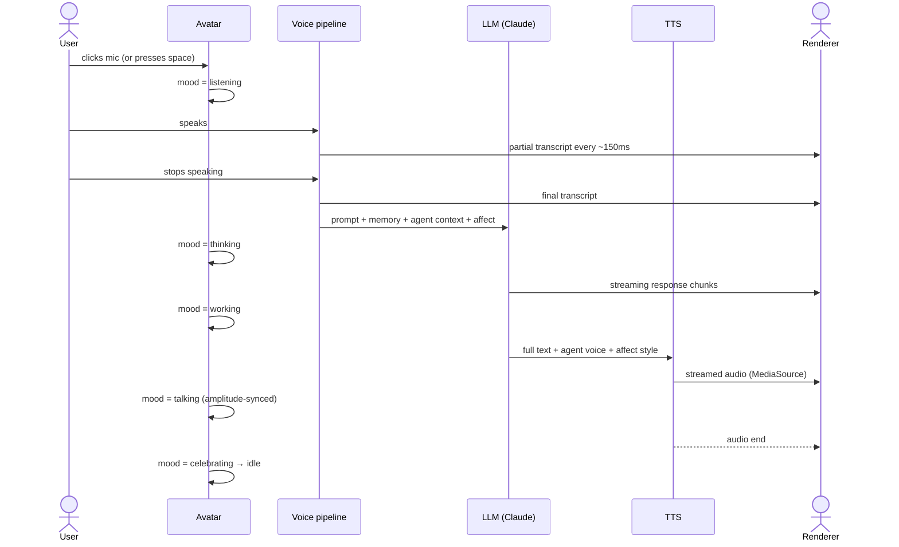

# Bubbles v3 — Full Functional Requirements

> **Audience:** Product, design, engineering, QA.
> **Pair with:** [02-Full-Development-Plan.md](02-Full-Development-Plan.md) for milestone sequencing and [03-Full-Backend-Plan.md](03-Full-Backend-Plan.md) for technical implementation.

---

## 1. Product Definition

Bubbles v3 is a **cross-platform desktop AI companion** — a draggable, always-on-top pixel-art avatar that holds a voice-first conversation, expresses emotion, and executes user-approved creative + research tasks (image, music, landing-page, web search) entirely through direct AI provider APIs. There is **no CLI dependency**.

### 1.1 Product Pillars

1. **Voice is primary.** The user speaks; Bubbles speaks back. Typing always works as a fallback.
2. **Emotion is visible and audible.** Bubbles' tone, avatar animation, and pacing reflect the user's affect *and* its own confidence.
3. **Every destructive action is gated.** Approval cards (click or voice) appear before any file write, deployment, or outgoing message.
4. **Local-first, audit-friendly.** Conversations, memories, approvals, and traces all live on-device. Redacted log export ships from day one.
5. **Cross-platform.** Windows 10+, macOS 12+, Ubuntu 22.04+ — single codebase, single installer per platform.

### 1.2 Non-Goals (v3)

- No email or calendar integration.
- No multi-agent delegation.
- No vector-based semantic memory (schema headroom only).
- No mobile or web build.
- No third-party agent marketplace.
- No generic shell-command tool.

---

## 2. Personas

| Persona | Primary needs | Default agent |
|---|---|---|
| **Casual desktop user** | A pet that listens and reacts; light Q&A; fun creative requests | **Bubbles** (general, read-only) |
| **Developer** | Code-aware file edits with diff preview; landing-page scaffolding; predictable cost | **Coda** (coding partner) |
| **Researcher / writer** | Cited web research, structured summaries, reliable voice readout | **Sage** (research analyst) |
| **Creative** | Image + music generation, fast iteration | **Bubbles** + custom agent |

---

## 3. Required Capabilities (must ship in v3)

Each capability below is a hard requirement. Failures from Versions A and B map to specific mitigations in [00-Audit-and-Decision-Log.md §1-2](00-Audit-and-Decision-Log.md).

### 3.1 C1 — Voice Input (Speech-to-Text)

**User story.** *"I press the mic, speak, and see my words appear as I talk. When I stop, Bubbles takes the turn."*

**Acceptance criteria:**
- Mic permission requested at first launch (during setup wizard), persisted by OS.
- Two activation modes:
  - **Push-to-talk** — hold space bar (configurable) while speaking.
  - **Continuous listening** — toggleable; voice-activity detection (VAD) auto-segments turns.
- Live partial transcript visible within **300 ms** of first audible word (P95).
- Final transcript within **800 ms** of speech end (P95) for cloud STT; **1500 ms** for local fallback.
- Three-tier provider fallback (Deepgram → Whisper API → whisper.cpp); see [05-Full-AI-Integrations-Plan.md §3](05-Full-AI-Integrations-Plan.md).
- Mic input is **never persisted** as raw audio — only the final transcript is stored.
- Barge-in: speaking while Bubbles is talking interrupts TTS within **200 ms**.

**Failure recovery:**
- No mic device → friendly error, fall back to text composer, voice button shows "No microphone".
- Provider 4xx/5xx → automatic fallback to next tier within **500 ms**.
- All providers fail → text composer remains usable; toast says "Voice unavailable — typing still works."

**Success metrics:**
- Word error rate (WER) ≤ **8 %** on clean English audio (16 kHz, no background noise).
- ≥ 95 % of voice turns complete without provider fallback in standard network conditions.
- < **1 %** of voice turns end with "Voice unavailable" toast.

### 3.2 C2 — Voice Output (Text-to-Speech)

**User story.** *"Bubbles answers in a warm, expressive voice that fits the agent I'm talking to."*

**Acceptance criteria:**
- Time-to-first-audio (TTFA) ≤ **400 ms** for cloud TTS (P95), ≤ **2 s** for local fallback.
- Streaming playback (audio plays as bytes arrive) for ElevenLabs and OpenAI TTS.
- Voice ID is per-agent, declared in agent config; v3 ships with curated voice IDs for each preset.
- Spoken-response policy enforced: messages longer than **280 chars or 40 words** are summarized to first 2 sentences + *"I put the full details in chat."*
- Captions mirror spoken audio in `CaptionBar`.
- Three-tier fallback (ElevenLabs Turbo v2.5 → OpenAI `tts-1-hd` → Piper local); see [05-Full-AI-Integrations-Plan.md §4](05-Full-AI-Integrations-Plan.md).
- Avatar mood synced to TTS audio amplitude (lip-sync wobble).
- TTS audio is **never persisted** to disk except for explicit "save as audio file" user action.

**Failure recovery:**
- TTS provider down → silent fallback, no user message, captions still shown.
- All TTS tiers fail → chat reply remains, tool chip shows *"Voice unavailable — text reply delivered."*

**Success metrics:**
- ≤ **2 %** of replies fall back to local Piper.
- ≤ **0.5 %** of replies fail to render any audio when at least one network provider is reachable.

### 3.3 C3 — Emotional Interaction Layer

**User story.** *"Bubbles notices when I sound frustrated and responds with a calmer tone."*

**Acceptance criteria:**
- Every user turn (voice or text) is tagged with an `AffectTag`:
  - `primary`: one of `urgent | frustrated | stuck | confused | satisfied | curious | neutral`
  - `confidence`: 0–1
  - `urgency`: 0–3
  - `valence`: -1..+1
  - `arousal`: 0..1
  - `evidence`: the snippet that drove the classification
  - `ttsStyle`: `warm | focused | calm | encouraging | celebratory`
- Affect computation:
  - **Text turns:** Claude Haiku one-shot classification + regex baseline merge.
  - **Voice turns:** Hume EVI prosody analysis on the audio + same Claude/regex pass on the transcript.
- Avatar reflects affect via mood transitions: `frustrated → concerned`, `satisfied → celebrating`, `confused → confused`, etc.
- TTS voice style hint passed to ElevenLabs (`style` parameter) per agent + affect.
- Conversation memory records the affect history; the LLM is shown the last 3 affect tags as context.
- Bubbles can ask one clarifying question per turn if affect is `confused` (confidence ≥ 0.6) and no other intent matched.

**Failure recovery:**
- Hume EVI rate-limit or down → regex baseline only; mood still updates.
- Claude affect classification times out → regex baseline only.

**Success metrics:**
- Manual eval pass: 80 % of curated 50-turn dataset gets correct `primary` label.
- Avatar mood transitions feel "natural" in design review (qualitative, gated by demo walkthrough).

### 3.4 C4 — Voice-Driven Music Generation

**User story.** *"I say 'Make me a lo-fi beat for studying,' and 30 seconds later I'm playing it."*

**Acceptance criteria:**
- Triggered by intents matching `creative.music` (regex + intent classifier).
- Two-step UX:
  1. Bubbles confirms the prompt, plays back the parsed brief, and asks "Generate?"
  2. On approval (voice "yes" or click), generation starts.
- Approval risk: **medium** (external API spend + content generation).
- Provider chain: Suno API (`suno-v4.5`) → Replicate (`meta/musicgen-large`) → curated fixture library.
- Generated audio (MP3 or WAV) saved to `<userData>/artifacts/music-<ts>/track.mp3`.
- Chat card shows:
  - Inline `<audio controls>` element
  - "Save to disk" button (opens save dialog)
  - "Regenerate" button
  - Cost in USD
- Time-to-first-audio (TTFA) ≤ **45 s** with Suno, ≤ **90 s** with MusicGen (P95).
- Duration: 30–60 s default; user can say "make it longer" up to 4 min cap.

**Failure recovery:**
- Suno auth error → automatic Replicate fallback; user is told once via toast.
- All providers fail → friendly error + cost-meter shows `$0` (no charge).
- Cost cap hit → refusal with "I'm at today's spend cap; raise it in Settings."

**Success metrics:**
- ≥ 90 % of music requests complete successfully when at least Suno or Replicate is reachable.
- ≤ **$0.15** average cost per 30-s track (Suno pricing as of 2026-05).

### 3.5 C5 — Voice-Driven Image Generation

**User story.** *"I say 'Make a poster for my coffee shop with neon lighting,' and a preview appears in chat."*

**Acceptance criteria:**
- Triggered by intents matching `creative.image`.
- Single approval step (medium risk).
- Provider chain: Replicate (`black-forest-labs/flux-1.1-pro`) → OpenAI `gpt-image-1` (formerly DALL-E 3 pathway) → Stability AI SDXL.
- Generated PNG saved to `<userData>/artifacts/image-<ts>/image.png`.
- Chat card shows preview + "Save to disk" + "Regenerate" + "Open in default viewer".
- TTFA ≤ **15 s** with FLUX, ≤ **20 s** with OpenAI (P95).
- Default size: 1024 × 1024; aspect ratio configurable by voice ("make it wide").

**Failure recovery:**
- Content policy violation from provider → user-friendly message ("The provider flagged this prompt — try rephrasing"); no charge.
- All providers fail → toast + offer to retry.

**Success metrics:**
- ≥ 95 % of image requests complete on first provider attempt.
- ≤ **$0.05** average cost per image (FLUX pricing as of 2026-05).

### 3.6 C6 — Voice-Driven Landing Page Generation

**User story.** *"I say 'Build me a landing page for Cloud Cafe,' and a browser opens with the working site."*

**Acceptance criteria:**
- Triggered by intents matching `coding.landing_page`.
- High risk approval (creates files + spawns a local server).
- Approval preview shows: site folder path, the full workflow (generate → a11y check → vite build → serve), expected port range.
- Generation pipeline (all in-process, no shellouts):
  1. **Generate** — Claude Sonnet drafts `index.html`, `style.css`, `package.json`, `vite.config.ts` based on the brief. Uses a strict JSON-output schema.
  2. **A11y check** — In-process check enforces `html lang`, `h1`, `img alt`, `label for input`, color-contrast (WCAG AA).
  3. **Vite build** — `vite.build()` programmatic API targets `<sandbox>/dist/`.
  4. **Serve** — Built-in static file server (Node `http`) bound to `127.0.0.1`, port picked from `4173+`, path-traversal-guarded.
  5. **Open** — `shell.openExternal(url)`.
- Deterministic sandbox: `<userData>/artifacts/landing-pages/<sha256(brief).slice(0,12)>/` — same prompt reuses the folder.
- All file writes inside the sandbox are checked with `assertSandboxPath`; any escape is a hard error.
- Iterative refinement: user says "make the headline bolder" → same approval workflow runs against the existing folder.

**Failure recovery:**
- A11y check fails → chat shows the rule violation, no build runs.
- Vite build fails → stderr captured, redacted, shown in chat.
- Port range exhausted → chat says "Couldn't find a free port; close some apps and retry."

**Success metrics:**
- 100 % of generated pages pass the 5 a11y rules on first build.
- ≤ **8 s** end-to-end from approval to browser open for a one-section page.

### 3.7 C7 — Voice-Driven Web Research

**User story.** *"I say 'Look up the best espresso machines under $500,' and Bubbles reads me a summary with sources."*

**Acceptance criteria:**
- Triggered by intents matching `research.web`.
- Low risk approval (read-only) — auto-approved by default; user can require approval per agent in connector settings.
- Provider chain: Tavily Search API (primary; AI-optimized) → Brave Search API (fallback) → curated fixture results (offline / CI).
- Each result includes: title, URL, snippet, published date.
- Bubbles synthesizes a summary using Claude Sonnet with the result snippets in context (citation-required prompt).
- Chat card shows summary + numbered citations linking to source URLs.
- Voice summary speaks the headline + cites top 3 source names ("I found 5 sources, including Consumer Reports, The Sweet Setup, and Wirecutter").
- Up to 10 results per search; results not persisted beyond the active conversation.

**Failure recovery:**
- Tavily quota or 5xx → auto-fallback to Brave.
- Both fail → graceful error: "Web search is unavailable right now."

**Success metrics:**
- ≥ 90 % of research turns produce at least 3 cited sources.
- Median time-to-summary ≤ **5 s** (search + LLM synthesis).

### 3.8 C8 — System Access

**User story.** *"Bubbles can read and write files in my workspace, capture audio, render to the screen — without surprising me."*

**Acceptance criteria:**
- **Filesystem:** Workspace root chosen at setup. All `readFile` / `writeFile` / `listDir` calls path-canonicalized + scoped to that root. Path escape → hard error.
- **Audio capture:** Mic permission granted at setup. Renderer captures audio via `getUserMedia`; raw audio never crosses to main except as a streamable WS payload to STT.
- **Audio playback:** Web Audio API; `MediaSource` for streaming TTS.
- **Network:** All outbound HTTPS goes through main process. No direct fetch from renderer to third parties.
- **API keys:** Stored in OS keychain via Electron `safeStorage`. Loaded into memory at startup; cleared on quit.
- **Per-tool gating:** Every destructive tool requires approval (with payload-scoped "Always Allow" memory).
- **No shell execution.** `child_process.spawn` is restricted to one allow-listed binary: Piper TTS (bundled offline fallback).
- **Auto-launch:** Optional, off by default; toggleable in Settings.

**Failure recovery:**
- Mic permission denied → setup wizard explains how to grant it manually per OS.
- Workspace root missing on startup → recreate at default `~/bubbles-workspace/`.

### 3.9 C9 — Agents Birth System

**User story.** *"I say 'Create a QA agent that reviews test plans,' and Bubbles drafts the agent, shows me, and asks for approval before saving."*

**Acceptance criteria:**
- Triggered by intents matching `agent.create`.
- Three-step flow:
  1. User states the request via voice or text.
  2. Bubbles opens the **Agents → Birth** panel showing a Claude-Sonnet-drafted preview:
     - `name`, `role`, `badgeName`, `voiceStyle`, `voiceId` (curated from preset voices), `tint`, `allowedTools`, `memoryRules`, `safetyRules`, `responseStyle`, `skillsMarkdown` (the full `skills.md` content).
  3. User clicks "Create approved agent" → `agent_file_create` approval (medium risk).
- On approval: write `agents/<id>/agent.json` and `agents/<id>/skills.md` to the workspace agents directory; reload registry; switch active agent.
- Hard-blocked fields rejected at schema validation: `color`, `theme`, `sprite`, `costume`, `prop`, `avatarStyle`, `appearance` — agents can only choose `tint` from a curated palette.
- Strict JSON schema validation via Zod; LLM gets a tool-use forced response with the schema.
- Timeline entry recorded on creation.

**Failure recovery:**
- LLM returns invalid JSON → retry once with stricter prompt; if still invalid, error in chat.
- Filesystem write fails (permission, disk full) → error + revert in-memory state.
- Agent ID collision → append `-2`, `-3` until unique.

**Success metrics:**
- ≥ 95 % of birth requests produce a valid, savable preview on first attempt.
- 0 user-reported cases of created agents mutating the avatar visually.

### 3.10 C10 — Supporting Architecture

This is the implicit backbone supporting C1–C9. Each item is a hard requirement.

| Subsystem | Hard requirement |
|---|---|
| **IPC contract** | Every channel `v1:*`, every payload Zod-validated, every payload regex `^v1:[a-z0-9:_-]+$` checked at registration |
| **Persistence** | `<userData>/bubbles.sqlite` via `better-sqlite3@12.x`, WAL journal, FK on, 5 s busy timeout |
| **Secrets** | Electron `safeStorage` per-key; never logged; never sent to renderer |
| **Redaction** | `redactSecrets` applied at every persistence boundary, log line, and error message; regex covers `sk-`, `Bearer`, `--api-key`, OpenAI key prefixes, Anthropic key prefixes |
| **Observability** | NDJSON trace events to `<userData>/task-logs/observability.ndjson` with `traceId / voiceTurnId / taskId / approvalId / ttsId` |
| **Cost meter** | Every provider call records `kind / provider / model / input / output / cost_usd / turn_id` |
| **Daily spend cap** | Hard pre-call gate; user-editable in Settings |
| **Approval service** | All destructive actions; risk auto-classified; preview deep-redacted; payload-scoped Always-Allow |
| **Voice approval resolver** | Regex-based; `cancel` matched before `deny`; max 2 unclear attempts before fallback to buttons |
| **Memory system** | Explicit (`Remember that…`) + LLM-extracted (Claude Haiku) memories scoped per-agent |
| **Timeline** | Every meaningful event logged with cross-references |
| **Test mode** | `BUBBLES_TEST_MODE=1` swaps every provider for a deterministic fixture |

---

## 4. User Flows

### 4.1 First-Run Setup

Setup is **resumable** — quitting mid-setup re-enters at the same step on next launch.

### 4.2 A Voice Turn (Happy Path)

### 4.3 An Approval Resolution

Identical to Version A's voice approval flow ([CLI-Integrated-Bubbles-Full-Functional-Analysis.md §8.3](../CLI-Integrated-Bubbles-Full-Functional-Analysis.md)); the resolver is **kept** in v3.

---

## 5. Cross-Cutting User Requirements

### 5.1 Accessibility

- **Captions** mirror every TTS utterance and STT partial.
- **Keyboard parity** — all interactive elements (composer, approvals, agent switcher, settings) reachable via Tab + Enter/Space.
- **ARIA labels** on the avatar (mood-aware), chat surface, approval cards, status indicators.
- **High-contrast theme** toggleable in Settings.
- **Reduced-motion mode** — avatar transitions to static mood frames; no animation loops.

### 5.2 Internationalization

- v3 ships English only.
- Architecture supports `i18next`-style locale bundles; STT/TTS provider configs include language code (`en-US` default).

### 5.3 Privacy & Trust

- **Local-first**: chat history, memories, timeline, approvals all in SQLite on user machine.
- **No telemetry** by default. Opt-in anonymous error reporting added in v3.1.
- **Redacted log export** ships from v3.0.
- **What leaves the device:**
  - Mic audio → STT provider (Deepgram WS or Whisper HTTPS) — not stored on provider per their policies.
  - Text turns → Anthropic Claude.
  - Image/music prompts → respective providers.
  - Web search queries → Tavily / Brave.
- **What never leaves the device:**
  - API keys (sealed in OS keychain).
  - Approval previews after redaction.
  - Generated artifacts (until user shares them).
  - Transcripts of unsent voice turns.

### 5.4 Performance

| Operation | Target P95 | Hard ceiling |
|---|---|---|
| Cold launch to avatar visible | ≤ 1.5 s | 3 s |
| Click avatar → panel visible | ≤ 200 ms | 500 ms |
| STT first partial | ≤ 300 ms | 800 ms |
| STT final transcript | ≤ 800 ms | 2 s |
| LLM first token | ≤ 800 ms | 3 s |
| TTS first audio byte | ≤ 400 ms | 1.2 s |
| End-to-end voice turn (short) | ≤ 3 s | 6 s |
| Approval card render | ≤ 100 ms | 300 ms |

### 5.5 Reliability

- **Three-tier fallback** on every external dependency (STT, TTS, LLM where applicable, image, music, search).
- **Graceful degradation:** every failure path ends in a usable chat (typing always works).
- **Crash recovery:** on next launch, restore the last open conversation per agent from SQLite.
- **Background failure tolerance:** Hume EVI failure does not break the turn; only affects affect richness.

---

## 6. Definition of Done (Per Capability)

A capability is **Done** when:
1. Happy path passes manual + Playwright E2E.
2. All three provider fallbacks verified in test mode + at least one in live mode.
3. Approval path (where applicable) covers approve, deny, and cancel branches.
4. Cost meter records correctly for live calls (within 5 % of provider's reported usage).
5. Trace events emitted for start / success / failure.
6. Spoken response policy honored (≤ 280 chars or summarized).
7. Captions accurate (STT WER spot-check ≤ 8 %).
8. Documentation + user-facing copy reviewed by design.

---

## 7. Out-of-Scope Tracker (Not v3)

Items captured here so v4 planning can pick them up:

| Item | Reason for deferral |
|---|---|
| Gmail / Calendar real OAuth | OAuth flow + connector hardening is a quarter-long effort |
| Vector recall on `memories` | Requires `sqlite-vec` extension + embedding provider choice |
| Multi-agent delegation tool | Coordination + cost model needs design |
| Auto-update + release channels | Code signing & notarization on Win/Mac comes first |
| Plugin SDK / agent marketplace | Sandboxing model for third-party agents TBD |
| Mobile companion app | Different product surface; share API layer only |
| Generic shell tool | Sandboxing risk; intentional v3 exclusion |
| Real-time video / vision input | TTFA budget and provider cost ramp |

---

## 8. Acceptance Test Catalog (Sample)

A sample of the QA test plan; full plan in `tests/acceptance/` of the implementation repo.

| ID | Capability | Test |
|---|---|---|
| C1-01 | Voice input | Push mic, say "Hello Bubbles" — final transcript matches within 800 ms (P95) |
| C1-02 | Voice input | Cut network mid-utterance — STT falls back to whisper.cpp, final transcript still arrives |
| C1-03 | Voice input | Deny mic permission — voice button shows disabled; toast guides user |
| C2-01 | TTS | Send "Hi" — first audio plays within 400 ms |
| C2-02 | TTS | Force ElevenLabs offline (test mode flag) — OpenAI TTS plays without user notice |
| C2-03 | TTS | Force all TTS offline — text reply renders, chip shows "Voice unavailable" |
| C3-01 | Affect | Type "this is urgent please help" — `urgent` affect tag with confidence ≥ 0.7 |
| C3-02 | Affect | Speak in frustrated tone — Hume EVI provides arousal ≥ 0.5; mood becomes `concerned` |
| C4-01 | Music | Say "Make me a lo-fi beat" — preview card with playable audio in ≤ 60 s |
| C4-02 | Music | Suno auth fail (test flag) — MusicGen fallback, user sees one toast |
| C5-01 | Image | Say "Generate a coffee shop logo" — image in ≤ 15 s |
| C5-02 | Image | Triggering content policy violation — friendly error, no charge |
| C6-01 | Landing | Approve "build me a landing page for Cloud Cafe" — browser opens within 8 s |
| C6-02 | Landing | Reject sandbox path escape (synthetic test) — hard error, no write |
| C7-01 | Research | "Best espresso machines under $500" — summary with ≥ 3 cited sources |
| C7-02 | Research | Tavily quota hit — Brave fallback, no user notice |
| C8-01 | System | Workspace escape attempt via `..` — rejected; chat shows error |
| C8-02 | System | API key never appears in any log file (grep `<userData>/task-logs/`) |
| C9-01 | Agent birth | "Create a QA agent" — preview shown, no visual fields populated |
| C9-02 | Agent birth | Approve creation — files written; agent appears in switcher within 1 s |
| C10-01 | IPC | Unknown channel from renderer — main rejects + logs |
| C10-02 | Cost cap | Set cap to $0.01, send a turn — refused before any provider call |

---

## 9. References

- [00-Audit-and-Decision-Log.md](00-Audit-and-Decision-Log.md) — what we kept, dropped, rebuilt.
- [02-Full-Development-Plan.md](02-Full-Development-Plan.md) — phases, milestones, DoD per phase.
- [03-Full-Backend-Plan.md](03-Full-Backend-Plan.md) — service architecture, data flow.
- [04-Full-Frontend-Plan.md](04-Full-Frontend-Plan.md) — UI structure, voice UX patterns, accessibility.
- [05-Full-AI-Integrations-Plan.md](05-Full-AI-Integrations-Plan.md) — STT/TTS/LLM/image/music provider details.
- [06-Full-ThirdParty-Integrations-Plan.md](06-Full-ThirdParty-Integrations-Plan.md) — external APIs, auth, cost.
