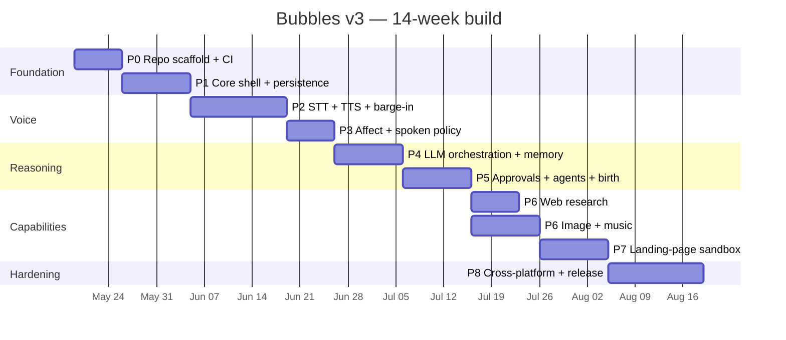
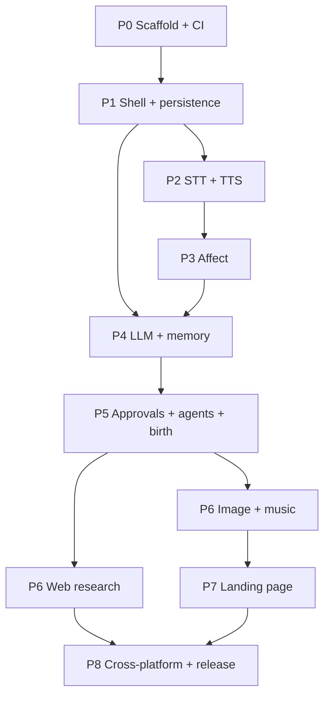

# Bubbles v3 — Full Development Plan

> **Audience:** Engineering managers, tech leads, contributors.
> **Pair with:** [01-Full-Functional-Requirements.md](01-Full-Functional-Requirements.md) for the capability scope this plan delivers.

---

## 1. Plan Overview

Bubbles v3 is built in **eight phases over ~14 weeks** by a team of **2 senior + 1 mid-level Electron/TypeScript engineers** (assumed). Each phase has a hard Definition of Done; no phase begins until the previous phase's DoD passes.



---

## 2. Team & Roles

| Role | Responsibility |
|---|---|
| **Tech lead** | Architecture, IPC contract, code review, cross-platform gates |
| **Voice & AI engineer** | STT, TTS, affect, LLM orchestration, prompt design |
| **Frontend / UX engineer** | Avatar, chat, approvals, settings, accessibility |
| **QA contractor (P5+)** | Playwright E2E, manual acceptance, cross-platform smoke |
| **Designer (part-time)** | Avatar sprites, mood transitions, chat & approval UI, OS-native feel |

---

## 3. Phase Detail

### Phase 0 — Repo Scaffold + CI (Week 1)

**Goal:** A green CI on Day 7 with `pnpm build`, `pnpm test`, `pnpm typecheck`, `pnpm lint`, `pnpm e2e:smoke`.

**Tasks:**
- pnpm + Turborepo monorepo: `apps/desktop`, `apps/renderer`, `packages/shared-types`, `packages/shared-logger`, `packages/persistence`, `packages/voice`, `packages/llm`, `packages/agents`, `packages/approvals`, `packages/capabilities`, `packages/observability`.
- TypeScript 5.6 + Biome 2 + Vitest 3 + Playwright 1.50.
- `electron-vite@3` + Vite 6 + React 19 + Tailwind 4.
- `electron-builder@26` config skeleton for Win/Mac/Linux.
- GitHub Actions: `verify.yml` (Ubuntu — lint + typecheck + unit), `e2e-win.yml`, `e2e-mac.yml` (Windows + macOS runners — smoke).
- Pre-commit hook: `biome check` + `pnpm typecheck`.
- `.env.example` documents all keys (`ANTHROPIC_API_KEY`, `DEEPGRAM_API_KEY`, `ELEVENLABS_API_KEY`, `OPENAI_API_KEY`, `REPLICATE_API_TOKEN`, `SUNO_API_KEY`, `TAVILY_API_KEY`, `HUME_API_KEY`).

**Definition of Done:**
- ✅ Skeleton Electron app launches on Win/Mac/Linux dev machines.
- ✅ All three CI workflows green.
- ✅ Renderer + main + preload bundled to `apps/desktop/out/` and runs in `electron .`.
- ✅ `better-sqlite3` rebuilds correctly across ABIs (Node test + Electron prod).

### Phase 1 — Core Shell + Persistence (Weeks 2–3)

**Goal:** Avatar window + chat panel render, SQLite persists state across relaunch.

**Tasks:**
- Two BrowserWindow setup ([Backend Plan §3.1](03-Full-Backend-Plan.md)).
- PixiJS 8 avatar with one mood (idle) + drag/click.
- React 19 chat panel shell with composer + message list.
- Preload bridge with typed `window.bubbles.*` API (`getState`, `sendMessage`, `togglePanel`, `setMood`, `onStateChange`).
- `better-sqlite3@12.x` schema migration 001:
  ```sql
  conversations, messages, memories (headroom), timeline_events,
  approvals, agents_index, cost_events, permissions, settings
  ```
- `app-state` IPC + broadcast.
- Setup wizard scaffolding (welcome → API key → done; no provider tests yet).
- API key storage via Electron `safeStorage`.
- Cross-platform `keepAvatarAbovePanel` validation.
- Tray icon + `Ctrl/Cmd+Space` global shortcut.

**Definition of Done:**
- ✅ Avatar visible on all three OSes; drag persists position across relaunch.
- ✅ Click toggles panel; panel position auto-flips at screen edges.
- ✅ Type into composer → user message appears + echoes back via test responder.
- ✅ Setup wizard captures Anthropic key, verifies with `messages.create` ping, persists encrypted.
- ✅ SQLite WAL files visible in `<userData>/`; relaunch restores active conversation.
- ✅ E2E smoke (Playwright) passes on Win + Mac CI.

### Phase 2 — STT + TTS + Barge-In (Weeks 4–5)

**Goal:** Voice in, voice out, can interrupt.

**Tasks:**
- `@bubbles/voice` package:
  - `SttProvider` interface; implementations: `DeepgramSttProvider`, `WhisperSttProvider`, `WhisperCppSttProvider`.
  - `TtsProvider` interface; implementations: `ElevenLabsTtsProvider`, `OpenAiTtsProvider`, `PiperTtsProvider`.
  - `VoiceSessionStateMachine`: `idle → listening → processing → speaking → idle`.
  - `BargeInDetector` over PCM input frames.
- Renderer mic capture via `getUserMedia({audio: {sampleRate: 16000, channelCount: 1}})`.
- Real-time audio piping to main via `MessageChannel` (chunked Int16Array).
- Audio playback via `MediaSource` + `SourceBuffer` for streaming MP3 / Opus.
- `useVoiceSession` React hook orchestrating local UI state.
- Mic permission probe on setup; OS-specific guidance modal.
- Cross-platform mic device enumeration + picker in Settings.
- VAD via `@ricky0123/vad-web` (in-renderer WebAssembly VAD; ~700 ms post-roll).
- Push-to-talk via space-bar hold (configurable).
- Captions component mirrors STT partial + TTS playback.
- Trace events: `voice.session_started / voice.partial / voice.final / voice.barge_in / tts.first_byte / tts.completed`.
- Fixture mode: deterministic transcript + silent MP3 (from Version B's test mode pattern).

**Definition of Done:**
- ✅ Push-to-talk: hold space, speak, release → final transcript renders, LLM (test responder for now) replies, TTS plays end-to-end.
- ✅ Barge-in: speaking over TTS within 200 ms cancels playback and starts a new turn.
- ✅ All three STT providers selectable in Settings; fallback chain triggers on simulated 5xx.
- ✅ All three TTS providers selectable; fallback chain triggers on simulated 5xx.
- ✅ Captions visible during listening + speaking.
- ✅ Acceptance tests C1-01..C1-03, C2-01..C2-03 pass.

### Phase 3 — Affect + Spoken Policy (Week 6)

**Goal:** Emotional Interaction Layer wired into every turn.

**Tasks:**
- `AffectDetector` (regex baseline from Version A — ported).
- Claude Haiku affect classifier (one-shot prompt + Zod-validated JSON).
- Hume EVI prosody analyzer (audio in → `arousal`, `valence`, dominant emotion) — fed during voice turns.
- Merge strategy: regex (cheap) + Haiku (text accuracy) + EVI (audio richness) → unified `AffectTag`.
- `SpokenResponsePolicy` module (Version A's port — keep, tune thresholds).
- Avatar mood mapper updated to use full affect: `frustrated → concerned`, `urgent → working (faster fps)`, `satisfied → celebrating`.
- TTS `voice_style` parameter map per agent × affect.
- Trace events: `affect.detected / affect.merged`.

**Definition of Done:**
- ✅ 50-turn affect eval dataset shows ≥ 80 % correct primary-label classification.
- ✅ Mood transitions on the avatar match the intended affect in design review.
- ✅ Spoken responses > 280 chars are summarized to two sentences + chat marker.
- ✅ ElevenLabs receives `style` parameter that demonstrably changes voice quality (qualitative).

### Phase 4 — LLM Orchestration + Memory (Weeks 7–8)

**Goal:** Replace the test responder with real Claude turns; conversational memory persists.

**Tasks:**
- `@bubbles/llm` package wrapping Anthropic SDK:
  - `LlmClient` with streaming, tool use, prompt caching.
  - System-prompt builder: agent skills.md + recent memories + active affect.
  - Token-budget enforcer (8k input cap; oldest non-pinned messages trimmed).
- `MemoryStore`:
  - `MemoryItem`: `id, type, content, agentId, tags, importance, createdAt, updatedAt`.
  - Explicit "Remember…" parser.
  - Claude Haiku extractor runs after each non-trivial turn.
  - Redaction on insert AND on read (defense in depth from Version A).
- `TimelineStore`:
  - `TimelineEvent`: `id, type, title, summary, taskId?, agentId?, memoryId?, approvalId?, metadata, createdAt`.
- `IntentClassifier` (regex; Version A's port) deciding `general.chat / research.web / coding.* / creative.* / agent.create / memory.remember`.
- `FlowRouter`:
  - For `general.chat` → `LlmClient.stream(...)`.
  - For routed intents → defer to capability handler (will be filled in P5–P7).
- Cost meter recording per-turn Claude usage.
- Daily spend cap pre-gate.

**Definition of Done:**
- ✅ Real Claude streaming replies appear in chat with TTS playback.
- ✅ "Remember that I prefer 10 am meetings" → memory row in DB + timeline event.
- ✅ Next turn's prompt includes the recent memory as context (verifiable in trace events).
- ✅ Daily cap pre-gate blocks turns when exceeded; user sees friendly error.
- ✅ Spend dashboard shows live cost accumulation.

### Phase 5 — Approvals + Agents + Birth (Weeks 9–10)

**Goal:** Approval gate + multi-agent + Agents Birth System.

**Tasks:**
- `@bubbles/approvals`:
  - `ApprovalService` (SQLite, port from Version A).
  - `RiskClassifier` (port).
  - `VoiceApprovalResolver` (cancel-first regex, retry/fallback) — port.
  - Approval modal in renderer with risk-colored cards.
  - Diff viewer (Version B port) for `writeFile` previews.
  - Payload-scoped Always-Allow (`tool_name + sha256(args)`) — new for v3.
- `@bubbles/agents`:
  - `AgentRegistry` (filesystem-backed, port from B).
  - `SkillsCompiler` using `gray-matter` for frontmatter.
  - `AgentBirthService`:
    - Claude Sonnet structured-output prompt with Zod schema.
    - Hard-blocked visual fields enforced at schema validation.
    - Preview UI in renderer (Agents → Birth panel).
    - `agent_file_create` approval → file write on approval.
- Ship three preset agents seeded into workspace agents dir on first launch:
  - `bubbles` (white, general, read-only).
  - `coda` (blue, coding, write + plan).
  - `sage` (mauve, research, read-only + cite).
- Agent switcher dropdown in chat panel header.

**Definition of Done:**
- ✅ All preset agents load on first launch from filesystem.
- ✅ Switching agents starts a new conversation (per-agent history).
- ✅ Voice-driven approve/deny/cancel resolves the most recent pending approval.
- ✅ Agent Birth: voice "create a QA agent" → preview → approve → file written + active agent switched within 5 s.
- ✅ Visual-field LLM injection attempted in eval — schema validator rejects.

### Phase 6 — Web Research + Image + Music (Weeks 11–12)

**Goal:** Three creative/research capabilities end-to-end.

**Track A — Web Research (Week 11, 1 engineer):**
- `TavilyWebSearchAdapter` (primary).
- `BraveWebSearchAdapter` (fallback).
- `FixtureWebSearchAdapter` (test mode).
- `WebResearchHandler`: search → Claude Sonnet synthesis with citation-required prompt → chat card.
- Approval: low risk, auto-approved unless agent setting overrides.

**Track B — Image (Week 11, 1 engineer):**
- `ReplicateImageAdapter` (FLUX 1.1 Pro primary).
- `OpenAiImageAdapter` (gpt-image-1).
- `StabilityImageAdapter` (SDXL fallback).
- `ImageGenerationHandler`: prompt → adapter → save to `<userData>/artifacts/image-<ts>/image.png` → chat card with preview.
- Approval: medium risk.

**Track C — Music (Weeks 11–12, 1 engineer):**
- `SunoMusicAdapter` (primary).
- `ReplicateMusicAdapter` (MusicGen fallback).
- `FixtureMusicAdapter` (curated library).
- `MusicGenerationHandler`: same shape as image; polling for Suno's async job model.
- Approval: medium risk.

**Cross-Track:**
- Cost meter records all three per provider × model.
- `bubbles-artifact://` protocol handler (port from A) renders artifacts in chat.

**Definition of Done:**
- ✅ Voice "look up best espresso machines" → cited chat card in ≤ 5 s.
- ✅ Voice "make a logo for Cloud Cafe" → preview in chat in ≤ 15 s.
- ✅ Voice "make me a lo-fi beat" → playable audio in ≤ 60 s.
- ✅ Each capability triggers its fallback when primary is offline (test flag).
- ✅ Acceptance tests C4-01..C5-02, C7-01..C7-02 pass.

### Phase 7 — Landing-Page Sandbox (Weeks 13–14)

**Goal:** Voice-to-landing-page end-to-end with sandboxing.

**Tasks:**
- `@bubbles/capabilities/landing-page`:
  - Claude Sonnet structured-output generator (HTML, CSS, vite config, package.json) using a strict Zod schema.
  - In-process a11y checker (regex/DOM scan; rules: `html[lang]`, `h1`, `img[alt]`, `label[for]`, `aria-label` on icon buttons).
  - Color-contrast check via `wcag-contrast` npm.
  - Programmatic `vite.build()` call (not shell-out).
  - Static file server (Node `http`) with path-traversal guard.
  - `findAvailablePort` from 4173 upward.
  - `assertSandboxPath` enforcement.
- Approval card preview shows full workflow + sandbox folder path.
- `shell.openExternal(url)` on success.
- Iterative refinement: same sandbox folder when the brief hash matches.

**Definition of Done:**
- ✅ Voice "build me a landing page for Cloud Cafe" → approval → browser opens in ≤ 8 s.
- ✅ All five a11y rules enforced; failing rules block build with chat explanation.
- ✅ Sandbox escape test (synthetic `../../etc/hosts`) → rejected before write.
- ✅ Iterative refinement reuses folder; second build is faster.

### Phase 8 — Cross-Platform Hardening + Release (Weeks 15–16)

**Goal:** Beta-ready installer for all three platforms.

**Tasks:**
- Cross-platform smoke matrix on real devices: Win 10, Win 11, macOS 13 (Intel + Apple Silicon), Ubuntu 22.04, Ubuntu 24.04.
- HiDPI verification: avatar renders correctly at 100 %, 125 %, 150 %, 200 %, 250 % scale.
- Multi-monitor: avatar restoration logic verified across monitor add/remove.
- Performance budget audit (Section 5.4 of Functional Requirements).
- API key migration tooling (none yet — but write the migration framework for future use).
- Error reporting (opt-in) via Sentry (optional).
- Auto-update scaffolding (`electron-updater`) — wired but disabled in v3.0.
- Cost-cap UX polish + spend dashboard charts.
- Redacted log export wired to "Export logs" menu.
- License + privacy policy in About dialog.
- Final acceptance run of all C1–C10 tests on all three OSes.
- `electron-builder` packaging:
  - **Windows:** NSIS installer + portable zip.
  - **macOS:** Universal DMG (Intel + Apple Silicon).
  - **Linux:** AppImage + .deb.

**Definition of Done:**
- ✅ Three installers exist; each installs cleanly on a fresh VM.
- ✅ All C1–C10 acceptance tests pass on all three OSes in test mode + live mode.
- ✅ Installer size ≤ 250 MB per platform.
- ✅ Crash-free startup rate ≥ 99 % across 100 cold launches per platform.
- ✅ Documentation: README + setup guide + troubleshooting + privacy policy.

---

## 4. Dependency Graph



Hard ordering: **P2 (voice) must finish before P3 (affect)**, because affect detection benefits from real audio paths.  **P4 (LLM) must finish before P5 (agents)**, because agent skills.md gets fed to Claude.  P6 tracks parallelize; P7 depends on P6's adapter pattern.

---

## 5. Risk Register

| ID | Risk | Likelihood | Impact | Mitigation |
|---|---|---|---|---|
| R1 | Deepgram WebSocket reliability on Windows Electron | Medium | High (C1) | Test on Win 10 + Win 11 in P2; pre-validate WS lib choices; Whisper HTTPS fallback within 500 ms |
| R2 | ElevenLabs API quota exhaustion mid-demo | Medium | Medium (C2) | OpenAI TTS auto-fallback; daily cap pre-gate; clear toast |
| R3 | PixiJS HiDPI scaling regressions across OSes | High | High (Version B failure) | Explicit `devicePixelRatio` reads; cross-OS smoke test in P1 + P8; ResizeObserver-driven canvas |
| R4 | Mic permission denied on macOS — silent failure | Medium | High (C1) | Pre-flight `navigator.permissions.query` + OS-specific guidance in P2 |
| R5 | `better-sqlite3` ABI mismatch in Electron 32 vs Node 22 | Low | Medium | `electron-rebuild` in CI; `select-sqlite-binary.mjs` pattern from Version B |
| R6 | Hume EVI rate limits / cost | Medium | Low (C3) | EVI is enhancement only; regex baseline ensures affect always works |
| R7 | Suno API access (currently invite/paid) | High | High (C4) | Suno via Topmediai API gateway as alternative; MusicGen ready as primary if Suno unavailable |
| R8 | Anthropic Claude availability during demo | Low | High (everything) | Same-API-shape Sonnet 4.6 + Opus 4.7 swap; OpenAI GPT-4o + Anthropic SDK abstraction allows secondary LLM |
| R9 | Replicate cold-start latency for FLUX | Medium | Medium (C5) | Pre-warm with a 1×1 ping on first launch; user toast if cold |
| R10 | Cross-platform installer size > 250 MB | Medium | Low | electron-builder asar packaging + asset compression in P8 |
| R11 | Voice barge-in race conditions | Medium | High (C1+C2) | Strict state machine with timestamps; integration test specifically targets <200 ms cutover |
| R12 | Landing-page Vite build memory spike on cheap dev machines | Low | Medium (C6) | Vite build in worker thread with 1 GB heap limit; fail gracefully |
| R13 | Code signing (macOS notarization) delays release | High | Medium | v3.0 ships unsigned + signed v3.0.1; clear "Open anyway" instructions |
| R14 | Spurious approval modal due to LLM hallucinated tool args | Medium | Medium | Zod-validated tool args at gateway; invalid → tool result "invalid args" without modal |
| R15 | Affect classification false-positives on sarcasm | Medium | Low | Documented limitation; regex tuned conservative; design review checkpoint |

---

## 6. Milestone Checklist (External-Facing)

| Milestone | Date | Artifact |
|---|---|---|
| M0 — Public scaffold | Week 1 | GitHub repo green CI |
| M1 — Internal alpha | End of Week 5 | Voice in / voice out works; basic chat |
| M2 — Internal beta | End of Week 10 | All capabilities scaffolded; approvals + agents shipping |
| M3 — Closed beta | End of Week 14 | Image + music + landing page demos |
| M4 — Public beta | End of Week 16 | Installers for Win/Mac/Linux |

---

## 7. Definition of Done — Project Level

The project ships v3.0 when:
1. All C1–C10 acceptance tests pass on Win/Mac/Linux in both test mode and live mode.
2. All risks in Section 5 have either been **mitigated** (with evidence) or **accepted** (documented in README).
3. P95 latency budgets (Functional Requirements §5.4) verified on a mid-tier device (e.g., M1 MacBook Air, mid-range Windows laptop).
4. Installer size + signing status documented; "Open anyway" guidance live.
5. Privacy policy + license + acceptable-use review by legal (if applicable).
6. Public README with screenshots + 90-second demo video.
7. CHANGELOG.md from M0 onward; semantic versioning (`0.x.y` during beta).

---

## 8. Post-v3.0 Backlog (v3.x Maintenance + v4 Planning)

**v3.0.x patches:**
- macOS notarization
- Sentry opt-in error reporting
- Auto-update channel turned on
- High-contrast theme polish

**v3.1 minor (≈ 6 weeks post-v3.0):**
- Custom voice cloning (ElevenLabs voice library upload)
- Conversation list UI (DB headroom already present)
- Per-agent system prompt overrides via Settings UI

**v4 planning items:**
- Email + Calendar (Gmail/Google Calendar OAuth)
- Vector recall over `memories` (`sqlite-vec` + Voyage embeddings)
- Multi-agent delegation
- Plugin SDK + third-party agent marketplace
- Real-time vision input (screenshot Q&A)

---

## 9. References

- [01-Full-Functional-Requirements.md](01-Full-Functional-Requirements.md) — capability acceptance criteria.
- [03-Full-Backend-Plan.md](03-Full-Backend-Plan.md) — services + APIs.
- [04-Full-Frontend-Plan.md](04-Full-Frontend-Plan.md) — UI structure.
- [05-Full-AI-Integrations-Plan.md](05-Full-AI-Integrations-Plan.md) — model + provider choices.
- [06-Full-ThirdParty-Integrations-Plan.md](06-Full-ThirdParty-Integrations-Plan.md) — vendor specifics.
- [00-Audit-and-Decision-Log.md](00-Audit-and-Decision-Log.md) — kept/dropped/rebuilt decisions.
