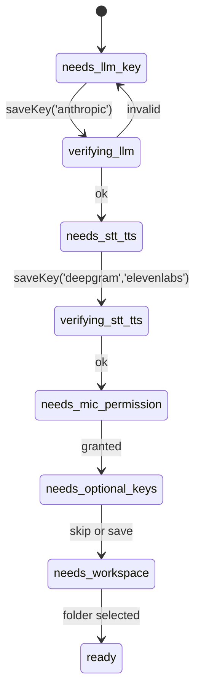

# Bubbles v3 — Full Backend Plan

> **Audience:** Backend / Electron-main engineers.
> **Pair with:** [05-Full-AI-Integrations-Plan.md](05-Full-AI-Integrations-Plan.md) for model-side concerns and [04-Full-Frontend-Plan.md](04-Full-Frontend-Plan.md) for renderer-side coupling.

---

## 1. Architectural Overview

```mermaid
flowchart TB
    subgraph Renderer["Renderer (React, no Node)"]
        UI[Avatar + Chat + Approvals + Settings]
    end

    subgraph Preload["Preload (contextBridge)"]
        Bridge[window.bubbles.* (typed)]
    end

    subgraph Main["Electron Main (Node 22)"]
        IPC[IPC Router v1:*]
        Orch[Turn Orchestrator]
        Voice[Voice Pipeline]
        LLM[LLM Client]
        Memory[MemoryStore]
        Approval[ApprovalService]
        Agent[AgentRegistry + Birth]
        Cap[Capability Handlers]
        Conn[Provider Adapters]
        Cost[CostMeter]
        Trace[TraceLogger]
        Safe[safeStorage]
        Sand[Sandbox + Static Server]
    end

    subgraph Persistence["Local Persistence"]
        DB[(better-sqlite3<br/>bubbles.sqlite)]
        FS[(<userData>/artifacts)]
        KC[(OS Keychain<br/>via safeStorage)]
        Logs[(<userData>/task-logs)]
    end

    subgraph External["External APIs (HTTPS only)"]
        Anthropic
        Deepgram
        ElevenLabs
        OpenAI
        Replicate
        Suno
        Tavily
        Hume
    end

    UI <--> Bridge <--> IPC
    IPC --> Orch
    Orch --> Voice & LLM & Cap & Memory & Approval & Agent
    Voice --> Conn
    LLM --> Conn
    Cap --> Conn
    Cap --> Sand
    Conn --> External
    Memory --> DB
    Approval --> DB
    Cost --> DB
    Trace --> Logs
    Safe --> KC
    Sand --> FS
```

### Key invariants
1. **Renderer never speaks to the network.** All HTTPS goes through main.
2. **Renderer never imports Node modules.** `contextIsolation: true`, `nodeIntegration: false`, `sandbox: true` (yes — full sandbox; renderer code must be pure browser-context).
3. **One main process owns the canonical app state.** Both windows are kept in sync via `app:state` broadcast.
4. **Every IPC channel is `v1:*` and Zod-validated** at registration time.
5. **No `child_process.spawn`** except for Piper TTS local binary.
6. **No CLI dependency** — all AI providers are SDK + HTTPS only.

---

## 2. Process Topology

| Process | Tech | Responsibilities |
|---|---|---|
| **Main** | Electron 32 main + Node 22 | Windows, IPC, persistence, all AI provider calls, sandbox |
| **Renderer (Avatar)** | Chromium + React 19 + PixiJS 8 | Avatar window only — sprite, drag, mood |
| **Renderer (Panel)** | Chromium + React 19 | Full workspace — chat, approvals, settings |
| **Preload** | Chromium isolated world | `contextBridge.exposeInMainWorld('bubbles', ...)` |
| **Worker thread (in-main)** | Node `worker_threads` | Vite build for landing-page sandbox; heavy CPU isolated from event loop |

Window roles are discriminated by URL query `?window=avatar|panel`.

---

## 3. Workspace Layout (Backend)

```
apps/desktop/
├── src/
│   ├── main/
│   │   ├── index.ts                      # Boot orchestration
│   │   ├── windows/
│   │   │   ├── avatar.ts                 # Frameless, transparent, always-on-top
│   │   │   ├── panel.ts                  # Docked workspace
│   │   │   └── bounds.ts                 # Multi-monitor restoration
│   │   ├── ipc/
│   │   │   ├── router.ts                 # v1:* registration + Zod gate
│   │   │   ├── turnHandler.ts            # User-turn orchestration
│   │   │   ├── voiceIpc.ts               # STT/TTS state machine
│   │   │   ├── approvalIpc.ts
│   │   │   ├── approvalVoiceIpc.ts
│   │   │   ├── memoryIpc.ts
│   │   │   ├── agentIpc.ts
│   │   │   ├── settingsIpc.ts
│   │   │   ├── setupIpc.ts
│   │   │   ├── capabilityIpc.ts
│   │   │   └── logsIpc.ts
│   │   ├── protocol/
│   │   │   └── bubblesArtifact.ts        # bubbles-artifact://
│   │   ├── tray.ts
│   │   ├── shortcuts.ts                  # Ctrl/Cmd+Space global
│   │   ├── autoUpdate.ts                 # Dormant scaffolding
│   │   └── boot.ts                       # First-launch tasks
│   └── preload/
│       └── index.ts                      # contextBridge surface

packages/
├── shared-types/      Zod + TS types for every IPC + domain entity
├── shared-logger/     pino + redactSecrets + withTurnId
├── persistence/       better-sqlite3 + DAOs + migrations
├── observability/     TraceLogger + NDJSON writer
├── secure/            safeStorage wrappers + redactSecrets
├── voice/             STT/TTS pipeline + providers + VAD wrapper
├── llm/               Claude client + memory + intent + flow router
├── agents/            AgentRegistry + SkillsCompiler + BirthService
├── approvals/         ApprovalService + RiskClassifier + VoiceResolver
├── capabilities/
│   ├── research/      Tavily/Brave adapters + synthesis
│   ├── image/         Replicate/OpenAI/Stability adapters
│   ├── music/         Suno/Replicate adapters
│   └── landing-page/  Generator + a11y + Vite + sandbox + server
└── cost/              CostMeter + daily-cap pre-gate
```

---

## 4. IPC Contract (v1)

Every channel has the prefix `v1:` and a Zod schema in `packages/shared-types/src/ipc.ts`.

### 4.1 Channel registration pattern

```ts
// packages/shared-types/src/ipc.ts
import { z } from 'zod';

export const VersionedChannel = z.string().regex(/^v1:[a-z0-9:_-]+$/);

export const SendMessageRequest = z.object({
  turnId: z.string().uuid(),
  text: z.string().min(1).max(8000),
  agentId: z.string().min(1),
  conversationId: z.string().uuid().optional(),
  inputMode: z.enum(['voice', 'text']),
  affect: AffectTagSchema.optional(),
});
export type SendMessageRequest = z.infer<typeof SendMessageRequest>;

export const IPC = {
  app: {
    getState: 'v1:app:get-state',
    sendMessage: 'v1:app:send-message',
    state: 'v1:app:state',
  },
  voice: {
    startSession: 'v1:voice:start-session',
    stopSession: 'v1:voice:stop-session',
    submitAudioChunk: 'v1:voice:submit-audio-chunk',
    submitFinal: 'v1:voice:submit-transcript',
    speak: 'v1:voice:speak',
    stopSpeaking: 'v1:voice:stop-speaking',
    bargeIn: 'v1:voice:barge-in',
    event: 'v1:voice:event',
  },
  // ...
} as const;
```

### 4.2 Channel table

| Channel | Mode | Request | Response |
|---|---|---|---|
| `v1:app:get-state` | invoke | — | `AppState` |
| `v1:app:send-message` | invoke | `SendMessageRequest` | `{turnId, status}` |
| `v1:app:state` | send (M→R) | — | `AppState` |
| `v1:voice:start-session` | invoke | `{provider?}` | `VoiceSessionState` |
| `v1:voice:stop-session` | invoke | — | `VoiceSessionState` |
| `v1:voice:submit-audio-chunk` | send (R→M) | `Int16Array` (chunked) | — |
| `v1:voice:submit-transcript` | send (R→M) | `{turnId, transcript}` | — |
| `v1:voice:speak` | invoke | `{turnId, text, voiceId, style?}` | `{ttsId}` |
| `v1:voice:stop-speaking` | send | — | — |
| `v1:voice:barge-in` | send | `{turnId}` | — |
| `v1:voice:event` | send (M→R) | `VoiceEvent` (partial, final, error, etc.) | — |
| `v1:agents:list` | invoke | — | `{agents: AgentSummary[]}` |
| `v1:agents:activate` | invoke | `{agentId}` | `{ok, activeAgent}` |
| `v1:agents:birth-preview` | invoke | `{request: string}` | `AgentBirthDraft` |
| `v1:agents:create-approved` | invoke | `{approvalId, draft}` | `{agent}` |
| `v1:memory:list` | invoke | `{limit?, agentId?}` | `{memories: MemoryItem[]}` |
| `v1:memory:timeline` | invoke | `{limit?}` | `{events: TimelineEvent[]}` |
| `v1:memory:clear` | invoke | — | `{ok}` |
| `v1:approvals:list` | invoke | — | `{approvals}` |
| `v1:approvals:approve` | invoke | `{id}` | `Approval` |
| `v1:approvals:deny` | invoke | `{id}` | `Approval` |
| `v1:approvals:cancel` | invoke | `{id}` | `Approval` |
| `v1:approvals:voice-resolve` | invoke | `{approvalId?, voiceTurnId, transcript}` | `ResolveOutcome` |
| `v1:setup:get-status` | invoke | — | `SetupStatus` |
| `v1:setup:save-key` | invoke | `{provider, key}` | `SetupStatus` |
| `v1:setup:test-provider` | invoke | `{provider}` | `{ok, error?}` |
| `v1:setup:status` | send (M→R) | `SetupStatus` | — |
| `v1:settings:get` | invoke | — | `Settings` |
| `v1:settings:update` | invoke | `Partial<Settings>` | `Settings` |
| `v1:capabilities:open-artifact` | invoke | `{path}` | `{ok}` |
| `v1:logs:export-redacted` | invoke | — | `{path}` |
| `v1:window:move-by` | send | `{dx, dy}` | — |
| `v1:panel:toggle` | send | — | — |
| `v1:panel:close` | send | — | — |

### 4.3 Validation gate

```ts
// apps/desktop/src/main/ipc/router.ts
export function registerHandler<TReq, TRes>(
  channel: string,
  requestSchema: z.ZodType<TReq>,
  handler: (req: TReq, event: Electron.IpcMainInvokeEvent) => Promise<TRes>,
): void {
  if (!VersionedChannel.safeParse(channel).success) {
    throw new Error(`Invalid channel name: ${channel}`);
  }
  ipcMain.handle(channel, async (event, raw) => {
    const parsed = requestSchema.safeParse(raw);
    if (!parsed.success) {
      logger.warn({channel, errors: parsed.error.flatten()}, 'ipc.invalid_payload');
      return {ok: false, error: 'invalid_payload'};
    }
    try {
      return {ok: true, data: await handler(parsed.data, event)};
    } catch (err) {
      logger.error({channel, err: redactSecrets(String(err))}, 'ipc.handler_error');
      return {ok: false, error: 'internal_error'};
    }
  });
}
```

---

## 5. Turn Orchestration

The **Turn Orchestrator** is the entry point for every user input (voice or text). It owns the lifecycle of a single user turn from input to TTS completion.

```mermaid
sequenceDiagram
    participant R as Renderer
    participant Orch as Turn Orchestrator
    participant Affect as AffectDetector
    participant Cap as Cost meter pre-gate
    participant Mem as Memory store
    participant Router as FlowRouter
    participant LLM
    participant Cap2 as Capability handler
    participant Approval as ApprovalService
    participant TTS

    R->>Orch: v1:app:send-message {turnId, text, inputMode, audioFeatures?}
    Orch->>Affect: classify(text, audioFeatures)
    Affect-->>Orch: AffectTag
    Orch->>Cap: ensureUnderDailyCap()
    Cap-->>Orch: ok | refused
    alt refused
        Orch-->>R: message: friendly cap error; avatar=concerned
    else ok
        Orch->>Mem: getRecent({agentId, limit:8})
        Mem-->>Orch: MemoryItem[]
        Orch->>Router: route({text, agentId, intent})
        alt direct LLM
            Router-->>Orch: handled=false
            Orch->>LLM: stream({systemPrompt, memory, affect, history})
            LLM-->>Orch: stream deltas
            Orch-->>R: stream deltas (v1:app:state appends)
        else capability
            Router->>Cap2: run(taskType, params)
            alt requires approval
                Cap2->>Approval: create(ApprovalRequest)
                Approval-->>Orch: pending
                Orch-->>R: avatar=waiting_approval, approval card
                Note over R,Approval: user resolves (voice or click)
                Approval-->>Orch: approved → handleApprovalResolved
                Orch->>Cap2: executeApproved(...)
            end
            Cap2-->>Orch: result + artifacts
        end
        Orch->>Mem: extractAndPersist({turnId, text, response})
        Orch->>TTS: speak({turnId, voiceText, voiceId, style})
        TTS-->>R: streamed audio (v1:voice:event)
    end
```

### 5.1 State machine for a turn

```
received → routing → executing → responding → speaking → done
                              ↘ awaiting_approval → resuming → executing
                              ↘ errored
```

Trace events emitted at every transition.

---

## 6. Persistence

### 6.1 Database

`better-sqlite3@12.x`, single file `<userData>/bubbles.sqlite`, `PRAGMA journal_mode=WAL`, `PRAGMA foreign_keys=ON`, `PRAGMA busy_timeout=5000`.

### 6.2 Schema (migration 001)

```sql
CREATE TABLE schema_meta (key TEXT PRIMARY KEY, value TEXT NOT NULL);
INSERT INTO schema_meta(key, value) VALUES ('version', '001');

CREATE TABLE conversations (
  id TEXT PRIMARY KEY,
  agent_id TEXT NOT NULL,
  started_at INTEGER NOT NULL,
  ended_at INTEGER,
  summary TEXT
);

CREATE TABLE messages (
  id TEXT PRIMARY KEY,
  conversation_id TEXT NOT NULL REFERENCES conversations(id) ON DELETE CASCADE,
  role TEXT NOT NULL CHECK (role IN ('user','assistant','tool','system')),
  content TEXT NOT NULL,
  tool_name TEXT,
  tool_args TEXT,
  tool_result TEXT,
  affect TEXT,                 -- JSON
  input_mode TEXT,             -- voice|text
  turn_id TEXT,
  created_at INTEGER NOT NULL
);
CREATE INDEX idx_messages_conv_created ON messages(conversation_id, created_at);

CREATE TABLE memories (
  id TEXT PRIMARY KEY,
  type TEXT NOT NULL,
  content TEXT NOT NULL,
  agent_id TEXT,
  source_message_id TEXT REFERENCES messages(id),
  tags TEXT,                   -- JSON array
  importance INTEGER NOT NULL CHECK (importance BETWEEN 1 AND 5),
  created_at INTEGER NOT NULL,
  updated_at INTEGER NOT NULL
);
CREATE INDEX idx_memories_agent_imp ON memories(agent_id, importance DESC, created_at DESC);

CREATE TABLE timeline_events (
  id TEXT PRIMARY KEY,
  type TEXT NOT NULL,
  title TEXT NOT NULL,
  summary TEXT,
  task_id TEXT,
  agent_id TEXT,
  memory_id TEXT REFERENCES memories(id) ON DELETE SET NULL,
  approval_id TEXT,
  metadata TEXT,               -- JSON
  created_at INTEGER NOT NULL
);
CREATE INDEX idx_timeline_created ON timeline_events(created_at DESC);

CREATE TABLE approvals (
  id TEXT PRIMARY KEY,
  task_id TEXT,
  agent_id TEXT,
  action_type TEXT NOT NULL,
  risk TEXT NOT NULL CHECK (risk IN ('low','medium','high')),
  title TEXT NOT NULL,
  explanation TEXT NOT NULL,
  preview TEXT NOT NULL,       -- JSON (redacted on insert)
  status TEXT NOT NULL CHECK (status IN ('pending','approved','denied','cancelled')),
  attempt_count INTEGER NOT NULL DEFAULT 0,
  resolved_at INTEGER,
  created_at INTEGER NOT NULL
);
CREATE INDEX idx_approvals_status_created ON approvals(status, created_at);

CREATE TABLE permissions (
  id TEXT PRIMARY KEY,
  tool_name TEXT NOT NULL,
  payload_hash TEXT NOT NULL,   -- sha256(JSON.stringify(args))
  decision TEXT NOT NULL CHECK (decision IN ('allow','deny','allow_always')),
  decided_at INTEGER NOT NULL,
  expires_at INTEGER
);
CREATE UNIQUE INDEX uq_permissions_tool_payload ON permissions(tool_name, payload_hash);

CREATE TABLE cost_events (
  id TEXT PRIMARY KEY,
  provider TEXT NOT NULL,
  kind TEXT NOT NULL CHECK (kind IN ('llm','stt','tts','image','music','search','affect')),
  model TEXT,
  input_tokens INTEGER,
  output_tokens INTEGER,
  characters INTEGER,
  seconds REAL,
  units INTEGER,
  cost_usd REAL NOT NULL,
  turn_id TEXT,
  created_at INTEGER NOT NULL
);
CREATE INDEX idx_cost_created ON cost_events(created_at DESC);

CREATE TABLE settings (
  key TEXT PRIMARY KEY,
  value TEXT NOT NULL
);

-- Connector / provider state cached for UI
CREATE TABLE provider_state (
  id TEXT PRIMARY KEY,         -- 'anthropic', 'deepgram', etc.
  name TEXT NOT NULL,
  auth_status TEXT NOT NULL,   -- not_configured|ready|invalid|needs_auth
  health_status TEXT NOT NULL, -- healthy|degraded|unhealthy
  last_checked_at INTEGER,
  last_error TEXT,
  updated_at INTEGER NOT NULL
);
```

### 6.3 DAO pattern

All SQL lives in `packages/persistence/src/dao/*`. No SQL outside DAOs (rule lifted directly from Version B's "Foundation Enablers").

```ts
// packages/persistence/src/dao/messages.ts
export function createMessageDao(db: BetterSqlite3.Database) {
  const insert = db.prepare(`INSERT INTO messages
    (id, conversation_id, role, content, tool_name, tool_args, tool_result, affect, input_mode, turn_id, created_at)
    VALUES (?,?,?,?,?,?,?,?,?,?,?)`);

  return {
    insertMessage(input: NewMessage): void {
      insert.run(
        input.id, input.conversationId, input.role, input.content,
        input.toolName ?? null, input.toolArgs ?? null, input.toolResult ?? null,
        input.affect ? JSON.stringify(input.affect) : null,
        input.inputMode ?? null, input.turnId ?? null, input.createdAt
      );
    },
    // listByConversation, deleteByConversation, etc.
  };
}
```

### 6.4 Secrets

- API keys: `safeStorage.encryptString(key)` → stored in `provider_state.value` (or a separate `secrets` table); OS-keychain-backed.
- Loaded into memory at startup; cleared on quit.
- Never sent to renderer (only redacted form like `sk-***ng...3a` for the Settings UI).

---

## 7. Voice Pipeline

### 7.1 STT Provider Interface

```ts
// packages/voice/src/stt/SttProvider.ts
export interface SttProvider {
  id: 'deepgram' | 'whisper' | 'whisper-cpp';
  startSession(opts: SttSessionOptions): Promise<SttSession>;
}

export interface SttSession {
  sendAudio(chunk: Int16Array): void;
  finalize(): Promise<void>;
  cancel(): void;
  on(event: 'partial' | 'final' | 'error' | 'closed', handler: Function): void;
}
```

### 7.2 Deepgram (primary)

Stream raw 16 kHz PCM audio to `wss://api.deepgram.com/v1/listen?model=nova-3&encoding=linear16&sample_rate=16000&interim_results=true&endpointing=300`.

```ts
class DeepgramSttSession implements SttSession {
  private ws: WebSocket;
  private emitter = new EventEmitter();

  constructor(apiKey: string, opts: SttSessionOptions) {
    this.ws = new WebSocket(buildUrl(opts), {
      headers: { Authorization: `Token ${apiKey}` }
    });
    this.ws.on('message', (data) => {
      const msg = JSON.parse(data.toString());
      const transcript = msg.channel?.alternatives?.[0]?.transcript;
      if (msg.is_final) this.emitter.emit('final', transcript);
      else if (transcript) this.emitter.emit('partial', transcript);
    });
  }
  sendAudio(chunk: Int16Array) {
    if (this.ws.readyState === WebSocket.OPEN) {
      this.ws.send(Buffer.from(chunk.buffer));
    }
  }
  async finalize() {
    this.ws.send(JSON.stringify({ type: 'CloseStream' }));
    await once(this.emitter, 'closed');
  }
  cancel() { this.ws.close(); }
}
```

### 7.3 Whisper API (fallback)

Buffer entire utterance (max 30 s), POST as `multipart/form-data` to `https://api.openai.com/v1/audio/transcriptions` with `model=whisper-1`.

### 7.4 whisper.cpp (local, last resort)

- Bundled `ggml-base.en.bin` (~140 MB) shipped with the installer.
- Wrapped via `whisper.cpp` Node bindings (`@bubbles/whisper-node` — thin native addon).
- Used when no network or both cloud providers fail.

### 7.5 TTS Provider Interface

```ts
export interface TtsProvider {
  id: 'elevenlabs' | 'openai' | 'piper';
  synthesizeStream(opts: TtsOptions): AsyncIterable<Buffer>; // audio frames
}
```

### 7.6 ElevenLabs Turbo v2.5 (primary)

WebSocket streaming from `wss://api.elevenlabs.io/v1/text-to-speech/{voice_id}/stream-input?model_id=eleven_turbo_v2_5`. Frames arrive as Opus or MP3 chunks. First-byte typically ≤ 300 ms.

Voice IDs (curated; see [05-Full-AI-Integrations-Plan.md §4.2](05-Full-AI-Integrations-Plan.md)):
- **Bubbles** — `EXAVITQu4vr4xnSDxMaL` (Sarah, warm)
- **Coda** — `TX3LPaxmHKxFdv7VOQHJ` (Liam, focused)
- **Sage** — `pNInz6obpgDQGcFmaJgB` (Adam, measured)

### 7.7 OpenAI TTS (fallback)

`POST /v1/audio/speech` with `model: 'tts-1-hd'`, voices: `alloy`, `echo`, `nova`. Streaming via SSE.

### 7.8 Piper (offline)

Bundled `piper.exe` / `piper` binary + `en_US-amy-medium.onnx` voice model (~63 MB). Invoked via `child_process.spawn('piper', ['-m', model, '-f', '-'])`, audio piped over stdout.

### 7.9 Voice Session State Machine

States: `idle | listening | processing | speaking | error`.

Transitions are governed by `VoiceSessionStateMachine` with strict guards:

```ts
const transitions: Record<State, Partial<Record<Event, State>>> = {
  idle:       { startMic: 'listening' },
  listening:  { final: 'processing', cancel: 'idle' },
  processing: { ttsStarted: 'speaking', error: 'error', cancel: 'idle' },
  speaking:   { ttsEnded: 'idle', bargeIn: 'listening', cancel: 'idle' },
  error:      { reset: 'idle' },
};
```

Barge-in works because `speaking` accepts `bargeIn` directly. Implementation:
1. Renderer's VAD detects user voice > -40 dBFS for 80 ms while in `speaking` state.
2. Sends `v1:voice:barge-in {turnId}`.
3. Main calls `ttsSession.cancel()` (closes WS) and starts a new listening session.

### 7.10 VAD

`@ricky0123/vad-web` runs Silero VAD via WASM in renderer; emits `speech_start` and `speech_end` events. Configured with:
- `positiveSpeechThreshold`: 0.85
- `negativeSpeechThreshold`: 0.35
- `redemptionFrames`: 14 (~700 ms of silence post-roll)

---

## 8. LLM Client

`packages/llm/src/LlmClient.ts` wraps `@anthropic-ai/sdk` with streaming, tool use, and prompt caching.

### 8.1 Prompt structure

```
[system, cache_control=ephemeral]
  - Bubbles persona base prompt
  - <agent skills.md content>
  - Active tools manifest (Zod-derived JSON schema)
  - Current affect summary
[messages]
  - last 8 conversation turns
  - top 4 memories by importance for active agent
  - current user message
```

Prompt caching: the system block is cached at 1024-token boundary; agent skills.md typically caches across turns (5-minute TTL).

### 8.2 Streaming + tool use

```ts
const stream = await client.messages.stream({
  model: 'claude-sonnet-4-6',
  max_tokens: 1024,
  system: buildSystemBlocks({ agent, affect, tools }),
  messages: history,
  tools: toolManifest,
});
for await (const event of stream) {
  if (event.type === 'content_block_delta' && event.delta.type === 'text_delta') {
    emit('delta', event.delta.text);
  }
  if (event.type === 'content_block_start' && event.content_block.type === 'tool_use') {
    emit('tool_call_start', event.content_block);
  }
  // ... tool input deltas, content_block_stop, message_stop
}
```

### 8.3 Cost tracking

`stream.finalMessage().usage` provides `input_tokens`, `output_tokens`, `cache_read_input_tokens`, `cache_creation_input_tokens`. CostMeter computes via pricing table (see [06-Full-ThirdParty-Integrations-Plan.md §3](06-Full-ThirdParty-Integrations-Plan.md)).

---

## 9. Capability Handlers

Each capability is a self-contained module under `packages/capabilities/`. The interface:

```ts
export interface CapabilityHandler<TInput, TOutput> {
  taskType: TaskType;
  classify(text: string): boolean;          // optional fast-path classifier
  prepare(input: TInput): Promise<{
    approvalRequest?: NewApprovalRequest;
    plan: TaskPlan;
  }>;
  execute(input: TInput, ctx: ExecutionContext): Promise<TOutput>;
}
```

### 9.1 Web Research

```ts
// packages/capabilities/research/index.ts
async execute({ query }: { query: string }, ctx) {
  const results = await this.searchProvider.search(query, { maxResults: 10 });
  const synthesis = await ctx.llm.stream({
    system: CITATION_SYSTEM_PROMPT,
    messages: [{ role: 'user', content: buildSynthesisPrompt(query, results) }],
    model: 'claude-sonnet-4-6',
    max_tokens: 600,
  });
  return { summary: synthesis.text, citations: results };
}
```

### 9.2 Image Generation

```ts
async execute({ prompt, size }: { prompt: string; size?: string }, ctx) {
  await ctx.approval.requireApproved(ctx.approvalId);
  const outDir = path.join(ctx.artifactRoot, `image-${ctx.turnId}`);
  await mkdir(outDir, { recursive: true });
  const provider = await this.pickProvider();
  const bytes = await provider.generate({ prompt, size: size ?? '1024x1024' });
  const filePath = path.join(outDir, 'image.png');
  await writeFile(filePath, bytes);
  return { kind: 'image', path: filePath, provider: provider.id };
}
```

### 9.3 Music Generation

Polls Suno's async job (`POST /generate` → returns `id`, `GET /status/{id}` until `complete`). Fallback to Replicate MusicGen (sync, slower).

### 9.4 Landing Page

```ts
async execute({ brief }: { brief: string }, ctx) {
  await ctx.approval.requireApproved(ctx.approvalId);
  const siteId = sha256(brief).slice(0, 12);
  const siteDir = path.join(ctx.sandboxRoot, siteId);
  assertSandboxPath(ctx.sandboxRoot, siteDir);

  // 1. Generate
  const draft = await this.generateSiteDraft(brief, ctx.llm);
  await this.writeDraft(siteDir, draft);

  // 2. A11y
  const checks = await this.runA11yChecks(siteDir);
  if (!checks.passed) throw new A11yFailedError(checks);

  // 3. Build (programmatic Vite)
  await this.runViteBuild(siteDir);

  // 4. Serve
  const port = await findAvailablePort(4173);
  const server = await createStaticServer({ root: path.join(siteDir, 'dist'), port });

  // 5. Open
  await shell.openExternal(`http://127.0.0.1:${port}`);
  return { kind: 'site', url: server.url, path: siteDir };
}
```

`runViteBuild` uses `vite.build({root, build:{outDir:'dist'}})` from a worker thread to avoid blocking main.

---

## 10. Approval System

Direct port of Version A's `ApprovalService` (best-in-class design), with three v3 enhancements:

1. **Payload-scoped Always-Allow** (`permissions(tool_name, payload_hash)`).
2. **Approval previews** carry an `artifactRef` for showing diff/preview in the modal.
3. **Voice resolver** handles `cancel` before `deny` (port from A).

### 10.1 Risk classifier

```ts
export function classifyApprovalRisk(actionType: ActionType): ApprovalRisk {
  if (actionType === 'agent_file_create') return 'medium';
  if (LOW_RISK.has(actionType)) return 'low';        // web_search, file_read, list_dir
  if (CREATIVE_TASKS.has(actionType)) return 'medium'; // image, music
  return 'high';                                       // write_file, shell, deploy, send
}
```

### 10.2 Side-effect routing

After approval flips to `approved`, the orchestrator looks up which executor to call from a registry:

```ts
type ResolveHandler = (approval: ApprovalRequest, ctx: ResolveCtx) => Promise<void>;
const handlers: Map<ActionType, ResolveHandler> = new Map([
  ['agent_file_create', agentBirthExecutor],
  ['file_write', fileWriteExecutor],
  ['shell_command', landingPageExecutor], // only allow-listed callers register
  ['image_generation', imageExecutor],
  ['music_generation', musicExecutor],
]);
```

---

## 11. Sandbox & Static Server

### 11.1 Sandbox rules

- **Sandbox root:** `<userData>/artifacts/landing-pages/`.
- `assertSandboxPath(root, target)`: resolves both, ensures `target` is within `root` (no `..` escape).
- Allowed file types: `html`, `css`, `js`, `json`, `svg`, `webp`, `png`.
- Max site size: 5 MB.
- Files written: only by the landing-page handler.

### 11.2 Static server

```ts
// packages/capabilities/landing-page/server.ts
export async function createStaticServer({ root, port }: Opts) {
  const server = http.createServer((req, res) => {
    const urlPath = decodeURIComponent(new URL(req.url!, 'http://localhost').pathname);
    const target = path.join(root, urlPath === '/' ? 'index.html' : urlPath);
    if (!isInside(root, target)) {
      res.writeHead(403); res.end('Forbidden'); return;
    }
    fs.createReadStream(target)
      .on('error', () => { res.writeHead(404); res.end('Not Found'); })
      .pipe(res);
  });
  await new Promise<void>((r) => server.listen(port, '127.0.0.1', r));
  return { url: `http://127.0.0.1:${port}`, stop: () => server.close() };
}
```

### 11.3 `bubbles-artifact://` protocol

```ts
protocol.registerSchemesAsPrivileged([
  { scheme: 'bubbles-artifact', privileges: { secure: true, standard: true, stream: true, supportFetchAPI: true } }
]);

app.whenReady().then(() => {
  protocol.handle('bubbles-artifact', async (req) => {
    const url = new URL(req.url);
    const target = path.resolve(artifactRoot, url.pathname.replace(/^\/+/, ''));
    if (!isInside(artifactRoot, target)) return new Response('Forbidden', { status: 403 });
    return net.fetch(pathToFileURL(target).toString());
  });
});
```

---

## 12. Observability

`packages/observability/src/trace.ts` (port from Version A) + `packages/shared-logger/src/index.ts` (pino).

### 12.1 Trace events

NDJSON to `<userData>/task-logs/observability.ndjson`. Each event:
```json
{
  "ts": 1737648000123,
  "traceId": "trace-uuid",
  "voiceTurnId": "vt-uuid",
  "turnId": "turn-uuid",
  "taskId": "task-uuid",
  "approvalId": null,
  "ttsId": "tts-uuid",
  "name": "voice.final",
  "fields": { "transcript": "[REDACTED-on-secret]", "provider": "deepgram", "ms_to_final": 612 }
}
```

`sanitizeFields` runs `redactSecrets` on every string field before write.

### 12.2 Log files

- `<userData>/task-logs/observability.ndjson` — trace events.
- `<userData>/task-logs/<turnId>.log` — per-turn structured pino lines.

### 12.3 Export

`v1:logs:export-redacted` zips both files (already redacted by construction) and opens the parent folder in OS file manager.

---

## 13. Cost Meter

```ts
// packages/cost/src/index.ts
export interface CostEvent {
  provider: string;
  kind: 'llm' | 'stt' | 'tts' | 'image' | 'music' | 'search' | 'affect';
  model?: string;
  inputTokens?: number;
  outputTokens?: number;
  characters?: number;
  seconds?: number;
  units?: number;
  turnId?: string;
}

export class CostMeter {
  constructor(private dao: CostDao, private pricing: PricingTable) {}

  record(event: CostEvent): void {
    const cost_usd = this.pricing.compute(event);
    this.dao.insert({ ...event, cost_usd, created_at: Date.now() });
  }

  todayUsd(): number { return this.dao.sumSince(startOfDay()); }
  daySummary(days: number): DaySummary[] { return this.dao.summaryByDay(days); }
  isOverCap(capUsd: number): boolean {
    return capUsd > 0 && this.todayUsd() >= capUsd;
  }
}
```

Pricing table values come from [06-Full-ThirdParty-Integrations-Plan.md §3](06-Full-ThirdParty-Integrations-Plan.md). The table is data, not code — hot-swappable via settings.

---

## 14. Setup State Machine

Port the Version A setup state machine, but provider-agnostic.



Status persisted to `<userData>/setup-status.json`. Always interpretable across launches.

---

## 15. Cross-Platform Specifics

| Concern | Win | Mac | Linux |
|---|---|---|---|
| Always-on-top z-order | `setAlwaysOnTop(true,'screen-saver')` | Same, + `setVisibleOnAllWorkspaces(true,{visibleOnFullScreen:true})` | `setAlwaysOnTop(true,'screen-saver')` |
| Transparent window | `transparent:true` + `frame:false`; **no `vibrancy`** | `transparent:true` + `vibrancy:'under-window'` | `transparent:true`; depends on compositor |
| Mic permission | Implicit on first capture; system dialog | macOS 14+ requires `NSMicrophoneUsageDescription` in Info.plist; system prompt | Implicit; PulseAudio/PipeWire |
| Keychain | DPAPI via `safeStorage` | Apple Keychain via `safeStorage` | libsecret via `safeStorage` |
| Tray icon | 16×16 .ico | 22×22 PNG, monochrome template | 22×22 PNG, color |
| Global shortcut | `globalShortcut.register('Control+Space', ...)` | `Cmd+Space` reserved → use `Cmd+Shift+Space` | `Control+Space` |
| File associations | None in v3 | None in v3 | None in v3 |
| Packaging | NSIS .exe + portable zip | Universal .dmg | AppImage + .deb |

DPI handling (fix for Version B's UI deformity):

```ts
// main/index.ts
app.commandLine.appendSwitch('high-dpi-support', '1');
// Do NOT force device scale factor — let OS handle it.

// In renderer, when creating PixiJS Application:
const app = new PIXI.Application();
await app.init({
  width: 256,
  height: 280,
  backgroundAlpha: 0,
  resolution: window.devicePixelRatio,    // ← critical fix
  autoDensity: true,                       // ← critical fix
  antialias: false,                        // pixel art
});
```

---

## 16. Security Model

1. **Renderer sandbox:** `sandbox: true`, `nodeIntegration: false`, `contextIsolation: true`, no remote module.
2. **Preload surface:** typed `window.bubbles.*` only; no raw IPC access from renderer.
3. **CSP:** `default-src 'self'; img-src 'self' bubbles-artifact: data: blob:; media-src 'self' bubbles-artifact: blob:; connect-src 'self' wss://api.deepgram.com wss://api.elevenlabs.io;` — outbound network is restricted to whitelisted providers (renderer only; main can call anything).
4. **Approval gate:** every destructive action.
5. **Redaction:** every persistence write + log line + error message.
6. **Path scoping:** workspace + sandbox roots; `..` rejected.
7. **API keys:** `safeStorage` only; never logged, never sent to renderer in raw form.
8. **No `eval`, no `new Function`** — Biome rule enforces.
9. **Dependencies:** weekly `pnpm audit` in CI; pinned versions in `pnpm-lock.yaml`.

---

## 17. Test Strategy (Backend)

| Layer | Approach |
|---|---|
| DAOs | In-memory `better-sqlite3(':memory:')` |
| Provider adapters | Inject `fetch` mock; assert request shapes |
| Voice pipeline | Inject `SttProvider` and `TtsProvider` mocks; fake audio buffers |
| Approval service | Time-traveling `now()` injection |
| Orchestrator | Mock LLM with deterministic streams; mock capabilities |
| IPC | Mock `ipcMain.handle`; assert dispatch + side effects |
| End-to-end | Playwright + Electron, `BUBBLES_TEST_MODE=1` |

---

## 18. Failure Mode Catalog

| Failure | Detection | Response |
|---|---|---|
| Anthropic 5xx | `try/catch` around `client.messages.stream` | Retry with exponential backoff (3 attempts, 1–8 s); user sees toast on final failure |
| Anthropic 401 | HTTP code | "Anthropic key is invalid. Open Settings to update." Setup state set to `needs_llm_key`. |
| Deepgram WS close mid-stream | `ws.on('close', cb)` | Switch to Whisper API, replay buffered audio |
| Whisper 429 | HTTP code | Fall back to whisper.cpp |
| ElevenLabs WS error | `ws.on('error', cb)` | Switch to OpenAI TTS for this turn |
| OpenAI TTS 5xx | HTTP code | Switch to Piper |
| Replicate prediction failure | `prediction.error` | Try OpenAI Images |
| Suno job stuck > 90 s | Timer | Cancel, switch to Replicate MusicGen |
| Tavily quota | HTTP 429 | Switch to Brave Search |
| `better-sqlite3` ABI mismatch | Boot-time `new Database` throws | Fatal — show "Reinstall required" dialog |
| Disk full on artifact write | `fs.writeFile` ENOSPC | Friendly error in chat; no charge counted |
| Mic device removed mid-turn | `getUserMedia` track ends | Cancel turn; toast |

---

## 19. References

- [04-Full-Frontend-Plan.md](04-Full-Frontend-Plan.md) — UI surface that consumes these IPC contracts.
- [05-Full-AI-Integrations-Plan.md](05-Full-AI-Integrations-Plan.md) — provider details + prompt design.
- [06-Full-ThirdParty-Integrations-Plan.md](06-Full-ThirdParty-Integrations-Plan.md) — vendor specifics + costs.
- [00-Audit-and-Decision-Log.md](00-Audit-and-Decision-Log.md) — kept/dropped/rebuilt rationale.
