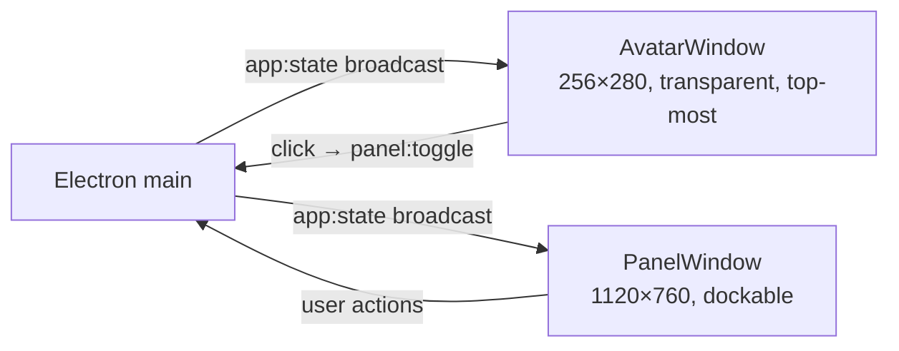
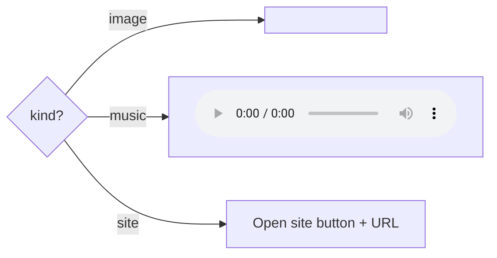

# Bubbles v3 — Full Frontend Plan

> **Audience:** Frontend / UX engineers + designers.
> **Pair with:** [03-Full-Backend-Plan.md](03-Full-Backend-Plan.md) for the IPC surface this UI consumes.
> **Explicit goal:** Fix the **UI rendering / deformity bug from Version B** while keeping the cross-window pet metaphor from Versions A + B.

---

## 1. Overview

Bubbles v3's frontend is a single Vite + React 19 bundle that mounts as **two distinct windows** discriminated by URL query:

- `?window=avatar` — the floating pixel-art pet (PixiJS canvas + minimal HUD).
- `?window=panel` — the full assistant workspace (chat, approvals, settings, agents, memory).

Both windows share the same main-process app state via the typed `window.bubbles` preload bridge.

### Design principles

1. **Voice is the headline.** Mic button is the largest interactive element in the panel header; captions are always visible during STT/TTS.
2. **Emotion is visible.** Avatar mood is the primary affect channel; chat bubble accents reinforce.
3. **Approvals are unmissable.** Risk-colored cards float above chat with high-contrast borders.
4. **Diff is honest.** Every file write shows a before/after side-by-side preview before approval.
5. **Fail loud, recover quietly.** Errors render as concrete chat lines (no silent failures); fallbacks happen in main without UI flicker.
6. **OS-native feel without bespoke chrome.** Frameless windows with respectful padding; standard system fonts; no over-customized titlebars on Mac/Win.

---

## 2. Tech Stack

| Concern | Choice | Pin |
|---|---|---|
| Framework | React 19 (concurrent renderer; `use` hook) | 19.0.x |
| Build | Vite 6 + electron-vite 3 | 6.0.x / 3.x |
| Language | TypeScript 5.6 strict | 5.6.x |
| Styling | Tailwind CSS 4 + CSS variables | 4.0.x |
| Component lib (primitives) | Radix UI (Dialog, Toast, Tooltip, Switch) | latest |
| Icons | Lucide React | latest |
| State | Zustand 4 (small, no boilerplate) | 4.5.x |
| Audio (renderer) | Web Audio API + MediaSource + `@ricky0123/vad-web` | latest |
| Avatar | PixiJS 8 | 8.x |
| Forms | React Hook Form + Zod resolver | latest |
| Diff viewer | `react-diff-viewer-continued` | latest |
| Date / time | `date-fns` | 3.x |
| Accessibility testing | `@axe-core/playwright` | latest |
| Visual regression | Playwright snapshot | 1.50.x |

No CSS-in-JS (Tailwind covers it). No Storybook in v3 (revisit for v3.1).

---

## 3. Window Architecture

### 3.1 Two-window topology



The avatar window:
- Holds the PixiJS sprite + a small speech-bubble HUD that shows the last Bubbles reply.
- Stays above the panel via `setAlwaysOnTop(true, 'screen-saver')` re-asserted on panel focus events (port from Version A).
- Repositions to the bottom-right of the primary display work area if its saved bounds are off-screen (multi-monitor restore, port from Version B).

The panel window:
- Opens to the immediate top-left of the avatar (auto-flips to the right if it would clip the screen edge).
- Cmd/Ctrl+W or Esc closes it; the avatar remains visible.

### 3.2 PixiJS HiDPI fix (Version B's deformity root cause)

```ts
// apps/renderer/src/avatar/AvatarStage.tsx
import { Application, Assets, AnimatedSprite, settings, SCALE_MODES } from 'pixi.js';

settings.RESOLUTION = window.devicePixelRatio;
settings.SCALE_MODE = SCALE_MODES.NEAREST; // pixel art

const app = new Application();
await app.init({
  width: 256,
  height: 280,
  backgroundAlpha: 0,
  resolution: window.devicePixelRatio,
  autoDensity: true,
  antialias: false,
  preference: 'webgpu',  // WebGPU preferred on Win/Mac; falls back to WebGL2 automatically
});

// Track DPR changes (user moves to another display)
const dprQuery = window.matchMedia(`(resolution: ${window.devicePixelRatio}dppx)`);
dprQuery.addEventListener('change', () => {
  app.renderer.resolution = window.devicePixelRatio;
  app.renderer.resize(256, 280);
});
```

Three additional fixes:
1. **CSS sizing**: parent `<div>` sized in CSS pixels (`width: 256px; height: 280px`); the canvas gets correct backing-store size via `autoDensity`.
2. **ResizeObserver on the parent**: re-call `app.renderer.resize` if the parent ever changes (some users have window-zoom enabled). This was missing in B.
3. **No `<canvas>` `style.transform: scale(...)`**: Version B did this in some code paths, which compounded scaling errors. v3 strictly uses native canvas sizing only.

Validated on:
- Win 10 / 11 @ 100 %, 125 %, 150 %, 200 % display scaling
- macOS Retina + non-Retina (Intel + Apple Silicon)
- Ubuntu 22.04 GNOME @ 100 % and 200 % fractional scaling

---

## 4. Component Tree

```
App
├── if window=avatar:
│   ├── AvatarStage         (PixiJS canvas)
│   ├── SpeechBubble        (last reply HUD)
│   ├── ListeningHalo       (animated ring when listening)
│   └── (drag handlers wire to main IPC)
│
└── if window=panel:
    ├── WorkspaceHeader     (agent switcher, status pills, settings gear)
    ├── IntegrationStatusBar(setup state + provider health + voice readiness)
    ├── ColumnLayout
    │   ├── LeftRail
    │   │   ├── AgentSwitcher
    │   │   ├── AgentBirthPanel
    │   │   └── ConversationList     (DB headroom used; v3 ships UI)
    │   ├── CenterColumn
    │   │   ├── ChatSurface
    │   │   ├── VoiceControls + CaptionBar
    │   │   ├── ApprovalStack          (pending approvals stacked here)
    │   │   └── Composer               (textarea + send button + mic button)
    │   └── RightRail
    │       ├── SetupCard              (when not ready)
    │       ├── ConnectorSettings      (provider keys + health)
    │       ├── MemoryTimeline
    │       ├── SpendDashboard
    │       └── LogExport
    └── Modals
        ├── SetupWizard      (during onboarding)
        ├── DiffPreviewModal (for writeFile approvals)
        └── ConfirmDestructiveModal
```

---

## 5. State Management

### 5.1 Zustand store

```ts
// apps/renderer/src/state/store.ts
interface AppStore {
  // Mirrored from main via app:state
  activeAgent: AgentProfile | null;
  approvals: ApprovalRequest[];
  avatarState: AvatarState;
  availableAgents: AgentSummary[];
  messages: ChatMessage[];
  recentMemories: MemoryItem[];
  timelineEvents: TimelineEvent[];
  voiceState: VoiceSessionState;
  setupStatus: SetupStatus | null;
  settings: Settings;
  providers: ProviderState[];

  // Local-only UI state
  panelOpen: boolean;
  composerDraft: string;
  diffPreview: { path: string; before: string; after: string } | null;
  toasts: Toast[];

  // Actions
  applyAppState: (next: AppState) => void;
  setComposerDraft: (s: string) => void;
  // ...
}
```

`applyAppState` does a structural merge; the renderer never mutates `messages` etc. directly — it submits IPC commands and waits for the next `app:state` broadcast.

### 5.2 Why Zustand and not Redux/Jotai

- Zero boilerplate; fits the "single source from main" model.
- Time-traveling devtools available via middleware if needed.
- Smaller bundle than Redux Toolkit.

---

## 6. Avatar Rendering Details

### 6.1 Sprite catalogue

PixiJS Spritesheet: `assets/sprites/bubbles_v3.png` + `bubbles_v3.json`.

Atlas: 8 × 9 grid of 128×128 frames (one row per mood):

| Row | Mood | Frames | FPS | Loop |
|---|---|---|---|---|
| 0 | idle | 8 | 8 | yes |
| 1 | listening | 6 | 10 | yes |
| 2 | thinking | 6 | 10 | yes |
| 3 | working | 8 | 12 | yes |
| 4 | waiting_approval | 4 | 6 | yes |
| 5 | confused | 6 | 8 | once → idle |
| 6 | concerned | 6 | 8 | once → idle |
| 7 | celebrating | 8 | 12 | yes (forced 3 s) |
| 8 | sleeping | 4 | 4 | yes |

Per-agent **tint** applied to the sprite (Version B's pattern):
- `bubbles`: `0xFFFFFF` (white / default)
- `coda`: `0x6FB1FF` (blue)
- `sage`: `0xC9A8FF` (mauve)
- Custom agents pick from a curated palette of 12 tints.

### 6.2 Lip-sync

While TTS audio plays in the panel, the panel computes RMS amplitude via `AnalyserNode` and broadcasts to the avatar window through main:

```
panel → v1:audio:amplitude {turnId, rms} → main → v1:audio:amplitude_broadcast → avatar
```

Avatar applies a low-pass smoother (`smoothed = smoothed * 0.7 + rms * 0.3`) and scales `sprite.scale.y` by `1 + clamp(smoothed, 0, 1) * 0.15`. The sprite "breathes" in time with the voice.

### 6.3 Drag interaction

Pointer-down + move (≥ 5 px) starts drag; pointer-up below threshold is a click that toggles the panel.

```ts
// apps/renderer/src/avatar/AvatarStage.tsx
useEffect(() => {
  const handler = {
    pointerdown: (e: PointerEvent) => { downX = e.screenX; downY = e.screenY; dragging = false; },
    pointermove: (e: PointerEvent) => {
      const dx = e.screenX - downX, dy = e.screenY - downY;
      if (!dragging && Math.hypot(dx, dy) > 5) dragging = true;
      if (dragging) window.bubbles.window.moveBy(dx, dy);
    },
    pointerup: () => { if (!dragging) window.bubbles.panel.toggle(); },
  };
  // ...
});
```

The actual window move happens in main (avoids Win-specific quirks with `Electron.startMoving`).

---

## 7. Chat Surface

### 7.1 Message types

```ts
type ChatMessage =
  | { id: string; role: 'user'; text: string; affect?: AffectTag; inputMode: 'voice'|'text'; createdAt: number }
  | { id: string; role: 'assistant'; text: string; streaming: boolean; artifacts?: Artifact[]; citations?: Citation[]; createdAt: number }
  | { id: string; role: 'tool'; toolName: string; status: 'pending'|'success'|'denied'|'error'; result?: string; createdAt: number };
```

### 7.2 Streaming UI

Assistant messages render incrementally:
1. On first delta, a new message stub appears with `streaming: true`.
2. Each delta appends to its `text`; `requestAnimationFrame` batches DOM updates.
3. On `streaming: false`, a citation footer + artifact cards render.

Markdown rendering via `react-markdown` + `remark-gfm` (sanitized via `rehype-sanitize`). Code blocks use `shiki` for syntax highlighting.

### 7.3 Artifact cards



Each card has consistent affordances: **Open**, **Save copy…**, **Regenerate**, plus the per-kind cost in USD.

---

## 8. Voice UX

### 8.1 Mic button states

| State | Visual | ARIA label |
|---|---|---|
| `idle` (mic ready) | Mic icon, neutral color | "Start voice input" |
| `listening` | Pulsing accent ring | "Listening (release to send)" |
| `processing` | Rotating spinner | "Processing your message" |
| `speaking` | Volume icon, animated | "Bubbles is speaking (click to interrupt)" |
| `error` | MicOff icon, red border | "Voice unavailable — using text" |
| `disabled` (no perm) | MicOff icon, dimmed | "Microphone permission required" |

### 8.2 Push-to-talk

- Hold Space (or configured key) → mic starts. Release → finalize.
- A subtle scale animation on the mic button + a "Hold to talk" tooltip.

### 8.3 Continuous mode

- Toggle in Settings.
- VAD auto-segments turns; visible by a "Listening" indicator at top of chat.
- Press Esc to disable.

### 8.4 Caption bar

Below the chat area, above the composer:

```
┌────────────────────────────────────────────────┐
│  • Listening:  "build me a landing page for…"  │   ← STT partial
└────────────────────────────────────────────────┘
```

During TTS:
```
┌────────────────────────────────────────────────┐
│  🔊 "Approved. I drafted the reply…"            │   ← caption mirror
│  [Tap or speak to interrupt]                    │
└────────────────────────────────────────────────┘
```

### 8.5 Barge-in affordance

While speaking:
- The mic button stays interactive.
- Renderer's VAD (`@ricky0123/vad-web`) emits speech-start; on the first frame, `v1:voice:barge-in` is dispatched and the caption switches back to STT mode.

---

## 9. Approval UI

### 9.1 Card design

```
┌─ approval-card (risk=high) ────────────────────┐
│ ⚠ High risk · Send to landing page sandbox     │
│                                                │
│ Bubbles will:                                  │
│  1. Generate index.html + style.css            │
│  2. Run accessibility checks                   │
│  3. Build with Vite                            │
│  4. Serve at 127.0.0.1:4173                    │
│  5. Open in browser                            │
│                                                │
│ Sandbox: <userData>/artifacts/landing-pages/   │
│          a1b2c3d4e5f6/                         │
│                                                │
│ Voice: say "approve", "deny", or "cancel"      │
│ [ Deny ] [ Cancel ]            [ Approve ]     │
└────────────────────────────────────────────────┘
```

Risk colors (Tailwind):
- `low` → `border-emerald-500 bg-emerald-50`
- `medium` → `border-amber-500 bg-amber-50`
- `high` → `border-rose-500 bg-rose-50`

### 9.2 Diff modal for file writes

`react-diff-viewer-continued` rendered inside a Radix Dialog. Two columns (before / after), syntax-highlighted, with collapsible unchanged blocks.

If the file doesn't exist, a single "Create new file" pane is shown with the proposed content.

### 9.3 Always-Allow

Above the buttons, a `Switch` labeled "Always allow this exact action" (payload-scoped). When toggled, approving creates a `permissions` row keyed by `tool_name + sha256(args)`.

### 9.4 Voice resolution feedback

When a voice "approve / deny / cancel" arrives, the card briefly flashes its border + plays a subtle audio chime + transitions out. If unclear:
- First retry: card stays; status text reads "I didn't catch that — say approve, deny, or cancel."
- Second retry fails: status reads "Please use the buttons." Voice path disabled for this card.

---

## 10. Setup Wizard

A Radix Dialog with `<fieldset>`-like steps. Each step is a separate React component:

```
<SetupWizard>
  <Stepper currentStep={setupStatus.state} />
  {state === 'welcome' && <WelcomeStep />}
  {state === 'needs_llm_key' && <LlmKeyStep />}
  {state === 'verifying_llm' && <VerifyingStep provider="anthropic" />}
  {state === 'needs_stt_tts' && <SttTtsKeysStep />}
  {state === 'needs_mic_permission' && <MicPermissionStep />}
  {state === 'needs_optional_keys' && <OptionalKeysStep />}
  {state === 'needs_workspace' && <WorkspaceStep />}
  {state === 'ready' && <SuccessStep />}
  {state === 'setup_error' && <ErrorStep />}
</SetupWizard>
```

Each input is masked + validated by Zod via React Hook Form. Verification is a live ping back via `v1:setup:test-provider`.

Mic permission step uses `navigator.permissions.query({name: 'microphone'})` and shows OS-specific manual-grant guidance if the permission was already denied.

---

## 11. Settings

Settings rail (right column) cards:

1. **Voice** — mic device picker, STT provider, TTS provider, voice preview button, push-to-talk key, continuous-listening toggle.
2. **Providers** — API key entry per provider (masked), test button, health pill.
3. **Spend** — daily cap (USD input), today/7d/30d totals + Recharts line chart, per-provider breakdown.
4. **Workspace** — folder path, browse button.
5. **Memory** — list of recent memories (clickable to delete), "Clear all" with confirmation modal.
6. **Accessibility** — high-contrast toggle, reduced-motion toggle, caption size.
7. **About** — version, license, privacy policy link, "Export redacted logs" button.

---

## 12. Accessibility

| Concern | Implementation |
|---|---|
| Keyboard navigation | Every interactive element reachable via Tab; focus rings visible |
| Screen readers | ARIA labels on avatar (mood-aware), chat surface (`aria-live=polite`), captions (`aria-live=assertive`), approval cards |
| Captions | Always available during TTS + STT |
| Reduced motion | `@media (prefers-reduced-motion: reduce)`: avatar transitions to static mood frame; chat scroll instant; no toast animations |
| High contrast | `@media (prefers-contrast: more)`: stronger borders, no semi-transparent backgrounds |
| Focus order | Logical: header → composer → chat history → approvals → settings rail |
| Color contrast | WCAG AA ≥ 4.5:1 for body text, 3:1 for large text (verified with axe + manual review) |
| Voice + click parity | Every voice action has a visible button equivalent |
| `prefers-color-scheme` | Light + dark themes via Tailwind `dark:` |

Accessibility test gate: `@axe-core/playwright` runs against the main panel + setup wizard + approval modal in every CI run.

---

## 13. Theming

Tailwind 4 with CSS variables:

```css
@theme {
  --color-bubbles-bg: 0 0% 100%;
  --color-bubbles-fg: 222 47% 11%;
  --color-bubbles-accent: 217 91% 60%;
  --color-bubbles-muted: 215 16% 47%;
  --color-risk-low: 142 71% 45%;
  --color-risk-medium: 38 92% 50%;
  --color-risk-high: 0 84% 60%;
}

.dark {
  --color-bubbles-bg: 222 47% 11%;
  --color-bubbles-fg: 0 0% 100%;
}
```

Components consume via `bg-[hsl(var(--color-bubbles-bg))]` patterns.

---

## 14. Performance Budget

| Metric | Budget |
|---|---|
| Cold render to avatar visible | ≤ 1.5 s |
| Panel open (window already created) | ≤ 200 ms |
| Time-to-interactive (panel) | ≤ 1 s |
| First chat message render | ≤ 100 ms after IPC delta |
| Lighthouse Accessibility (panel) | ≥ 95 |
| Bundle size (renderer) | ≤ 1.5 MB gzipped |
| PixiJS lazy import | sprite-only initial chunk |

Lazy load the panel's heavy components (`react-diff-viewer-continued`, `shiki`, `Recharts`) via `React.lazy`.

---

## 15. Internationalization (i18n)

v3.0 ships English only, but architecture is i18n-ready:
- Strings live in `apps/renderer/src/i18n/en.json`.
- `useT(key, vars?)` hook wraps `i18next`.
- Locale persists in Settings; loads at app boot.

Voice prompts (STT/TTS) include an explicit `language: 'en-US'` parameter; locale changes will swap that too.

---

## 16. Testing Strategy (Frontend)

| Layer | Approach |
|---|---|
| Pure utilities | Vitest unit tests (no DOM) |
| Components | React Testing Library + jsdom (Vitest config `environment: 'jsdom'`) |
| Hooks (`useVoiceSession`, `useAffect`, etc.) | `@testing-library/react-hooks` |
| Visual regression | Playwright snapshot tests (light + dark + reduced-motion + 200% DPR) |
| Accessibility | `@axe-core/playwright` in E2E suite |
| E2E flows | Playwright + Electron (smoke, voice mock, approval, settings) |
| Performance | Lighthouse CI on panel via headless Electron run |

Mock layer: `window.bubbles.*` is mocked in unit tests via a `BubblesBridgeMock` provider that resolves with deterministic state.

---

## 17. UI Failure-Mode Catalog (with Version B fixes)

| Symptom | Root cause | v3 fix |
|---|---|---|
| Avatar appears stretched / pixelated on HiDPI | PixiJS `resolution` not set to DPR | `resolution: window.devicePixelRatio` + `autoDensity: true` (see §3.2) |
| Avatar disappears after monitor unplug | Bounds restoration off-screen | Cross-display intersection check (port from V1) |
| Avatar shows behind panel | Z-order race | `keepAvatarAbovePanel()` on panel focus event |
| Chat scrolls under composer | Layout collapse on small heights | Flex layout with `min-h-0` on chat list + explicit composer height |
| Sprite tint persists across agent switch | Per-AnimatedSprite tint not cleared | `sprite.tint = newAgentTint` on every `playAnimation` call |
| Mood transitions snap back too fast | `celebrating` falls through to `idle` immediately | Forced 3 s minimum show time (port from V1) |
| Modal content overflows viewport on small displays | Fixed dialog width | `max-h-[80vh]` + `overflow-auto` |
| Approval card stack covers chat | Stack rendered as overlay | Stack rendered as part of chat column flow + smooth slide-in |
| Audio amplitude not updating avatar | Window-to-window messaging not wired in some builds | Single source of truth: main relays `v1:audio:amplitude_broadcast` |
| Window resize breaks PixiJS canvas | No ResizeObserver | `ResizeObserver` on parent re-resizes the PixiJS renderer |
| Caption flicker on streaming TTS | Captions re-rendered on each chunk | Caption text uses ref + only re-renders on text equality change |

---

## 18. Folder Layout (Frontend)

```
apps/renderer/
├── index.html
├── src/
│   ├── main.tsx                    # entry; selects window by ?window=
│   ├── App.tsx
│   ├── i18n/
│   │   └── en.json
│   ├── state/
│   │   ├── store.ts                # Zustand
│   │   └── bridge.ts               # Subscribes to window.bubbles.onStateChange
│   ├── avatar/
│   │   ├── AvatarStage.tsx
│   │   ├── SpeechBubble.tsx
│   │   └── animationCatalog.ts
│   ├── panel/
│   │   ├── WorkspaceLayout.tsx
│   │   ├── WorkspaceHeader.tsx
│   │   ├── IntegrationStatusBar.tsx
│   │   ├── chat/
│   │   │   ├── ChatSurface.tsx
│   │   │   ├── ChatMessage.tsx
│   │   │   ├── ArtifactCard.tsx
│   │   │   ├── ToolChip.tsx
│   │   │   └── Composer.tsx
│   │   ├── voice/
│   │   │   ├── VoiceControls.tsx
│   │   │   ├── CaptionBar.tsx
│   │   │   └── useVoiceSession.ts
│   │   ├── approvals/
│   │   │   ├── ApprovalStack.tsx
│   │   │   ├── ApprovalCard.tsx
│   │   │   └── DiffPreviewModal.tsx
│   │   ├── agents/
│   │   │   ├── AgentSwitcher.tsx
│   │   │   ├── AgentBirthPanel.tsx
│   │   │   └── AgentBirthPreview.tsx
│   │   ├── settings/
│   │   │   ├── ConnectorSettings.tsx
│   │   │   ├── SpendDashboard.tsx
│   │   │   ├── MemoryTimeline.tsx
│   │   │   └── AccessibilitySettings.tsx
│   │   └── setup/
│   │       ├── SetupWizard.tsx
│   │       ├── steps/*.tsx
│   │       └── Stepper.tsx
│   ├── components/
│   │   ├── Toast.tsx
│   │   ├── ConfirmDialog.tsx
│   │   ├── Pill.tsx
│   │   └── ...
│   ├── styles/
│   │   ├── globals.css
│   │   └── themes.css
│   └── lib/
│       ├── bubblesBridge.ts       # typed re-export of window.bubbles
│       ├── markdown.ts            # remark/rehype config
│       └── time.ts
└── public/
    ├── sprites/bubbles_v3.png
    └── sprites/bubbles_v3.json
```

---

## 19. UX Patterns Catalog

### 19.1 Empty states

- Chat empty → friendly greeting from the active agent + 3 suggested prompts as voice/text shortcuts.
- No memories → "Bubbles doesn't remember anything yet. Try saying 'Remember that…'"
- No approvals pending → hidden (stack collapses to zero height).

### 19.2 Confirmation patterns

- Destructive UI actions (clear memory, reset all providers, delete agent) → Radix Dialog with typed-to-confirm input (`Type "clear memory" to continue`).

### 19.3 Toast usage

- Success: green, 3 s.
- Info: blue, 4 s.
- Warning: amber, 5 s.
- Error: red, persistent until dismissed.
- Max 3 toasts stacked.

### 19.4 Skeletons

- Memory timeline: 3 row skeleton while loading.
- Spend dashboard: chart skeleton with shimmer.

---

## 20. References

- [03-Full-Backend-Plan.md](03-Full-Backend-Plan.md) — IPC contract this UI consumes.
- [01-Full-Functional-Requirements.md](01-Full-Functional-Requirements.md) — capability acceptance criteria.
- [05-Full-AI-Integrations-Plan.md](05-Full-AI-Integrations-Plan.md) — voice provider state visible in Voice settings.
- [00-Audit-and-Decision-Log.md](00-Audit-and-Decision-Log.md) — specifically Version B failure analysis.
