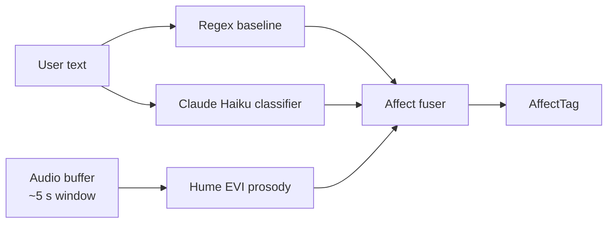

# Bubbles v3 — Full AI Integrations Plan

> **Audience:** AI / ML engineers, prompt designers.
> **Pair with:** [03-Full-Backend-Plan.md](03-Full-Backend-Plan.md) for provider abstraction shape and [06-Full-ThirdParty-Integrations-Plan.md](06-Full-ThirdParty-Integrations-Plan.md) for vendor specifics (auth, quotas, costs).

---

## 1. Overview

Bubbles v3 talks to **seven distinct AI provider categories**, every one of them via official SDK or direct HTTPS — **no CLI tools anywhere**. Each category has a primary provider, one or two fallbacks, and a deterministic fixture for test mode + offline operation.

| Category | Primary | Fallback 1 | Fallback 2 | Fixture |
|---|---|---|---|---|
| **LLM (reasoning)** | Anthropic Claude Sonnet 4.6 | Anthropic Opus 4.7 (escalation) | OpenAI GPT-4o | Canned reply by prompt match |
| **LLM (fast / cheap)** | Anthropic Claude Haiku 4.5 | OpenAI GPT-4o-mini | — | Canned reply |
| **STT** | Deepgram Nova-3 (WS) | OpenAI Whisper-1 (HTTPS) | whisper.cpp local (`ggml-base.en.bin`) | Fixed transcript |
| **TTS** | ElevenLabs Turbo v2.5 (WS) | OpenAI tts-1-hd (SSE) | Piper local (`en_US-amy-medium`) | Silent 42-byte MP3 |
| **Emotion / Affect (voice prosody)** | Hume EVI (audio events) | regex + Haiku text classifier | regex only | Static `neutral` tag |
| **Image generation** | Replicate FLUX 1.1 Pro | OpenAI gpt-image-1 | Stability AI SDXL | Synthetic SVG |
| **Music generation** | Suno v4.5 (via official Suno API) | Replicate MusicGen-Large | — | Pre-recorded library snippets |
| **Web search** | Tavily Search API (`tavily.search`) | Brave Search API | — | Local fixture results |
| **Agents Birth (structured JSON)** | Claude Sonnet 4.6 tool-use | Claude Opus 4.7 | OpenAI GPT-4o JSON mode | Hand-crafted preview |

A central `ProviderRouter` performs the fallback cascade with the following rules:
- HTTP 5xx, network error, or timeout > 12 s → try next provider.
- HTTP 4xx other than 429 → fail immediately (likely auth or content issue; no point retrying with the same payload elsewhere unless category-specific logic says so).
- 429 → respect `Retry-After` if ≤ 8 s, otherwise fall through to next provider.
- Two consecutive successful calls on a fallback → temporarily promote it as primary for that session (degrade-once, don't oscillate).

---

## 2. LLM (Reasoning)

### 2.1 Primary: Anthropic Claude Sonnet 4.6

**Model ID:** `claude-sonnet-4-6`
**SDK:** `@anthropic-ai/sdk@latest` (TypeScript)
**Auth:** `Authorization: Bearer <ANTHROPIC_API_KEY>` (env, stored in OS keychain).
**Why:** Best price/quality balance for v3's workload; first-class streaming + tool use + prompt caching; reliable HTTPS endpoint (no CLI).

**Request shape:**
```ts
const stream = await client.messages.stream({
  model: 'claude-sonnet-4-6',
  max_tokens: 1024,
  system: [
    { type: 'text', text: BUBBLES_BASE_PROMPT, cache_control: { type: 'ephemeral' } },
    { type: 'text', text: agent.skillsMarkdown, cache_control: { type: 'ephemeral' } },
    { type: 'text', text: buildAffectContext(affect) },
    { type: 'text', text: buildMemoryContext(memory) },
  ],
  messages: history,
  tools: toolManifest,
});
```

**Streaming events handled:**
- `message_start` → record token budget.
- `content_block_delta` (type=`text_delta`) → forward to renderer as chat delta.
- `content_block_start` (type=`tool_use`) → start a `ToolChip` in pending state.
- `content_block_delta` (type=`input_json_delta`) → buffer args incrementally.
- `content_block_stop` → finalize tool args; dispatch to approval gate or executor.
- `message_delta` → capture stop reason.
- `message_stop` → log usage; record cost event.

### 2.2 Escalation: Anthropic Claude Opus 4.7

**Model ID:** `claude-opus-4-7`
Used only for explicitly hard tasks:
- Landing-page generation (multi-section briefs).
- Agent Birth where the user request is ambiguous.
- Memory extraction when Sonnet returned empty results twice in a row.

Triggered by `taskType` ∈ `{ coding.landing_page, agent.create (>1 retry) }` or via an explicit `complexity: 'high'` flag the orchestrator can set.

### 2.3 Fallback: OpenAI GPT-4o

**Model ID:** `gpt-4o` (or `gpt-4o-2024-11-20`)
**SDK:** `openai@latest`
**Used when:** Anthropic returns 5xx three times in a row or the user has flipped a setting "Prefer OpenAI as fallback LLM" (Settings → Providers).

Conversion layer (`packages/llm/src/adapters/openaiAdapter.ts`) maps the `messages.stream` shape onto `chat.completions.create({stream:true})`, normalizes events back to the Anthropic-shaped event stream so the rest of the orchestrator code is provider-agnostic.

### 2.4 Prompt Design

**`BUBBLES_BASE_PROMPT`** (cached, ~700 tokens):
- Bubbles persona: warm, concise spoken summaries, accessibility considerations.
- Hard rules: never claim to perform an action that requires approval before it has been approved; cite sources for research; respect agent safety rules; reply within the spoken-policy character budget if the user is in voice mode.
- Output shape contract: assistant responses default to plain text; when invoking a tool, use the structured tool_use block.

**Per-agent skills (cached per-agent, ~300–900 tokens):**
Read from `agents/<id>/skills.md`, frontmatter-parsed with `gray-matter`. Sections injected:
- Personality
- Capabilities
- Rules
- Voice style hints

**Affect context (uncached, ~80 tokens):**
```
Current user affect: primary=frustrated, confidence=0.78, urgency=2, valence=-0.4, arousal=0.65.
Speak calmly. Acknowledge frustration briefly without dwelling. Default voice style: calm.
```

**Memory context (uncached, ~400 tokens):**
The top 4 memories by importance for the active agent, plus the top 4 most recent.

### 2.5 Prompt Caching Strategy

| Block | Cache control | Reason |
|---|---|---|
| `BUBBLES_BASE_PROMPT` | `cache_control: ephemeral` | Identical across all turns; > 1024 tokens (caching threshold met) |
| Agent skills.md | `cache_control: ephemeral` | Same per active agent; bursts within 5-min TTL |
| Tool manifest | `cache_control: ephemeral` | Stable per session |
| Affect | none | Changes every turn |
| Memory | none | Changes every turn |
| Message history | none | Grows every turn |

Expected cache-hit ratio after warm-up: **70–85 %** on the system block tokens.

### 2.6 Tool Use (Structured Outputs)

The same Anthropic tool-use mechanism is the gateway for capability execution. The orchestrator advertises tools whose names match `TaskType`s the active agent is allowed:

```ts
const toolManifest: Anthropic.Messages.Tool[] = [
  { name: 'read_file', description: 'Read a file from workspace', input_schema: ReadFileArgsSchemaJson },
  { name: 'write_file', description: 'Write a file (requires approval)', input_schema: WriteFileArgsSchemaJson },
  { name: 'list_dir', description: 'List a directory', input_schema: ListDirArgsSchemaJson },
  { name: 'web_search', description: 'Search the web', input_schema: WebSearchArgsSchemaJson },
  { name: 'generate_image', description: 'Generate an image (requires approval)', input_schema: ImageArgsSchemaJson },
  { name: 'generate_music', description: 'Generate music (requires approval)', input_schema: MusicArgsSchemaJson },
  { name: 'build_landing_page', description: 'Build a landing page (requires approval)', input_schema: LandingPageArgsSchemaJson },
  { name: 'remember', description: 'Save a memory', input_schema: RememberArgsSchemaJson },
];
```

JSON schemas are derived from Zod via `zod-to-json-schema`. The orchestrator validates the model's tool arguments against the same Zod schema before dispatching to the capability handler — defense-in-depth (LLM can hallucinate args).

### 2.7 Cost Tracking (LLM)

Pricing table (as of 2026-05; data, not code):

| Model | Input $/MTok | Output $/MTok | Cache write $/MTok | Cache read $/MTok |
|---|---|---|---|---|
| claude-sonnet-4-6 | 3.00 | 15.00 | 3.75 | 0.30 |
| claude-opus-4-7 | 15.00 | 75.00 | 18.75 | 1.50 |
| claude-haiku-4-5 | 0.80 | 4.00 | 1.00 | 0.08 |
| gpt-4o | 2.50 | 10.00 | — | 1.25 |
| gpt-4o-mini | 0.15 | 0.60 | — | 0.075 |

`stream.finalMessage().usage` provides the exact token counts; `CostMeter` records per turn.

---

## 3. Speech-to-Text (STT)

### 3.1 Primary: Deepgram Nova-3 (WebSocket streaming)

**SDK:** `@deepgram/sdk@latest`
**Endpoint:** `wss://api.deepgram.com/v1/listen`
**Why Nova-3:** Real-time WS streaming, partials within ~150 ms, end-of-speech detection ≤ 300 ms, ≤ 6 % WER on conversational English (Deepgram benchmark).

**URL parameters:**
- `model=nova-3`
- `encoding=linear16`
- `sample_rate=16000`
- `channels=1`
- `interim_results=true`
- `endpointing=300`
- `vad_events=true`
- `language=en-US`
- `smart_format=true`
- `punctuate=true`

**Event handling:** see [03-Full-Backend-Plan.md §7.2](03-Full-Backend-Plan.md).

**Failure triggers fallback:**
- WebSocket open fails twice → switch to Whisper API for this session.
- Any close with code != 1000 mid-utterance → buffered audio replayed to Whisper API.

### 3.2 Fallback 1: OpenAI Whisper API

**Model:** `whisper-1`
**Endpoint:** `POST https://api.openai.com/v1/audio/transcriptions`
**Why:** Best buffered (non-streaming) STT on the market; reliable HTTPS; cheap.

**Tradeoffs:**
- Non-streaming → user sees no partials, only the final transcript.
- 30 s max per request (we cap utterances at 28 s; longer pushes break into chunks server-side, but we don't enable that in v3).
- Latency: ~600–1200 ms post end-of-speech depending on length.

**Request:**
```ts
const file = await toFile(audioBuffer, 'utterance.wav');
const transcript = await openai.audio.transcriptions.create({
  file,
  model: 'whisper-1',
  language: 'en',
  response_format: 'json',
  temperature: 0,
});
```

### 3.3 Fallback 2: whisper.cpp (local)

**Binary:** `@bubbles/whisper-node` — thin Node N-API wrapper around `whisper.cpp` v1.7+.
**Model file:** `ggml-base.en.bin` (~141 MB) — shipped inside `apps/desktop/resources/whisper/`.

**Tradeoffs:**
- Slowest path (~1500 ms on M1 Air, ~3 s on Win mid-range).
- No partials.
- Offline-capable; chosen when both cloud providers fail or when "Offline mode" is set in Settings.

**Mitigation:** when whisper.cpp is selected, UI shows a small "Local STT (slower)" pill.

### 3.4 Provider Selection Logic

```ts
async function pickStt(): Promise<SttProvider> {
  const userPref = settings.preferredStt;            // 'auto' | 'deepgram' | 'whisper' | 'local'
  const order = userPref === 'auto'
    ? ['deepgram', 'whisper', 'whisper-cpp']
    : [userPref, ...others];
  for (const id of order) {
    const p = providers.get(id);
    if (await p.healthCheck()) return p;
  }
  throw new NoSttProviderError();
}
```

`healthCheck` is cheap (HEAD or auth ping) cached for 60 s.

### 3.5 Audio Capture Pipeline

```mermaid
flowchart LR
    Mic[getUserMedia<br/>16kHz mono] --> AC[AudioContext]
    AC --> SP[AudioWorkletNode<br/>(PCM16 conversion)]
    SP --> VAD[Silero VAD<br/>WASM]
    VAD --> Buf[(In-renderer ring buffer)]
    Buf -->|chunks 100ms| IPC[v1:voice:submit-audio-chunk]
    IPC --> Main[Main process]
    Main --> WS[Deepgram WS]
```

- **AudioWorklet:** converts Float32Array → Int16Array (16 kHz, mono) in the audio thread (off the main thread).
- **VAD (`@ricky0123/vad-web` Silero v5):** detects speech start/end; `redemptionFrames: 14` (~700 ms post-roll).
- **Ring buffer:** 5 s capacity. On VAD `speech_start`, last 200 ms of pre-roll are flushed forward to STT (catches the first phoneme).
- **Chunk size:** 100 ms (1600 samples × 2 bytes = 3200 bytes).
- **Backpressure:** if main can't drain fast enough, drop the oldest chunk and log `voice.backpressure`. Never block the audio worklet.

### 3.6 Cost & Privacy

| Provider | Cost | Audio retention |
|---|---|---|
| Deepgram Nova-3 | $0.0043 / minute (streaming) | Not retained (per their terms when audio retention is off — we set this) |
| OpenAI Whisper | $0.006 / minute | Not retained (per OpenAI's API data usage policy after Mar 1 2023) |
| whisper.cpp | $0 | Never leaves device |

Raw audio is **never written to disk** by Bubbles. Final transcripts are stored in `messages.content`.

---

## 4. Text-to-Speech (TTS)

### 4.1 Primary: ElevenLabs Turbo v2.5

**SDK:** `@elevenlabs/elevenlabs-js@latest`
**Endpoint:** `wss://api.elevenlabs.io/v1/text-to-speech/{voice_id}/stream-input?model_id=eleven_turbo_v2_5&output_format=mp3_44100_64`
**Why:** Lowest TTFA (200–400 ms); expressive (style + stability + similarity_boost params); WebSocket streaming.

**Per-agent voice IDs (curated):**

| Agent | Voice | ID | Notes |
|---|---|---|---|
| **Bubbles** (default) | Sarah (warm female) | `EXAVITQu4vr4xnSDxMaL` | Bright, conversational |
| **Coda** (coding) | Liam (focused male) | `TX3LPaxmHKxFdv7VOQHJ` | Crisp, precise |
| **Sage** (research) | Adam (measured male) | `pNInz6obpgDQGcFmaJgB` | Calm, authoritative |
| **Custom agents** | Picked from a curated allow-list of 12 voices | n/a | Hard-blocked from picking arbitrary IDs |

**Voice settings (per turn):**
```ts
{
  voice_id: agent.voiceId,
  model_id: 'eleven_turbo_v2_5',
  voice_settings: {
    stability: 0.5,
    similarity_boost: 0.75,
    style: affectToStyle(affect),       // 0–1; mapped per affect tag
    use_speaker_boost: true,
  },
  output_format: 'mp3_44100_64',
}
```

**Affect → style map:**
| Affect primary | style |
|---|---|
| neutral | 0.0 |
| satisfied | 0.45 |
| curious | 0.30 |
| confused | 0.15 |
| frustrated | 0.20 (calmer) |
| urgent | 0.55 |
| stuck | 0.25 |

### 4.2 Fallback 1: OpenAI TTS

**Endpoint:** `POST /v1/audio/speech`
**Model:** `tts-1-hd`
**Voices:** `alloy` (neutral), `nova` (warm), `echo` (focused), `shimmer` (bright).

```ts
const response = await openai.audio.speech.create({
  model: 'tts-1-hd',
  voice: agentVoiceMap[agent.id] ?? 'nova',
  input: text,
  speed: 1.0,
  response_format: 'mp3',
});
// Stream the response body to MediaSource
```

TTFA ~600 ms. No style parameter; the spoken-response policy still applies for length.

### 4.3 Fallback 2: Piper (offline)

**Binary:** `piper` (~1.5 MB) + `en_US-amy-medium.onnx` (~63 MB), bundled.
**Invocation:**
```ts
const piper = spawn(piperBin, ['-m', modelPath, '-f', '-'], { stdio: ['pipe', 'pipe', 'pipe'] });
piper.stdin.end(text);
piper.stdout.pipe(audioSink);
```

Output: 22 kHz mono WAV. TTFA ~800 ms on M1, ~1.5 s on Win mid-range.

### 4.4 Streaming Playback

Renderer side:
```ts
const mediaSource = new MediaSource();
audio.src = URL.createObjectURL(mediaSource);
mediaSource.addEventListener('sourceopen', () => {
  const sb = mediaSource.addSourceBuffer('audio/mpeg');
  // Chunks arrive via window.bubbles.voice.onTtsChunk((chunk) => sb.appendBuffer(chunk))
  // When tts.completed arrives, mediaSource.endOfStream();
});
```

### 4.5 Barge-In

When `v1:voice:barge-in` is received while in `speaking`:
1. Close the ElevenLabs WS (no graceful "flush"; just kill).
2. Call `mediaSource.endOfStream('decode')` to immediately drop pending playback.
3. Audio element pauses.
4. Voice state machine transitions `speaking → listening`.
5. Trace event `tts.barge_in` with `ms_into_speech` field.

### 4.6 Cost

| Provider | Cost |
|---|---|
| ElevenLabs Turbo v2.5 | $0.30 / 1000 characters (~$0.18 / minute of audio) |
| OpenAI tts-1-hd | $0.030 / 1000 characters |
| Piper | $0 |

Cost meter records `characters` for cloud providers, `seconds` for Piper (no per-call billing).

---

## 5. Emotional Interaction Layer

### 5.1 Three-Source Affect Fusion



Fusion weights when all three are available:
- Hume EVI (prosody, voice turns): 0.45 weight for `arousal`/`valence`.
- Haiku classifier (text semantic): 0.40 weight for `primary` label.
- Regex baseline: 0.15 weight; tiebreaker for `primary`.

For text-only turns, weights are Haiku 0.70 / Regex 0.30.

### 5.2 Regex Baseline

Port from Version A's `AffectDetector`. Deterministic, runs in < 1 ms.

Patterns (anchored, case-insensitive):
- `urgent | asap | right now | before X` → `urgent`, ttsStyle `focused`
- `frustrated | annoyed | not working | broken | argh` → `frustrated`, ttsStyle `calm`
- `stuck | blocked | can't figure | hopeless` → `stuck`, ttsStyle `encouraging`
- `confused | not sure | lost | what does that mean` → `confused`, ttsStyle `encouraging`
- `great | thanks | perfect | love this` → `satisfied`, ttsStyle `warm`
- `curious | wondering | interested` → `curious`, ttsStyle `warm`
- else → `neutral`, ttsStyle `warm`

### 5.3 Claude Haiku Classifier

**Model:** `claude-haiku-4-5-20251001`
**Prompt (cached):**
```
You are an affect classifier. Read the user message and output exactly one JSON object
matching this Zod schema:
{
  "primary": "urgent" | "frustrated" | "stuck" | "confused" | "satisfied" | "curious" | "neutral",
  "confidence": number,  // 0..1
  "valence": number,     // -1..+1, negative=unhappy
  "arousal": number,     // 0..1, high=intense
  "evidence": string     // the snippet from the message that drove this
}
Reply with JSON only, no commentary.
```

Stream off, `max_tokens: 100`, `response_format` natively JSON-mode via tool-use with a `record_affect` tool.

Cost: ~50 input + 60 output tokens = ~$0.0003 per call. Negligible.

### 5.4 Hume EVI (Empathic Voice Interface)

**SDK:** `hume@latest`
**Endpoint:** `wss://api.hume.ai/v0/stream/models` with `models: { prosody: {} }`
**Why:** State-of-the-art prosody emotion model; outputs 48 emotion dimensions including arousal, valence, dominance.

**Usage:** Tap a fork of the same audio stream sent to Deepgram (renderer-side splitter):
```ts
const splitter = audioContext.createChannelSplitter(1);
mediaStreamSource.connect(splitter);
splitter.connect(deepgramSink);
splitter.connect(humeSink);
```

Hume returns emotion scores every ~300 ms. We collapse the dominant 1–3 emotions into our `AffectTag`:
- Top emotion ∈ `{Anger, Frustration, Annoyance}` → `frustrated`.
- Top emotion ∈ `{Joy, Amusement, Satisfaction}` → `satisfied`.
- Top emotion ∈ `{Confusion, Realization}` → `confused`.
- High arousal + negative valence → `urgent` if matched.
- Else → most-recent regex/Haiku output.

**Cost:** $0.10/min for the prosody model. We sample at 25 % duty cycle (analyze 1 in 4 seconds) and stop analysis when voice state ≠ `listening`. Expected cost: $0.001–0.005 per voice turn.

**Failure isolation:** Hume EVI is enhancement-only; if its WS errors or times out, affect still works via Regex + Haiku.

### 5.5 Mood → Avatar Mapping

| Affect primary | Avatar mood | TTS voice style |
|---|---|---|
| urgent | working (faster FPS) | focused (0.55) |
| frustrated | concerned | calm (0.20) |
| stuck | confused → working | encouraging (0.25) |
| confused | confused | encouraging (0.15) |
| satisfied | celebrating | warm (0.45) |
| curious | thinking | warm (0.30) |
| neutral | idle / thinking | warm (0.00) |

---

## 6. Image Generation

### 6.1 Primary: Replicate FLUX 1.1 Pro

**SDK:** `replicate@latest`
**Model slug:** `black-forest-labs/flux-1.1-pro`
**Why:** Best-in-class quality as of 2026-05, fast (~5–8 s end-to-end), reasonable cost.

**Request:**
```ts
const output = await replicate.run('black-forest-labs/flux-1.1-pro', {
  input: {
    prompt: buildImagePrompt(userBrief, agent.style),
    aspect_ratio: aspectRatioFromBrief(userBrief), // '1:1' default
    output_format: 'png',
    output_quality: 90,
    safety_tolerance: 2,
    prompt_upsampling: true,
  },
});
// output is a URL; we fetch and persist as bytes
const bytes = await fetchAsBuffer(output as unknown as string);
```

**Prompt augmentation:**
The user's spoken brief is passed through a Claude Haiku prompt to enrich for image generation (no model knows what "a poster for my coffee shop" should *look* like). The enriched prompt is shown in the chat card so the user can adjust.

### 6.2 Fallback 1: OpenAI gpt-image-1

**Endpoint:** `POST /v1/images/generations`
**Model:** `gpt-image-1`

```ts
const result = await openai.images.generate({
  model: 'gpt-image-1',
  prompt: enrichedPrompt,
  n: 1,
  size: '1024x1024',
  quality: 'high',
  background: 'auto',
});
const bytes = Buffer.from(result.data![0]!.b64_json!, 'base64');
```

### 6.3 Fallback 2: Stability AI SDXL

**Endpoint:** `https://api.stability.ai/v2beta/stable-image/generate/sd3`
Used last-resort; cheaper but lower quality. Synchronous request.

### 6.4 Cost

| Provider | Cost per image (1024×1024) |
|---|---|
| Replicate FLUX 1.1 Pro | ~$0.04 |
| OpenAI gpt-image-1 (high) | ~$0.19 |
| Stability AI SD3 | ~$0.04 |

### 6.5 Content Policy

Each provider flags policy-violating prompts. We map errors to a single user-friendly message: *"The provider didn't generate this — the prompt may have hit a content policy. Try rephrasing."* No charge is recorded for refused prompts.

---

## 7. Music Generation

### 7.1 Primary: Suno API

**SDK:** `suno-api@latest` (community wrapper; official API is in private beta as of 2026-05; fallback to Topmediai if Suno API access is not available — see [06-Full-ThirdParty-Integrations-Plan.md §8](06-Full-ThirdParty-Integrations-Plan.md))
**Model:** `chirp-v4.5` (Suno v4.5)
**Why:** Best-in-class music quality + structural coherence.

**Flow (async polling):**
```ts
const job = await suno.generate({
  prompt: spokenBrief,
  make_instrumental: hintsInstrumental(spokenBrief),
  model: 'chirp-v4.5',
  duration_seconds: 30,
});
// Poll
let result;
const deadline = Date.now() + 90_000;
while (Date.now() < deadline) {
  result = await suno.getJob(job.id);
  if (result.status === 'complete') break;
  if (result.status === 'failed') throw new Error(result.error);
  await sleep(2000);
}
const bytes = await fetchAsBuffer(result.audio_url);
```

Chat card shows live status: "Composing…" → "Mixing…" → "Done in 47 s ($0.12)".

### 7.2 Fallback 1: Replicate MusicGen-Large

**Model slug:** `meta/musicgen:latest` (variant `large`)
**Tradeoffs:** Slower (~90 s for 30 s of audio); less coherent for vocals; instrumental-only effectively.

```ts
const output = await replicate.run('meta/musicgen', {
  input: {
    prompt: spokenBrief,
    model_version: 'large',
    duration: 30,
    output_format: 'mp3',
    normalization_strategy: 'peak',
  },
});
```

### 7.3 Fixture Library

For test mode + offline / quota failures, a curated 12-track library in `apps/desktop/resources/music-fixtures/` (royalty-free, < 30 s each). Selected by genre keyword in the brief.

### 7.4 Cost

| Provider | Cost per 30-s track |
|---|---|
| Suno v4.5 | ~$0.10 |
| Replicate MusicGen-Large | ~$0.045 |

---

## 8. Web Research

### 8.1 Primary: Tavily Search API

**SDK:** `@tavily/core@latest`
**Endpoint:** `POST https://api.tavily.com/search`
**Why:** Purpose-built for LLM grounding; returns clean snippets + URLs; supports `topic: 'general' | 'news'`; basic safety filtering built in.

```ts
const results = await tvly.search(query, {
  searchDepth: 'advanced',  // 'basic' for quick lookups
  maxResults: 10,
  includeAnswer: false,       // we synthesize ourselves
  includeRawContent: false,   // snippet sufficient
  topic: 'general',
});
```

### 8.2 Fallback: Brave Search API

**Endpoint:** `https://api.search.brave.com/res/v1/web/search`
**Why:** Independent index, generous free tier, fast.

```ts
const response = await fetch(`https://api.search.brave.com/res/v1/web/search?q=${encodeURIComponent(query)}&count=10&safesearch=moderate`, {
  headers: { 'X-Subscription-Token': braveApiKey, 'Accept': 'application/json' },
});
const json = await response.json();
const results = json.web.results.map(r => ({ title: r.title, url: r.url, snippet: r.description, publishedDate: r.page_age }));
```

### 8.3 Synthesis Prompt (Claude Sonnet)

```
You are a research assistant. Below are search results for the user's query.
Synthesize a concise answer (2–4 sentences) that cites sources by number.

User query: <query>

Sources:
[1] Title — URL
    Snippet
[2] ...

Instructions:
- Use [1], [2] inline citations.
- Do not invent facts not present in the snippets.
- If sources disagree, say so briefly.
- If the answer is uncertain, state that.
```

`max_tokens: 600`. The orchestrator then:
1. Renders the chat card with summary + numbered citations linking to URLs.
2. Composes a spoken summary that names the top 3 sources by domain.

### 8.4 Cost

| Provider | Cost |
|---|---|
| Tavily Advanced | $0.008 / search |
| Brave Search | First 2k/mo free, then $3 / 1k queries |
| Synthesis (Claude Sonnet) | ~$0.005 / query |

---

## 9. Agents Birth (Structured JSON)

### 9.1 Goal

The user states a vague request ("create a QA agent for mobile apps"); Bubbles drafts a valid `AgentProfile` + full `skills.md` content, validates against schema, surfaces in preview UI, awaits approval, then writes the files.

### 9.2 Schema (Zod)

```ts
const AgentBirthDraftSchema = z.object({
  id: z.string().regex(/^[a-z0-9][a-z0-9-]{1,38}$/),
  name: z.string().min(3).max(40),
  role: z.string().min(5).max(120),
  badgeName: z.string().min(2).max(20),
  tint: z.enum(CURATED_TINT_PALETTE),     // hard-blocked: free-form colors rejected
  voiceId: z.enum(CURATED_VOICE_IDS),     // hard-blocked: free-form voice IDs rejected
  voiceStyle: z.string().min(5).max(120),
  allowedTools: z.array(z.enum(TOOL_NAMES)).min(1).max(10),
  memoryRules: z.array(z.string().min(5).max(160)).min(1).max(8),
  safetyRules: z.array(z.string().min(5).max(160)).min(1).max(8),
  responseStyle: z.string().min(5).max(120),
  skillsMarkdown: z.string().min(80).max(8000),
});
```

Visual / appearance fields (`color`, `theme`, `sprite`, `costume`, `prop`, `avatarStyle`, `appearance`) are **rejected at validation** if the LLM emits them — port the Version A enforcement.

### 9.3 Prompt

System prompt:
```
You are an agent designer for the Bubbles assistant. The user described an agent they want.
Output a single JSON object matching the provided tool schema.

Hard constraints:
- Pick `tint` ONLY from this curated palette: ["white","blue","mauve","mint","peach","slate","amber","rose","sage","sand","violet","ocean"]
- Pick `voiceId` ONLY from: <list of 12 curated voice IDs and their personality summaries>
- `allowedTools` ONLY from: <list of available tools>
- Do NOT include any visual customization fields like color, theme, sprite, costume.
- `skillsMarkdown` must include sections "## Personality", "## Capabilities", "## Rules" with markdown formatting.
- Be conservative: if the user wants a destructive ability, mention it in safetyRules and require approval.
```

User prompt: the raw request.

Tool: `record_agent_birth_draft` — forces JSON shape via Anthropic tool use.

### 9.4 Validation + Retry

```ts
async function previewAgentBirth(request: string): Promise<AgentBirthDraft> {
  for (let attempt = 0; attempt < 2; attempt++) {
    const draft = await callClaudeSonnet(...);
    const parsed = AgentBirthDraftSchema.safeParse(draft);
    if (parsed.success) return parsed.data;
    // Re-ask with the error
    request = `${request}\n\nLast attempt failed validation: ${JSON.stringify(parsed.error.flatten())}. Output a valid draft.`;
  }
  throw new AgentBirthInvalidError();
}
```

### 9.5 Approval + File Write

After preview is shown:
1. User clicks "Create approved agent" → `agent_file_create` approval (risk: medium).
2. On approval, the orchestrator:
   - Writes `agents/<id>/agent.json` (the structured fields minus `skillsMarkdown`).
   - Writes `agents/<id>/skills.md` (the markdown content).
   - Reloads the registry; emits `agent.created` timeline event.
   - Optionally activates the new agent (default yes).

---

## 10. Memory Extraction

Each non-trivial assistant turn ends with a memory-extraction pass:

**Model:** Claude Haiku 4.5
**Prompt:**
```
The user just said: "<userText>"
You responded: "<assistantText>"

Extract zero or more durable memories worth saving. Output JSON array matching:
[{ type: "user_preference" | "project_context" | "decision" | "fact", content: string, importance: 1..5, tags: string[] }]

Rules:
- Be conservative; if nothing memorable, output [].
- Skip ephemeral context (e.g., "right now I want…").
- One memory per fact, not consolidated.
```

Tool: `record_memories`. Items are validated, redacted (`redactSecrets`), and persisted with `agentId` of the active agent.

**Cost per turn:** ~150 input + 80 output Haiku tokens ≈ $0.00045. Skipped if the user turn is < 10 characters.

---

## 11. Provider Health & Telemetry

Each provider adapter exposes:

```ts
interface ProviderAdapter {
  id: ProviderId;
  healthCheck(): Promise<{ ok: boolean; latencyMs: number; error?: string }>;
}
```

Run by the orchestrator on:
- App start (silent, populates `provider_state` table).
- Setup wizard final step (visible).
- Per-call failure (passively updates `auth_status` / `health_status` / `last_error`).

UI surfaces the state in **ConnectorSettings** (per-provider pill: green/amber/red + last error).

---

## 12. Test Mode (Deterministic AI)

When `BUBBLES_TEST_MODE=1`:

| Subsystem | Behavior |
|---|---|
| LLM | Canned responses by substring match on user input ("hi"→"Hello there!", "research"→"Here are my findings: …", default echo); streams word-by-word with 2 ms delay |
| STT | Returns a fixed transcript `"Hello Bubbles"` on every utterance; partials simulated |
| TTS | Returns a 42-byte silent MP3 frame; the UI still cycles `processing → speaking → idle` |
| Hume EVI | Returns `{primary: 'neutral', arousal: 0.3, valence: 0}` |
| Image | Writes a synthetic 512×512 PNG generated procedurally (no canvas; just a gradient) |
| Music | Returns a 1 s sine-wave WAV (no API call) |
| Suno/Replicate/OpenAI/etc. | All HTTPS clients stubbed to deterministic responses |
| Tavily/Brave | Returns 3 hand-crafted fixture results |
| Cost meter | Still records (deterministic small values), so dashboard isn't empty during demos |

Activated in `vitest`, Playwright E2E, and developer screencasts. No network calls in test mode.

---

## 13. Adapter Folder Layout

```
packages/
├── llm/
│   ├── src/
│   │   ├── LlmClient.ts              # public interface
│   │   ├── adapters/
│   │   │   ├── anthropicAdapter.ts
│   │   │   └── openaiAdapter.ts
│   │   ├── promptBuilders.ts
│   │   ├── memoryExtractor.ts
│   │   ├── intentClassifier.ts
│   │   └── flowRouter.ts
│   └── tests/...
├── voice/
│   ├── src/
│   │   ├── stt/
│   │   │   ├── SttProvider.ts
│   │   │   ├── DeepgramSttProvider.ts
│   │   │   ├── WhisperSttProvider.ts
│   │   │   └── WhisperCppSttProvider.ts
│   │   ├── tts/
│   │   │   ├── TtsProvider.ts
│   │   │   ├── ElevenLabsTtsProvider.ts
│   │   │   ├── OpenAiTtsProvider.ts
│   │   │   └── PiperTtsProvider.ts
│   │   ├── affect/
│   │   │   ├── AffectDetector.ts       # regex baseline
│   │   │   ├── HaikuAffectClassifier.ts
│   │   │   ├── HumeAffectProvider.ts
│   │   │   └── AffectFuser.ts
│   │   └── VoiceSessionStateMachine.ts
│   └── tests/...
├── capabilities/
│   ├── research/
│   │   ├── TavilyAdapter.ts
│   │   ├── BraveAdapter.ts
│   │   ├── FixtureAdapter.ts
│   │   └── WebResearchHandler.ts
│   ├── image/
│   │   ├── ReplicateAdapter.ts
│   │   ├── OpenAiImageAdapter.ts
│   │   ├── StabilityAdapter.ts
│   │   └── ImageHandler.ts
│   ├── music/
│   │   ├── SunoAdapter.ts
│   │   ├── ReplicateMusicAdapter.ts
│   │   ├── FixtureMusicAdapter.ts
│   │   └── MusicHandler.ts
│   └── landing-page/
│       ├── LandingPageHandler.ts
│       ├── SiteGenerator.ts            # Claude Sonnet structured output
│       ├── A11yChecker.ts
│       ├── ViteBuildWorker.ts
│       ├── StaticServer.ts
│       └── sandboxGuards.ts
└── agents/
    ├── AgentRegistry.ts
    ├── SkillsCompiler.ts               # gray-matter + marked
    └── AgentBirthService.ts
```

---

## 14. Per-Capability AI Latency Budgets

| Capability | Budget P95 | Components |
|---|---|---|
| Voice turn end-to-end (short reply) | ≤ 3.0 s | STT 0.8s + LLM TTFT 0.8s + LLM stream 0.4s + TTS TTFA 0.4s + perceived padding 0.6s |
| Web research | ≤ 5.0 s | Search 0.8s + Sonnet synthesis 2.5s + render 0.2s |
| Image generation (FLUX) | ≤ 12 s | Prompt enrichment 0.3s + Replicate 8s + transfer 1s |
| Music generation (Suno) | ≤ 60 s | Job submit 0.5s + polling 45s + transfer 2s |
| Landing page build | ≤ 8 s | Sonnet generate 3s + a11y 0.1s + Vite build 3s + serve 0.2s + open 0.5s |
| Agent birth preview | ≤ 4 s | Sonnet structured 3s + validation 0.05s |

---

## 15. References

- [03-Full-Backend-Plan.md](03-Full-Backend-Plan.md) — orchestrator + provider router.
- [04-Full-Frontend-Plan.md](04-Full-Frontend-Plan.md) — voice UX + caption + approval surface.
- [06-Full-ThirdParty-Integrations-Plan.md](06-Full-ThirdParty-Integrations-Plan.md) — vendor auth, quotas, lock-in.
- [01-Full-Functional-Requirements.md](01-Full-Functional-Requirements.md) — capability acceptance criteria these models satisfy.
