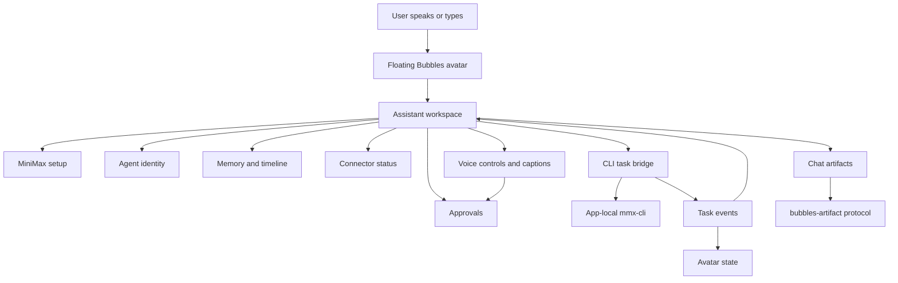

# Full MVP Manual Test Checklist

This checklist validates the implemented Bubbles MVP across the Electron desktop shell, MiniMax setup, CLI task bridge, agents, approvals, connectors, memory, timeline, avatar states, voice IPC, creative artifacts, landing-page sandboxing, observability, and degraded-mode behavior.

Latest integrated mock-test status: all 14 phases in `docs/MVP-Mock-Test.md` passed at commit `35d0fc0`. The current codebase has advanced beyond that baseline with voice controls/IPC, Google Workspace connector staging, MiniMax media artifacts, C7 landing-page sandboxing, and trace logging. Use `docs/MVP-Mock-Test-Status.md` for the historical evidence log and the current post-mock coverage status.

## Test Setup

- [ ] Run from the repository root: `/Users/dev/Documents/GitHub/bubbles-MVP`.
- [ ] Install dependencies if needed: `corepack pnpm install`.
- [ ] Start the desktop app: `corepack pnpm --filter @bubbles/desktop dev`.
- [ ] Use macOS, because the MVP stores MiniMax keys through the macOS Keychain path.
- [ ] Prepare a MiniMax General API key.
- [ ] Prepare a MiniMax Token Plan Key for `mmx-cli`.
- [ ] Decide whether this run is `Live`, `Fixture`, or `Degraded`.
- [ ] Record the current commit with `git rev-parse --short HEAD`.
- [ ] Record feature flags used for the run: `BUBBLES_VOICE_ENABLED`, `BUBBLES_VOICE_APPROVALS_ENABLED`, `BUBBLES_CONNECTORS_GMAIL_REAL`, `BUBBLES_CONNECTORS_CALENDAR_REAL`, `BUBBLES_CREATIVE_IMAGE`, `BUBBLES_CREATIVE_MUSIC`, `BUBBLES_CODING_LANDING_PAGE`, and `BUBBLES_MINIMAX_MEDIA_FIXTURE`.
- [ ] Keep `BUBBLES_MINIMAX_MEDIA_FIXTURE` unset or true for deterministic image/music artifact QA; set it to `false` only for live MiniMax media generation.
- [ ] For real Gmail or Calendar checks, prepare the Google Workspace OAuth/token path. Otherwise, use fixture mode or verify the `needs_auth` staging state.
- [ ] For voice QA, prepare the renderer/preload fixture transcript path. Current code supports voice IPC and macOS speech playback, but not live microphone STT capture.
- [ ] Keep a notes column for `Pass`, `Fail`, `Blocked`, and `Evidence`.

## System Flow

## 1. Launch, Windows, and Avatar Shell

- [ ] Launching the app opens the compact floating Bubbles avatar window.
- [ ] The avatar window is transparent, frameless, compact, and always above normal desktop content.
- [ ] The avatar displays the active badge text, initially `Bubbles`.
- [ ] The speech bubble displays the latest Bubbles message.
- [ ] Dragging the avatar moves the avatar window without opening the assistant panel.
- [ ] Clicking the avatar opens the separate assistant workspace window.
- [ ] Clicking the avatar again closes the assistant workspace.
- [ ] Closing the assistant workspace returns to compact avatar mode.
- [ ] The avatar remains visible above the workspace while the panel is open.
- [ ] Dragging the assistant header moves the assistant workspace.
- [ ] Dragging a file over the avatar visibly changes drop-target styling, then clears after leaving or dropping.

## 2. Assistant Workspace Layout

- [ ] The workspace contains the header, readiness/status area, conversation rail, active chat, task drawer, approval surface, connector panel, memory panel, and settings/setup area.
- [ ] The active chat shows message history and composer only, without unrelated demo strips.
- [ ] The voice controls render directly below chat, with a mic/barge-in button and caption surface.
- [ ] The task drawer starts with `No active CLI task yet`.
- [ ] The settings area includes MiniMax setup controls and `Export redacted logs`.
- [ ] The integration/status area reports MiniMax, connector, memory, and voice readiness.
- [ ] The connector panel lists `Web Search`, `Local Files`, `Email`, and `Calendar`.
- [ ] The memory panel shows `Saved` and `Timeline` sections.
- [ ] Developer avatar controls are hidden until the `Developer controls` disclosure is opened.
- [ ] Text remains readable and does not overlap at the default panel size.
- [ ] Resizing the workspace down to its minimum size keeps controls usable.

## 3. MiniMax First-Run Setup

- [ ] With no saved keys, setup requests the MiniMax General API key first.
- [ ] Chat input is disabled until setup reaches `ready`.
- [ ] Entering an invalid General API key keeps setup incomplete and shows a concise redacted error.
- [ ] Entering a valid General API key advances to Token Plan key entry.
- [ ] Setup cannot reach `ready` with only the General API key.
- [ ] Entering a Token Plan key triggers CLI detection.
- [ ] If the app-local `mmx-cli` is missing, setup shows the install approval step and command preview.
- [ ] `mmx-cli` is not installed until `Install MiniMax CLI` is clicked.
- [ ] After installation, setup authenticates the CLI with the Token Plan key, not the General API key.
- [ ] Setup checks CLI auth status, quota, and a text verification command.
- [ ] Ready state says `MiniMax API and CLI are ready`.
- [ ] `Recheck CLI` revalidates the saved setup state.
- [ ] Reset General API key removes the General key path and returns setup to General key entry.
- [ ] Reset Token Plan key keeps General API verified and returns setup to Token Plan entry.
- [ ] Reset all clears both MiniMax credentials and returns setup to the initial state.

## 4. Setup Failure and Recovery

- [ ] Network failure during General API verification is shown without exposing the raw key.
- [ ] Token Plan auth failure removes or rejects the bad Token Plan path and asks for the Token Plan key again.
- [ ] CLI install permission failure keeps setup incomplete with a concise permissions message.
- [ ] Runtime CLI health failures from task execution mark setup unhealthy and make `Recheck CLI` actionable.
- [ ] A successful `Recheck CLI` recovers from a transient runtime CLI health failure.
- [ ] No raw key appears in setup errors, chat, task drawer, memory, timeline, or exported logs.

## 5. Chat and CLI Task Bridge

- [ ] When setup is ready, the chat composer is enabled.
- [ ] Sending an empty message does nothing.
- [ ] Sending a general prompt adds the user message to chat.
- [ ] Bubbles creates an active task and sets the avatar to `thinking`.
- [ ] The Task Drawer receives `task.received`.
- [ ] CLI output streams into task events when available.
- [ ] A successful CLI result adds a Bubbles chat response with the result text.
- [ ] A task error adds a readable Bubbles error message.
- [ ] A cancelled task adds `I cancelled that task`.
- [ ] Final task events clear the active task id.
- [ ] Task logs are written to the app user-data task log folder in redacted form.
- [ ] Export redacted logs opens or exposes the redacted task log location.
- [ ] Cancelling immediately after task start still emits `task.cancelled`, even if the child process has not fully registered yet.

## 6. Intent Routing

- [ ] `Help me plan my MVP` routes to `general.plan` or the active general agent path.
- [ ] `Research the best way to connect MCP tools` routes to the research agent and CLI bridge.
- [ ] `Fix this project bug` routes to the coding agent and CLI bridge.
- [ ] `Read my last email` returns the blocked email connector message when email is not connected.
- [ ] `Check my calendar tomorrow` returns the blocked calendar connector message when calendar is not connected.
- [ ] `Reply that I can join` creates a pending email approval instead of sending.
- [ ] `Move my meeting tomorrow` creates a pending calendar approval instead of changing the calendar.
- [ ] `Generate a voice intro` shows the creative MiniMax routing readiness message.
- [ ] `Generate an image for the demo` routes to `creative.image` and returns an image artifact when media generation or fixture mode is enabled.
- [ ] `Generate a music track for the demo` routes to `creative.music` and returns an audio artifact when media generation or fixture mode is enabled.
- [ ] `Build a landing page for the demo` creates a `Generate landing page` approval before writing files or running commands.
- [ ] `Connect Gmail fixture` enables Email fixture mode through the shared connector setup path.
- [ ] `Set up Calendar` stages real Calendar setup with Google Workspace scopes or downgrades to fixture mode when the real connector flag is disabled.
- [ ] `Create a coding agent for this project` directs the user to Agent Birth instead of silently writing files.

## 7. Task Drawer and Avatar State Mapping

- [ ] `task.received` is visible in the Task Drawer.
- [ ] `task.status` maps to a working or thinking visual state.
- [ ] `tool.requested` is visible if emitted by the CLI.
- [ ] `approval.required` maps to `waiting_approval`.
- [ ] `task.result` maps to `celebrating`.
- [ ] `task.error` maps to `concerned`.
- [ ] `task.cancelled` maps to `idle`.
- [ ] The cancel button appears only while there is an active task.
- [ ] Clicking cancel sends cancellation and removes the active cancel affordance after the final event.
- [ ] Early cancellation clears stale active-task state and returns the avatar to `idle` or neutral.
- [ ] Pretty MiniMax JSON output is summarized as text rather than streamed as raw JSON fragments.
- [ ] Pretty MiniMax JSON errors remain rich and actionable.
- [ ] Stalled commands eventually become a timeout error.

## 8. Avatar Animations

- [ ] `idle` animation renders.
- [ ] `listening` animation renders.
- [ ] `thinking` animation renders.
- [ ] `working` animation renders.
- [ ] `waiting_approval` animation renders.
- [ ] `confused` animation renders.
- [ ] `concerned` animation renders.
- [ ] `celebrating` animation renders and loops while active.
- [ ] `sleeping` animation renders.
- [ ] Unknown avatar state falls back to `idle`.
- [ ] Sprite metadata uses 128 px frames and an 8 x 9 sheet.
- [ ] Agent changes do not alter avatar color, costume, props, sprite sheet, or theme.

## 9. Agents and Agent Switching

- [ ] The agent list loads all default agents: Bubbles, Research, Code, Schedule, and Creative.
- [ ] Activating Research changes the active badge to `Research`.
- [ ] Activating Code changes the active badge to `Code`.
- [ ] Activating Schedule changes the active badge to `Schedule`.
- [ ] Activating Creative changes the active badge to `Creative`.
- [ ] Agent activation creates a timeline event.
- [ ] Active agent choice is reflected in future task packet context.
- [ ] Each agent uses its own `agent.json` profile and `skills.md`.
- [ ] Agent allowed tools match the intended role.
- [ ] Agent profiles do not contain forbidden visual customization fields.

## 10. Agent Birth

- [ ] Agent Birth is visible in the conversation rail.
- [ ] Submitting an empty Agent Birth request does nothing.
- [ ] Submitting `Create a coding agent for this project` requests a generated preview.
- [ ] If the General API key is missing, the preview fails with a clear setup requirement.
- [ ] A successful preview shows agent name, role, skills path, and generated `skills.md`.
- [ ] Wrapped MiniMax JSON and partially shaped draft JSON are normalized before preview.
- [ ] The generated draft rejects avatar visual customization attempts.
- [ ] Clicking create does not immediately write files.
- [ ] Bubbles creates an `agent_file_create` approval.
- [ ] Pending approval sets avatar state to `waiting_approval`.
- [ ] Denying the approval does not create agent files.
- [ ] Cancelling the approval does not create agent files.
- [ ] Approving the approval writes the new agent files under `agents/`.
- [ ] After approval, the new agent becomes active and appears in the agent list.
- [ ] Agent creation creates timeline and memory/audit entries.

## 11. Approvals

- [ ] Pending approvals appear as focused approval cards.
- [ ] Approval cards show risk level, title, explanation, and redacted JSON preview.
- [ ] Email reply approvals use action type `send_email`.
- [ ] Calendar update approvals use action type `calendar_update`.
- [ ] Agent file creation approvals use action type `agent_file_create`.
- [ ] Landing-page generation approvals use action type `shell_command`.
- [ ] Sensitive external or write actions are classified as high risk where applicable.
- [ ] Agent file creation is medium risk.
- [ ] Voice approval decisions can approve, deny, or cancel the latest pending approval only when voice approvals are enabled.
- [ ] Two unclear spoken approval attempts fall back to the visible chat approval buttons.
- [ ] Deny resolves the approval as denied and prevents execution.
- [ ] Cancel resolves the approval as cancelled and prevents execution.
- [ ] Approve resolves the approval as approved and triggers only the approved follow-up behavior.
- [ ] Approval decisions are stored in the timeline.
- [ ] Approval decisions create approval-history memory entries.
- [ ] Approval previews redact keys, bearer tokens, and CLI auth arguments.

## 12. Connectors

- [ ] Default connector registry seeds Web Search, Local Files, Email, and Calendar.
- [ ] Each connector shows mode, auth status, and health status.
- [ ] Disabled connectors show an enable-fixture-mode button.
- [ ] Enabling fixture mode sets the connector to enabled, fixture, and ready.
- [ ] Health check on an enabled ready connector marks it healthy.
- [ ] Health check on an unconfigured connector marks it unhealthy with a helpful error.
- [ ] Disconnect disables the connector and resets auth/health state.
- [ ] Readiness rail explains unavailable connector fallback behavior.
- [ ] Web Search fixture mode can return fixture research results through the core connector.
- [ ] Web Search real mode can call an MCP command when configured.
- [ ] Web Search falls back to MiniMax search when that fallback is provided.
- [ ] Gmail setup shows `gmail.readonly`, `gmail.compose`, and `gmail.send` scope context.
- [ ] Calendar setup shows `calendar.events.owned`, read-only events, and free/busy scope context.
- [ ] Real Gmail or Calendar setup remains `needs_auth`/unhealthy when no OAuth token path is available.
- [ ] If real Gmail or Calendar feature flags are off, real-mode setup requests are downgraded to fixture mode.
- [ ] Connected Email fixture reads the latest fixture email.
- [ ] Connected Email fixture creates a draft before asking for send approval.
- [ ] Approving an Email fixture send approval executes the fixture send path and posts the approved result.
- [ ] Connected Calendar fixture lists tomorrow's fixture events.
- [ ] Connected Calendar fixture suggests a time before asking for calendar-update approval.
- [ ] Approving a Calendar fixture update executes the fixture create-event path and posts the approved result.
- [ ] Local Files reads only inside approved roots.
- [ ] Local Files write preparation requires approval.
- [ ] Email read remains blocked unless a ready Email connector, fixture or real, is available.
- [ ] Calendar read remains blocked unless a ready Calendar connector, fixture or real, is available.

## 13. Memory and Timeline

- [ ] Typing `Remember I like short plans` saves a user preference memory.
- [ ] Bubbles responds with `I'll remember: I like short plans`.
- [ ] Memory appears in the Memory `Saved` section.
- [ ] A `Memory saved` timeline event appears.
- [ ] Explicit remember commands are tagged as explicit and importance 4.
- [ ] Explicit remember commands redact token-like strings before chat echo, durable memory, and timeline writes.
- [ ] After ready setup, ordinary chat can extract durable memories through MiniMax JSON.
- [ ] Malformed MiniMax memory-extraction JSON fails gracefully and does not fail the user task.
- [ ] Task completion creates task summary memory.
- [ ] Task failure creates lower-importance task summary memory.
- [ ] Task start, completion, failure, and cancellation create timeline events.
- [ ] Agent activation creates a timeline event.
- [ ] Approval decisions create timeline events.
- [ ] Clear memory deletes saved memories.
- [ ] Clear memory adds a `Memory cleared` timeline event.
- [ ] Memory queries are scoped by active agent when used for task packet context.

## 14. Creative, Artifacts, and Landing-Page Sandbox

- [ ] Creative agent is available and can be activated.
- [ ] Image prompts produce a visible chat image artifact from app user-data storage. In fixture mode this is a deterministic SVG.
- [ ] Music prompts produce a playable chat audio artifact from app user-data storage. In fixture mode this is a deterministic WAV.
- [ ] Real MiniMax image/music mode constructs explicit `mmx image generate` or `mmx music generate` commands when `BUBBLES_MINIMAX_MEDIA_FIXTURE=false`.
- [ ] Image and audio artifact cards render through `bubbles-artifact://local/...`.
- [ ] Artifact opening rejects local paths outside the approved artifact root.
- [ ] Landing-page prompts create an approval card before sandbox file generation, build, serve, or browser opening.
- [ ] Approving the landing-page workflow generates files under Electron `userData` artifacts, runs the allowlisted accessibility check and Vite build, serves a localhost URL, and opens the system browser.
- [ ] Landing-page sandbox checks require `html lang`, one `h1`, image alt text, and a visible form label.
- [ ] Landing-page workflow commands are limited to `node scripts/accessibility-check.mjs` and Vite build.
- [ ] Landing-page server binds to `127.0.0.1`, starts at port `4173`, and increments if the port is busy.
- [ ] Denying or cancelling the landing-page workflow does not generate or serve a new site.
- [ ] Approved landing-page artifacts appear in chat as site artifacts with the local URL.
- [ ] TTS service returns muted state when voice is muted.
- [ ] TTS service returns an audio path when voice synthesis is enabled by integration code.
- [ ] Creative service can route voice, image, vision, and music requests through a configured runner.

## 14A. Voice IPC, Captions, and Spoken Approval QA

- [ ] With voice enabled, the voice control defaults to push-to-talk and shows `Voice ready`.
- [ ] With `BUBBLES_VOICE_ENABLED=false`, the control shows `Voice off`, is disabled, and typed chat remains usable.
- [ ] Click the mic button and confirm the voice state changes to listening and the avatar maps to `listening`.
- [ ] Submit or replay a fixture partial transcript through the preload/test harness and confirm the caption updates without creating a chat turn.
- [ ] Submit or replay the fixture final transcript for `Help me plan my day`; confirm the caption appears, a user chat turn is created, and Bubbles replies in chat.
- [ ] Confirm a short Bubbles reply is spoken through the native macOS speech adapter and mirrored by captions.
- [ ] While Bubbles is speaking, click or speak barge-in; confirm speech stops and the UI returns to listening.
- [ ] Create an approval request, then speak `approve`; confirm the approval resolves, the card disappears, and the timeline/memory record the outcome.
- [ ] Repeat with `deny`, `cancel`, and two unclear/timeout attempts; confirm fallback to click/chat approval.
- [ ] Voice-trigger `Connect Gmail fixture` and `Connect Calendar fixture`; confirm connector status updates without requiring real OAuth in CI.
- [ ] Voice-trigger web research, Gmail fixture read/reply, Calendar fixture scheduling, image generation, music generation, and C7 landing-page generation through the same shared message path as typed chat.
- [ ] Record live microphone STT as `Blocked` unless a real STT provider has been added; the current implementation validates voice IPC, fixture transcripts, and native speech playback.
- [ ] Open DevTools after the voice pass and confirm there are no red app errors beyond expected development warnings.

## 15. Security, Privacy, and Redaction

- [ ] MiniMax General API key and Token Plan key are stored separately.
- [ ] Raw keys are not stored in SQLite app data.
- [ ] Raw keys are not displayed in setup status.
- [ ] Raw keys are not written to task logs.
- [ ] Raw keys are not displayed in approval previews.
- [ ] Raw keys are not displayed in chat, memory, timeline, or connector errors.
- [ ] Token-like strings are redacted before durable memory and timeline persistence.
- [ ] Existing persisted memory and timeline rows are sanitized when stores are reopened.
- [ ] Bearer tokens are redacted.
- [ ] `mmx auth login --api-key ...` arguments are redacted in logs/errors.
- [ ] Connector launch config environment values are redacted before persistence.
- [ ] Local file access rejects paths outside approved roots.
- [ ] Bubbles requires approval before file writes, calendar updates, email sends, CLI installs, and agent file creation.
- [ ] Bubbles requires approval before C7 landing-page sandbox file generation and command execution.
- [ ] Artifact opening cannot escape the app user-data artifact root.
- [ ] Landing-page file writes cannot escape the landing-page sandbox root.
- [ ] Landing-page command execution rejects commands outside the allowlist.
- [ ] `task-logs/observability.ndjson` contains structured trace events with `traceId`, and where applicable `voiceTurnId`, `taskId`, `approvalId`, and `ttsId`.
- [ ] Observability trace events record text lengths, statuses, command labels, and payload keys, not raw audio, full transcripts, email bodies, calendar contents, OAuth tokens, or MiniMax keys.
- [ ] Exported redacted logs include task logs and observability logs, with `sk-`, `sk-cp-`, `Bearer ...`, and `--api-key ...` values redacted.

## 16. Persistence

- [ ] Setup status survives app restart when keys are still available.
- [ ] Missing app-local `mmx` invalidates a stored ready CLI state.
- [ ] Agent activation survives the registry state behavior expected by `AgentRegistry`.
- [ ] Connector configuration survives app restart.
- [ ] Connector health status and last error survive app restart.
- [ ] Memories survive app restart until cleared.
- [ ] Timeline events survive app restart.
- [ ] Redacted memory and timeline content stays redacted after app restart.
- [ ] Approval history survives app restart.
- [ ] Pending approvals remain visible after app restart until resolved.
- [ ] Task logs remain available through export.
- [ ] Generated image, audio, and site artifacts remain under app user-data artifact storage until manually cleaned.
- [ ] Running landing-page preview servers are stopped before app quit.

## 17. Degraded Demo Mode

- [ ] When setup is incomplete, readiness explains MiniMax is not fully verified.
- [ ] When connectors are not configured, readiness explains fixture or real connector options.
- [ ] Email read unavailable state is friendly and actionable.
- [ ] Calendar read unavailable state is friendly and actionable.
- [ ] Creative media unavailable state is friendly and actionable.
- [ ] CLI network/auth/quota failures are categorized in task errors.
- [ ] The UI remains usable after setup, connector, or CLI failures.
- [ ] No failure path leaves the avatar stuck in `working` or `waiting_approval` without an active task or approval.

## 18. Build and Automated Sanity Checks

- [ ] Run `corepack pnpm -r test`.
- [ ] Run `corepack pnpm -r typecheck`.
- [ ] Run `corepack pnpm build`.
- [ ] Run targeted core checks for new post-mock surfaces: `npm run test:core -- voiceApprovalResolver approvalVoiceDecision affectDetector spokenResponsePolicy flowRouter creativeService landingPageRunner mcpClient emailConnector calendarConnector trace`.
- [ ] Run targeted desktop checks for new post-mock surfaces: `npm run test:desktop -- voiceIpc approvalVoiceIpc speechPlayback connectorIpc VoiceControls CaptionBar useVoiceSession ChatSurface App`.
- [ ] Confirm no automated test exposes secrets in failure output.
- [ ] Confirm generated files in `agents/` are expected before committing.
- [ ] Confirm no unrelated local user changes were reverted.

## Exit Criteria

- [ ] All launch, setup, chat, task, agent, approval, connector, memory, and security checks pass or have documented MVP limitations.
- [ ] At least one full live CLI-backed task completes successfully with a visible task result.
- [ ] At least one approval flow is denied and one is approved.
- [ ] At least one memory is created and then visible in the memory panel.
- [ ] Fixture/degraded limitations are clearly visible to the tester and not hidden as successful real integrations.
- [ ] New post-mock surfaces are either passed with evidence or marked `Blocked`/`Pending` with the missing provider, credential, or feature flag named.
- [ ] Do not mark live microphone STT, real Google Workspace OAuth, or real MiniMax media generation as passed unless those paths were exercised live.
