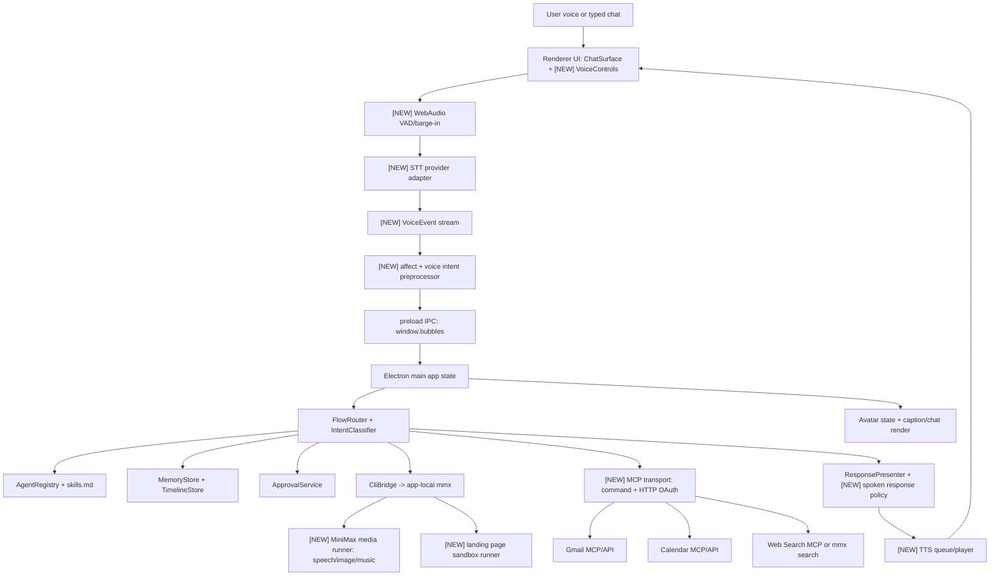

## 0. Discovery Report

### Repository map

`tree` is not installed, so discovery used `find . -maxdepth 3` from `/Users/dev/Documents/GitHub/bubbles-MVP`.

```txt
bubbles-MVP/
  package.json                         root scripts via corepack pnpm
  pnpm-workspace.yaml                  apps/* and packages/* workspace
  tsconfig.base.json                   strict shared TS config
  AGENTS.md                           repo-specific agent instructions
  agents/                              local agent profiles and skills
    general-assistant/
    research-agent/
    coding-agent/
    email-calendar-assistant/
    creative-minimax-helper/
    qa-agent-001/
  apps/desktop/                        Electron + Vite + React app
    package.json
    electron.vite.config.ts
    vite.config.ts
    electron-builder.yml
    index.html
    src/main/                          Electron main, preload, IPC
    src/renderer/                      React UI
    src/avatar/                        Pixi sprite avatar pipeline
  packages/core/                       shared TypeScript service layer
    package.json
    src/agents/
    src/approvals/
    src/cli/
    src/connectors/
    src/memory/
    src/minimax/
    src/orchestration/
    src/security/
    src/shared/
    src/timeline/
  docs/                                product plans, setup, test evidence
  tools/mcp/search-fixture.mjs         local MCP-shaped search fixture
  output/bubbles-sprite-run-v2/        generated sprite pipeline artifacts
```

No `README*`, `ARCHITECTURE*`, or `CONTRIBUTING*` files were present. `/docs/.DS_Store` is a binary macOS metadata file, not content-bearing. `/docs/dev_plan_mvp.pdf` was extracted with `pdftotext`; its content matches the implementation plan material in `/docs/dev_plan_mvp.md`.

### Tech stack and versions

| Area | Observed stack |
|---|---|
| Workspace | `pnpm@9.15.4` via `package.json`; workspace packages from `pnpm-workspace.yaml` |
| Desktop | Electron `^33.2.1`, `electron-vite@^2.3.0`, Vite `^5.4.11`, React `^18.3.1`, PixiJS `^8.6.6`, lucide-react `^0.468.0` in `apps/desktop/package.json` |
| Core | Strict TypeScript `^5.7.2`, Vitest `^2.1.8`, `sql.js@^1.14.1` in `packages/core/package.json` |
| Tests | Vitest, React Testing Library, jsdom from `apps/desktop/package.json`; commands in root `package.json` |
| App shell | Electron main/preload IPC in `apps/desktop/src/main/main.ts` and `apps/desktop/src/main/preload.ts`; no HTTP backend/routes |
| Packaging | local unsigned macOS DMG/ZIP config in `apps/desktop/electron-builder.yml` |

External docs checked for API reality: [MiniMax CLI](https://platform.minimax.io/docs/token-plan/minimax-cli), [MiniMax API overview](https://platform.minimax.io/docs/api-reference/api-overview), [Google Workspace MCP servers](https://developers.google.com/workspace/guides/configure-mcp-servers), [Gmail scopes](https://developers.google.com/workspace/gmail/api/auth/scopes), [Calendar scopes](https://developers.google.com/workspace/calendar/api/auth).

### Relevant module inventory

| Area | Current files read | Observed current behavior |
|---|---|---|
| Avatar | `apps/desktop/src/avatar/AvatarStage.tsx`, `apps/desktop/src/avatar/animationCatalog.ts`, `apps/desktop/src/avatar/bubbles_mvp.json`, `apps/desktop/src/renderer/components/FloatingAvatarWindow.tsx` | Pixi renders one sprite sheet with 9 states; `celebrating` is forced looping in code. |
| Chat lifecycle | `apps/desktop/src/renderer/App.tsx`, `apps/desktop/src/renderer/components/ChatSurface.tsx`, `apps/desktop/src/main/main.ts`, `apps/desktop/src/main/ipc/taskIpc.ts`, `packages/core/src/cli/cliBridge.ts`, `packages/core/src/cli/cliEventParser.ts`, `packages/core/src/cli/taskPacketBuilder.ts` | Typed chat goes through `app:send-message`, explicit remember/router shortcuts, then CLI task packet via local `mmx`. Result/error/cancel events append Bubbles chat messages. |
| Orchestration | `packages/core/src/orchestration/intentClassifier.ts`, `packages/core/src/orchestration/flowRouter.ts`, `packages/core/src/orchestration/orchestrator.ts`, `packages/core/src/orchestration/responsePresenter.ts` | Regex intent classification exists; email/calendar write routes create approvals; email/calendar reads are blocked if connector not connected; creative route is readiness-only. |
| Agents | `packages/core/src/agents/agentRegistry.ts`, `packages/core/src/agents/agentBirthService.ts`, `packages/core/src/agents/agentSchema.ts`, `apps/desktop/src/renderer/components/AgentSwitcher.tsx`, `apps/desktop/src/renderer/screens/AgentBirthPreview.tsx`, `agents/*` | Agents are local `agent.json` + `skills.md`; agent creation is previewed and then approval-gated before file writes. |
| Approvals | `packages/core/src/approvals/approvalService.ts`, `packages/core/src/approvals/riskClassifier.ts`, `apps/desktop/src/main/ipc/approvalIpc.ts`, `apps/desktop/src/renderer/components/ApprovalModal.tsx` | Pending approvals persist in SQLite, redact preview strings, and resolve through approve/deny/cancel IPC. Only approved agent drafts execute follow-up today. |
| MCP/connectors | `packages/core/src/connectors/*`, `apps/desktop/src/main/ipc/connectorIpc.ts`, `apps/desktop/src/renderer/screens/ConnectorSettings.tsx`, `tools/mcp/search-fixture.mjs` | Registry seeds web/local/email/calendar; command-style JSON-RPC MCP client exists; web search supports fixture/MCP/MiniMax fallback; Gmail/Calendar are fixture/readiness stubs, not real Workspace MCP. |
| MiniMax/media | `packages/core/src/minimax/minimaxApiClient.ts`, `packages/core/src/minimax/minimaxCliManager.ts`, `packages/core/src/minimax/setupService.ts`, `packages/core/src/minimax/ttsService.ts`, `packages/core/src/minimax/creativeService.ts` | MiniMax text JSON and CLI setup are real; TTS/creative services are injectable shells with tests, not wired to playback or media generation UI. |
| Memory/timeline/security | `packages/core/src/memory/*`, `packages/core/src/timeline/timelineStore.ts`, `packages/core/src/security/*` | SQLite-backed stores redact token-like strings; explicit `Remember...` commands create durable memory and timeline rows. |
| UI/status | `apps/desktop/src/renderer/components/AssistantPanel.tsx`, `WorkspaceStatusRail.tsx`, `IntegrationStatusBar.tsx`, `styles.css` | Workspace has chat, task drawer, approvals, connectors, setup, memory. Voice is a static `Voice off` label/button only. |
| Build/test docs | `docs/setup_guide.md`, `docs/debugging_tooling.md`, `docs/MVP-Mock-Test.md`, `docs/MVP-Mock-Test-Status.md`, `docs/Full-MVP-Test.md`, `docs/dev_plan_mvp.md`, `docs/full_plan_v2.md`, `docs/demo_script.md`, `docs/assistant_workspace_ui_refactor.md` | Current MVP base passed 14 mock phases; next work is real connectors plus voice/media. |

### Unknowns and clarifying questions

1. Which STT provider is acceptable for the first shippable voice loop: browser Web Speech, a cloud STT API, local Whisper-style model, or macOS-native speech? [BLOCKED-ON-Q1]
2. Should Google Workspace use official remote MCP HTTP servers directly, local command wrappers that bridge to those servers, or both? [BLOCKED-ON-Q2]
3. Should Gmail replies be sent through a verified Gmail MCP send tool if available, or Gmail REST `users.messages.send` behind the same connector if the MCP server only exposes draft creation? [VERIFY] [BLOCKED-ON-Q3]
4. Calendar write scopes are broader than the read-only scopes shown in Google’s MCP sample config. Should MVP request `calendar.events`/`calendar.events.owned` for writes? [BLOCKED-ON-Q4]
5. Which timezone should voice date parsing prefer when OS timezone, Google account timezone, and user travel differ? [BLOCKED-ON-Q5]
6. Should MiniMax image/music artifacts be stored only in app user-data or copied into a user-chosen downloads folder after approval? [BLOCKED-ON-Q6]
7. Is autonomous landing-page generation allowed to run build/dev-server commands automatically after one approval, or should every command be approved separately? [BLOCKED-ON-Q7]

### Assumptions

- [ASSUMPTION] Preserve existing architecture boundaries from `AGENTS.md`: core services in `packages/core`, Electron IPC/state in `apps/desktop/src/main`, React UI in `apps/desktop/src/renderer`.
- [ASSUMPTION] P0 STT uses a provider abstraction with Web Speech as the first browser/Electron implementation and chat fallback retained; production cloud/local STT is selected after Q1.
- [ASSUMPTION] TTS uses `mmx speech synthesize` first because MiniMax CLI docs verify speech synthesis, image, music, and search commands.
- [ASSUMPTION] Google Workspace connectors target official remote MCP endpoints (`https://gmailmcp.googleapis.com/mcp/v1`, `https://calendarmcp.googleapis.com/mcp/v1`) with OAuth 2.0, adding a command wrapper only to preserve the current `createMcpClient` test path.
- [ASSUMPTION] Voice approval timeout defaults to 8 seconds, with 2 reprompts, then chat approval fallback.
- [ASSUMPTION] Long TTS threshold is `min(280 chars, 40 words)`, keeping spoken replies short enough for desktop assistant flow while preserving full chat detail.
- [ASSUMPTION] Voice captions mirror every spoken utterance in chat/status UI for accessibility.
- [ASSUMPTION] C7 code generation runs in a per-task sandbox under Electron `userData`, never directly in the repo unless the user explicitly chooses a project folder and approves.

## 1. Architecture Overview



Typed chat remains the canonical path in `apps/desktop/src/renderer/App.tsx` and `apps/desktop/src/main/main.ts`. Voice becomes another input source that emits the same normalized user turn into `app:send-message`, while carrying `VoiceTurnContext` metadata for STT confidence, affect, approval mode, and barge-in state.

New voice/audio work is split deliberately:

| Layer | Responsibility |
|---|---|
| Renderer | Microphone permission, VAD, barge-in detection, STT provider runtime, audio playback, captions. |
| Electron main | Voice session state, IPC fanout, approval resolution, connector auth, artifact paths, local server launch. |
| Core | Provider-agnostic contracts, intent/affect classification, spoken response policy, capability routing, tests. |

Emotional intelligence runs in three places:

1. Pre-LLM tagging: after STT final text, `detectAffect(text, prosody?)` emits `affectTag`, `urgency`, `confidence`, and `styleHints`.
2. Prompt/task injection: `TaskPacket` gains `voiceContext.affect` so active agent and MiniMax/CLI can adapt wording.
3. Post-LLM style selection: `presentResponse` chooses `voiceText`, pacing, and TTS style from affect plus `agent.voiceStyle`, without changing safety decisions.

Latency targets:

| Stage | No-tool target |
|---|---:|
| VAD speech start / barge-in stop | <= 50 ms local |
| STT partial | <= 300 ms after speech starts |
| STT final | <= 900 ms after end-of-speech |
| Intent + affect | <= 150 ms local/simple model |
| LLM/router for non-tool chat | <= 1,200 ms p50, <= 2,000 ms p95 |
| TTS synthesis for short reply | <= 900 ms p50 |
| Audio playback start | <= 100 ms after audio ready |
| End-to-end voice-in to first-audio-out | <= 2.5 s p50, <= 4 s p95 |

Tool calls are not bounded to 2.5 s; Bubbles should speak a short acknowledgement within 1.2 s, then speak the final summary when work completes.

Non-functional defaults:

| Requirement | Plan |
|---|---|
| Privacy | Raw audio is not persisted; transcripts follow existing chat/memory redaction. Connector/private content is not sent to external LLM/media APIs without explicit user command or approval. |
| Reliability | If STT/TTS/MCP/LLM fails, avatar moves to `concerned`, chat remains usable, and status rail shows recovery action. |
| Observability | Add `traceId`, `voiceTurnId`, `taskId`, `approvalId`; log structured redacted events for VAD, STT, intent, MCP, TTS, approval outcomes, truncation. |
| Security | OAuth secrets in Keychain; connector env redacted; Calendar/Gmail scopes minimized; C7 sandboxed with command allowlist and approval. |
| Accessibility | Chat-only path retained; captions for TTS; all voice actions have visible equivalents; approvals remain keyboard/clickable. |

## 2. Component & Module Plan

| Path | New/modified | Responsibility | Public interface | Dependencies |
|---|---|---|---|---|
| `packages/core/src/voice/voiceTypes.ts` | New | Shared voice event/contracts | `VoiceEvent`, `VoiceTurnContext`, `VoiceSessionState` | `shared/types.ts` |
| `packages/core/src/voice/affectDetector.ts` | New | Text-first affect tagging, optional prosody | `detectAffect(input): AffectTag` | none; optional MiniMax JSON later |
| `packages/core/src/voice/spokenResponsePolicy.ts` | New | TTS threshold, summary fallback, caption text | `prepareSpokenResponse(response, context)` | `responsePresenter.ts` |
| `packages/core/src/orchestration/intentClassifier.ts` | Modify | Expand intent output for V1-V6/C1-C7 and voice aliases | `classifyIntent(userText, context?)` | existing tests |
| `packages/core/src/orchestration/flowRouter.ts` | Modify | Route real capabilities, connector calls, approvals | `route(input)` | approvals, connectors, creative/coding |
| `packages/core/src/orchestration/responsePresenter.ts` | Modify | Return full chat text, `voiceText`, citations, captions, affect style | `presentResponse(input)` | voice policy |
| `packages/core/src/minimax/ttsService.ts` | Modify | Use MiniMax speech synth adapter, return playable artifact metadata | `speak(text, voiceStyle, options)` | `minimaxCliManager` or command runner |
| `packages/core/src/minimax/creativeService.ts` | Modify | Image/music runners via `mmx image generate` and `mmx music generate` | `run({kind,prompt,outputDir})` | MiniMax CLI docs |
| `packages/core/src/connectors/mcpClient.ts` | Modify | Support current command JSON-RPC plus new HTTP MCP transport | `call(config, method, params)` | command runner, OAuth token provider |
| `packages/core/src/connectors/emailConnector.ts` | Modify | Gmail MCP search/read/draft/send path | `searchThreads`, `getThread`, `createDraft`, `sendDraft` [VERIFY] | Google Workspace MCP/Gmail API |
| `packages/core/src/connectors/calendarConnector.ts` | Modify | Calendar list/freebusy/create/update/suggest-time | `listEvents`, `suggestTime`, `createEvent`, `updateEvent` | Google Workspace MCP/Calendar API |
| `packages/core/src/connectors/webSearchConnector.ts` | Modify | Multi-source search and citation normalization | `search(config, query, options)` | existing fixture/MCP; `mmx search query` |
| `packages/core/src/coding/landingPageRunner.ts` | New | C7 sandbox creation, generated page build/test/server lifecycle | `planGenerateServe(request)` | command runner, approval service |
| `packages/core/src/observability/trace.ts` | New | Redacted structured event factory | `createTrace`, `logEvent`, `withTrace` | `redactSecrets.ts` |
| `apps/desktop/src/main/ipc/voiceIpc.ts` | New | Voice session IPC, TTS requests, approval voice decisions | `registerVoiceIpc(...)` | main app state, approval service |
| `apps/desktop/src/main/ipc/capabilityIpc.ts` | New | Artifact open/serve/download IPC for C5-C7 | `registerCapabilityIpc(...)` | shell, local server |
| `apps/desktop/src/main/main.ts` | Modify | Register voice/capability IPC, hydrate voice state, publish captions | existing `app:get-state` plus `voice:*` | all main services |
| `apps/desktop/src/main/preload.ts` | Modify | Expose `window.bubbles.voice`, `window.bubbles.tts`, `window.bubbles.artifacts` | typed IPC wrappers | Electron IPC |
| `apps/desktop/src/renderer/voice/useVoiceSession.ts` | New | VAD, STT provider, barge-in, audio playback orchestration | React hook | Web Audio, SpeechRecognition [VERIFY] |
| `apps/desktop/src/renderer/components/VoiceControls.tsx` | New | Mic toggle, listening state, captions, retry affordance | component props | `useVoiceSession` |
| `apps/desktop/src/renderer/components/CaptionBar.tsx` | New | Visible captions for spoken output and STT partials | component props | none |
| `apps/desktop/src/renderer/components/ChatSurface.tsx` | Modify | Show voice partials/captions and voice-origin messages | existing props plus `voiceState` | UI state |
| `apps/desktop/src/renderer/components/FloatingAvatarWindow.tsx` | Modify | Barge-in/listening affordance and speech caption sync | props for `voiceState` | AvatarStage |
| `apps/desktop/src/renderer/components/IntegrationStatusBar.tsx` | Modify | Replace static `Voice off` with live voice/STT/TTS state | `voiceStatus` prop | voice state |
| `apps/desktop/src/renderer/components/WorkspaceStatusRail.tsx` | Modify | Voice settings, provider health, captions toggle, logs | props/actions | Setup + voice IPC |
| `apps/desktop/src/renderer/global.d.ts` | Modify | Typed `window.bubbles.voice`/artifact APIs | declarations | preload |
| `apps/desktop/src/renderer/App.tsx` | Modify | Wire voice hook to existing app state and submit path | local state + props | existing app |
| `apps/desktop/src/renderer/App.test.tsx` and focused tests | Modify/new | Voice UI, captions, approval voice decisions, barge-in | RTL/Vitest | test setup |

## 3. Phased Implementation Roadmap

| Phase | Goals | Included features | Exit criteria | Effort | Rollback |
|---|---|---|---|---:|---|
| P0 Voice loop foundation | Add provider-agnostic voice input and TTS playback without changing task semantics | V1 typed/voice parity, VAD, barge-in, captions, TTS summary policy | Voice turn can submit general chat, Bubbles speaks short replies, long replies summarize, chat fallback unaffected | L | Feature flag `voice.enabled=false`; remove voice IPC/hook from UI |
| P1 Approvals + emotional layer | Make approval and affect voice-aware | V6, spoken approval prompts, yes/no resolution, affect pipeline | Pending approval speaks, listens, resolves approve/deny; affect changes wording/TTS style; 2 failed voice attempts fallback to chat | M | Disable `voice.approvals`; approvals stay click-only |
| P2 Real research + Workspace connectors | Replace read stubs with real/fallback connector flows | C1-C4, V5 MCP config voice flow | Web search returns citations; Gmail/Calendar read/write workflows work with fixtures and real MCP where configured | L | Keep fixture mode and current blocked messages |
| P3 Creative + autonomous coding | Add MiniMax media and landing-page sandbox | C5-C7 | Image/music artifacts render in chat; landing page generated, tested, served, opened after approval | L | Hide Creative/Coding capability buttons; keep existing creative readiness message |
| P4 Hardening | Reliability, privacy, observability, accessibility | All features, E2E harness, packaging checks | `npm test`, `npm run typecheck`, `npm run build`; manual voice QA passes; logs redact audio/text secrets | M | Keep P0-P3 behind config flags per capability |

## 4. Per-Feature Specifications

### V1 General chat

| Item | Spec |
|---|---|
| Triggers | “Hey Bubbles…”, mic button then any free-form turn, “Can you explain…”, “Help me plan…” |
| Sequence | User speaks -> VAD starts -> STT final -> affect tag -> `app:send-message` -> existing CLI/general route -> `presentResponse` -> TTS/caption/chat |
| Calls | Existing MiniMax CLI text path in `taskIpc.ts`; no MCP unless intent routes to capability |
| Edge cases | STT confidence below threshold asks “I caught part of that. Could you repeat it?”; TTS failure shows caption/chat only |
| Spoken/chat rule | <=280 chars/40 words spoken in full; longer response speaks generated summary + “I put the full details in chat.” |

### V2 Create an agent

| Item | Spec |
|---|---|
| Triggers | “Create an agent for…”, “Make a research/coding/scheduling agent…”, “Birth a QA agent…” |
| Sequence | Voice -> intent `agent.create` -> `agents:preview-birth` -> preview in rail/chat -> create request -> `agent_file_create` approval -> voice/click approval -> `agentRegistry.create` |
| Calls | MiniMax direct `POST /v1/chat/completions` via `generateMiniMaxJson`; approval service; file write only after approval |
| Edge cases | Missing General API key routes to setup; generated visual customization rejected by `agentSchema.ts`; duplicate id asks user to rename |
| Spoken/chat rule | Bubbles speaks preview summary only; full `agent.json`/`skills.md` shown in chat/Agent Birth preview |

### V3 Switch active agent

| Item | Spec |
|---|---|
| Triggers | “Switch to Research”, “Use the coding agent”, “Talk as Schedule Bubbles” |
| Sequence | Voice -> resolve agent by id/name/badge -> `agents:activate` -> timeline event -> badge updates -> confirmation |
| Calls | `AgentRegistry.list/load/activate`; no external call |
| Edge cases | Ambiguous names ask user to choose; archived/missing agent returns concerned state |
| Spoken/chat rule | Speak “Switched to Research.”; chat logs the agent change |

### V4 Issue task to active agent

| Item | Spec |
|---|---|
| Triggers | “Ask this agent to…”, “Have Code build…”, “Research, look up…” |
| Sequence | Voice -> active agent from `appState.activeAgent` -> task packet includes `skillsMarkdown`, memories, affect -> CLI bridge |
| Calls | Existing `buildTaskPacket`; `mmx text chat`; capability-specific tools as routed |
| Edge cases | No active agent falls back to general; task requiring unavailable tool triggers V5 setup |
| Spoken/chat rule | Speak acknowledgement quickly; final follows TTS summary threshold |

### V5 Configure MCP server required for task

| Item | Spec |
|---|---|
| Triggers | “Connect Gmail”, “Set up Calendar”, “Use real web search”, “Configure the MCP server for this” |
| Sequence | Voice -> connector intent -> setup wizard opens -> scope summary spoken -> OAuth/launch config -> health check -> connector ready |
| Calls | Current `ConnectorRegistry`; new HTTP MCP config for Gmail/Calendar; existing command MCP for fixtures |
| Edge cases | OAuth cancelled leaves `needs_auth`; unhealthy command shows redacted error; unavailable scopes stay fixture |
| Spoken/chat rule | Speak scope summary and result; full setup steps and errors in connector panel |

### V6 Approve / decline approval requests

| Item | Spec |
|---|---|
| Triggers | “Approve”, “Yes, do it”, “Decline”, “No, don’t”, “Cancel that” |
| Sequence | Pending approval -> TTS prompt -> voice yes/no parser -> `approvals:approve/deny/cancel` -> follow-up action if approved |
| Calls | `ApprovalService.approve/deny/cancel`; existing `handleApprovalResolved` plus new handlers per action type |
| Edge cases | No pending approval: “There’s nothing waiting for approval.”; ambiguous answer reprompt; timeout after 2 reprompts falls back to chat |
| Spoken/chat rule | Approval prompt and resolution spoken; preview always visible in chat/card |

### C1 Web research via voice

| Item | Spec |
|---|---|
| Triggers | “Search the web for…”, “Research…”, “Find sources on…” |
| Sequence | Voice -> `research.web` -> web connector -> normalize sources -> MiniMax synthesis -> citations in chat -> spoken summary |
| Calls | `webSearchConnector.search`; MCP `search` params `{query, maxResults}` for command providers; MiniMax CLI `mmx search query` [VERIFY exact flags] fallback |
| Edge cases | Private context in query triggers `external_data_send` approval; no connector/fallback returns setup guidance |
| Artifact | Chat research card with citations and uncertainty |
| Spoken confirmation | “I found three useful sources. Short version: … Full citations are in chat.” |

### C2 Add and organize Google Calendar events

| Item | Spec |
|---|---|
| Triggers | “Add a calendar event…”, “Schedule…”, “Move my meeting…”, “Make this weekly…” |
| Sequence | Voice -> parse date/time/timezone -> list conflicts -> propose event -> approval -> create/update via Calendar connector |
| Calls | Calendar MCP `list_events`, `suggest_time`, `create_event`, `update_event`; scopes likely `calendar.events` or `calendar.events.owned` [BLOCKED-ON-Q4] |
| Edge cases | Ambiguous date asks clarification; conflict offers alternatives; recurrence parsed but previewed before write |
| Artifact | Approval card + final event summary with calendar link if returned |
| Spoken confirmation | “I can add that for Tuesday at 2 PM. Please approve the calendar change.” then “Done, it’s on your calendar.” |

### C3 Read and reply to Gmail

| Item | Spec |
|---|---|
| Triggers | “Read my latest unread from Alex”, “What did Sarah email?”, “Reply that…” |
| Sequence | Voice -> Gmail search/read -> summary -> reply instruction -> draft -> approval -> send/draft final |
| Calls | Gmail MCP `search_threads`, `get_thread`, `create_draft`; send via MCP `send_draft` [VERIFY] or Gmail API `users.messages.send` [BLOCKED-ON-Q3] |
| Scopes | Read: `gmail.readonly`; compose/send: `gmail.compose` or `gmail.send` depending final path |
| Edge cases | Multiple matching senders asks choose; attachments summarized by metadata unless user approves content read; send always approval-gated |
| Artifact | Email summary card, draft preview, approval card |
| Spoken confirmation | “I drafted the reply. Please approve before I send anything.” |

### C4 Email-to-Calendar workflow

| Item | Spec |
|---|---|
| Triggers | “Put the meeting from that email on my calendar”, “Schedule the event in Alex’s email” |
| Sequence | Voice -> resolve email/thread -> extract date/time/location/attendees -> conflict check -> approval -> Calendar create |
| Calls | Gmail MCP `get_thread`; Calendar MCP `list_events`/`suggest_time`/`create_event`; MiniMax JSON extraction using General API |
| Edge cases | Missing date/time asks clarification; timezone from email/account preferred; external attendees previewed |
| Artifact | Combined email evidence + calendar approval preview |
| Spoken confirmation | “I found the meeting details and checked your calendar. Please approve creating the event.” |

### C5 MiniMax image generation

| Item | Spec |
|---|---|
| Triggers | “Generate an image of…”, “Make a poster/logo/mockup…” |
| Sequence | Voice -> creative intent image -> prompt confirmation if sensitive -> `mmx image generate` -> artifact path -> chat preview |
| Calls | MiniMax CLI `mmx image generate --prompt ... --out-dir <artifactDir>`; shorthand exists but use explicit command [VERIFY flags] |
| Edge cases | Unsafe/copyright-sensitive prompt asks rewrite; CLI quota/auth errors route to setup |
| Artifact | Image preview in chat from app user-data artifact path |
| Spoken confirmation | “The image is ready. You can download it from the chat window.” |

### C6 MiniMax music generation

| Item | Spec |
|---|---|
| Triggers | “Generate music for…”, “Make a short song…”, “Create background music…” |
| Sequence | Voice -> creative intent music -> collect duration/lyrics/instrumental -> approval if sensitive -> `mmx music generate` -> audio player in chat |
| Calls | MiniMax CLI `mmx music generate --prompt ... --out <file>`; lyrics/instrumental flags [VERIFY] |
| Edge cases | Missing style/duration asks one clarification; quota errors actionable; generated audio retained until user clears artifacts |
| Artifact | Chat audio player with metadata |
| Spoken confirmation | “The music is ready. You can listen in the chat window.” |

### C7 Autonomous coding task: landing page

| Item | Spec |
|---|---|
| Triggers | “Build a landing page for…”, “Make a webpage for my idea…” |
| Sequence | Voice -> coding intent -> plan spoken -> approval for sandbox code execution -> generate files -> run checks -> serve -> `shell.openExternal` -> iterative voice refinements |
| Calls | MiniMax CLI text for code generation; local command runner allowlist: `vite build`, `node scripts/accessibility-check.mjs`, local static server; no MCP required |
| Checks | Type-free static lint, HTML validity via jsdom, heading/alt/label/lang checks, Vite smoke build, Playwright/browser smoke [if installed in phase] |
| Edge cases | Build fail loops once with error repair; port conflict chooses next port; no repo write unless approved |
| Artifact | Local served URL, chat summary, generated files under sandbox |
| Spoken confirmation | “I opened the landing page locally. Take a look, and tell me what to change.” |

## 5. Data & Interface Contracts

```ts
type VoiceEvent =
  | { type: 'voice.session_started'; voiceTurnId: string; traceId: string }
  | { type: 'voice.partial'; voiceTurnId: string; text: string; confidence?: number }
  | { type: 'voice.final'; voiceTurnId: string; text: string; confidence?: number; affect?: AffectTag }
  | { type: 'voice.barge_in'; voiceTurnId: string; stoppedTtsId?: string }
  | { type: 'voice.error'; voiceTurnId?: string; error: string; provider: string };
```

```ts
interface AffectTag {
  primary: 'neutral' | 'frustrated' | 'confused' | 'urgent' | 'satisfied' | 'stuck';
  confidence: number;
  urgency: 0 | 1 | 2 | 3;
  evidence: string[];
  ttsStyle: 'warm' | 'calm' | 'brief' | 'encouraging' | 'focused';
}
```

```ts
interface IntentClassificationV2 {
  taskType: TaskType | 'voice.approval' | 'mcp.configure' | 'creative.image' | 'creative.music' | 'coding.landing_page';
  suggestedAgentId: string;
  confidence: number;
  slots: Record<string, unknown>;
  requiresApproval?: boolean;
  missingSlots?: string[];
}
```

```ts
interface VoiceTurnContext {
  voiceTurnId: string;
  traceId: string;
  inputMode: 'voice' | 'typed';
  sttProvider?: string;
  affect?: AffectTag;
  spokenSummaryPreferred: boolean;
  locale?: string;
  timezone?: string;
}
```

```ts
interface ApprovalVoiceDecision {
  approvalId: string;
  voiceTurnId: string;
  decision: 'approved' | 'denied' | 'cancelled' | 'unclear' | 'timeout';
  transcript?: string;
  confidence?: number;
}
```

```ts
interface AgentBirthVoiceRequest {
  requestText: string;
  voiceContext?: VoiceTurnContext;
  previewOnly: true;
}
```

```ts
interface McpToolInvocation {
  connectorId: 'web-search' | 'email' | 'calendar' | 'local-files';
  transport: 'command-jsonrpc' | 'http-oauth';
  method: string;
  params: Record<string, unknown>;
  traceId: string;
  approvalId?: string;
}
```

```ts
interface CapabilityOutput {
  taskType: string;
  status: 'completed' | 'blocked' | 'needs_approval' | 'failed';
  chatText: string;
  voiceText: string;
  citations?: Array<{ title: string; url: string; snippet?: string }>;
  artifacts?: Array<{ id: string; kind: 'image' | 'audio' | 'site'; path?: string; url?: string }>;
  nextStep?: string;
}
```

## 6. Testing Strategy

### Unit tests

| Area | Tests |
|---|---|
| Voice | VAD threshold state machine, barge-in event, STT normalization, spoken threshold, affect tags |
| Intent | V1-V6/C1-C7 phrase table, slot extraction, ambiguous references |
| Approvals | voice yes/no parser, timeout fallback, no pending approval behavior |
| Connectors | command MCP still passes existing tests; HTTP MCP request/auth errors; Gmail/Calendar fixture parity |
| Creative | `mmx` command construction, artifact metadata, quota/auth failure mapping |
| C7 | sandbox path enforcement, command allowlist, port selection, accessibility checker |

### Integration tests

- `npm run test:core -- voice intent flowRouter approvals connectors minimax`
- `npm run test:desktop -- VoiceControls ApprovalModal ChatSurface`
- Fixture MCP tests with `npm run mcp:search-fixture -- '<json-rpc-request>'`.
- Simulated voice path: feed recorded transcript events into `voiceIpc` and assert app state/messages/TTS requests.

### End-to-end harness

- Add `apps/desktop/src/test/fixtures/audio/` with short WAV fixtures for: general chat, approve, decline, calendar event, Gmail reply.
- Test harness can bypass live STT by replaying expected `VoiceEvent` final payloads for deterministic CI.
- Manual STT/TTS QA remains required for real microphone/provider.

### Per-feature acceptance tests

| Feature | Acceptance test |
|---|---|
| V1 | Spoken “Help me plan…” produces user chat, task event, Bubbles chat, spoken audio/caption |
| V2 | Spoken agent birth produces preview and approval before files |
| V3 | Spoken “Switch to Research” changes badge and timeline |
| V4 | Spoken task uses active agent id in packet |
| V5 | Spoken connector setup opens wizard and health-checks connector |
| V6 | Spoken approval resolves pending approval or falls back after timeout |
| C1 | Web research returns cited chat answer and short spoken summary |
| C2 | Calendar create/update previews conflicts and writes only after approval |
| C3 | Gmail read summarizes; reply sends only after approval |
| C4 | Email-to-calendar extracts details and creates event only after approval |
| C5 | Image artifact appears in chat; spoken completion references chat |
| C6 | Music artifact appears in chat player; spoken completion references chat |
| C7 | Landing page is generated, checked, served, opened, and refinable by voice |

### Manual QA scripts

Run `npm test`, `npm run typecheck`, `npm run build`, then extend `docs/Full-MVP-Test.md` with a voice pass: mic permission, barge-in, long-answer summary, approvals, Gmail/Calendar real/fixture, media generation, C7 sandbox, restart persistence, redacted log export.

## 7. Risk Register & Mitigations

| Risk | Likelihood | Impact | Mitigation | Owner role |
|---|---:|---:|---|---|
| Web Speech unavailable in Electron | High | High | Provider abstraction; chat fallback; select cloud/local STT in Q1 | Desktop engineer |
| TTS latency too high for every reply | Medium | Medium | Short summary threshold, queue cancellation, cache common prompts | Voice engineer |
| Barge-in misses speech start | Medium | High | WebAudio VAD independent of STT; stop audio on amplitude threshold | Voice engineer |
| Google MCP Developer Preview changes tools/scopes | Medium | High | Mark tool names [VERIFY]; wrapper adapter with fixture tests | Integrations engineer |
| Gmail send tool absent from MCP | Medium | High | Draft via MCP, send via Gmail REST only if approved and scoped | Integrations engineer |
| Calendar write scopes trigger app verification delays | High | Medium | Fixture mode + internal test users; support read-only MVP branch | Product/Integrations |
| Sensitive email content leaks to logs/LLM | Medium | High | Redaction, `external_data_send` approvals, no raw connector payload logs | Security engineer |
| C7 command execution escapes sandbox | Medium | High | UserData sandbox, allowlist commands, no shell interpolation, approval gate | Platform engineer |
| Generated page dependencies require network | Medium | Medium | Bundle static/Vite template and use existing local dev dependencies | Coding capability owner |
| Media artifacts consume disk | Medium | Low | Artifact retention setting, clear button, size limits | Desktop engineer |
| Existing tests become flaky with audio APIs | Medium | Medium | Mock providers in CI; real audio manual QA only | QA engineer |
| Voice approvals mishear “no” as “yes” | Low | High | Conservative parser, confidence threshold, repeat confirmation for high risk | Safety engineer |

## 8. Open Questions for the User

1. Which STT path should the MVP ship with first: Web Speech, cloud STT, local model, or macOS-native speech?
2. Should Bubbles connect directly to Google’s remote MCP HTTP servers, or use local MCP command wrappers for Gmail/Calendar?
3. If Gmail MCP does not expose a send tool, may Bubbles use Gmail REST send after the same approval gate?
4. Are Calendar write scopes acceptable for the MVP, or should Calendar start read-only plus fixture writes?
5. What timezone should voice scheduling use by default: OS timezone, Google Calendar timezone, or a user setting?
6. Where should generated image/music/site artifacts be stored: app user-data only or user-selected download folders?
7. For C7, is one approval for the sandboxed build/test/serve workflow enough, or should every command ask separately?
8. Should Bubbles require per-turn approval before sending private email/calendar content to MiniMax for summarization?
9. Should voice be always-listening after opt-in, push-to-talk only, or both?
10. Which MiniMax voices/styles should map to the default agents?

## 9. Acceptance Criteria Checklist

- [ ] Voice input can drive general chat end-to-end.
- [ ] Every Bubbles reply has caption text and TTS when voice is enabled.
- [ ] Long replies speak a short summary and place the full response in chat.
- [ ] Barge-in stops TTS immediately and starts listening.
- [ ] Voice can create an agent through preview and approval.
- [ ] Voice can switch the active agent.
- [ ] Voice can dispatch a task to the active agent.
- [ ] Voice can start MCP connector configuration.
- [ ] Voice can approve, deny, cancel, timeout, and fallback to chat approvals.
- [ ] Affect detection runs before LLM routing and post-response TTS styling.
- [ ] Web research returns multi-source cited chat output and spoken summary.
- [ ] Calendar event create/update supports parsing, recurrence, attendees, conflicts, and approval.
- [ ] Gmail read/reply supports triage, drafting, and approval before send.
- [ ] Email-to-calendar creates an approval preview from email-derived details.
- [ ] MiniMax image generation produces a chat-downloadable artifact.
- [ ] MiniMax music generation produces a playable chat artifact.
- [ ] Landing-page generation plans, writes sandboxed code, checks it, serves it, opens browser, and supports voice refinement.
- [ ] STT/TTS/MCP/LLM failures degrade gracefully to chat and status guidance.
- [ ] OAuth tokens and MiniMax keys stay out of repo, SQLite plaintext, logs, chat, memory, and previews.
- [ ] Gmail/Calendar scopes are minimal and visible before auth.
- [ ] C7 code execution is sandboxed and approval-gated.
- [ ] Structured logs include trace ids, voice turn ids, task ids, approval ids, TTS truncation, and approval outcomes.
- [ ] Chat-only and keyboard/click approval paths remain fully functional.
- [ ] `npm test`, `npm run typecheck`, and `npm run build` pass.
- [ ] Manual real-window QA verifies mic permission, TTS playback, barge-in, approvals, connectors, media artifacts, and C7 browser opening.
