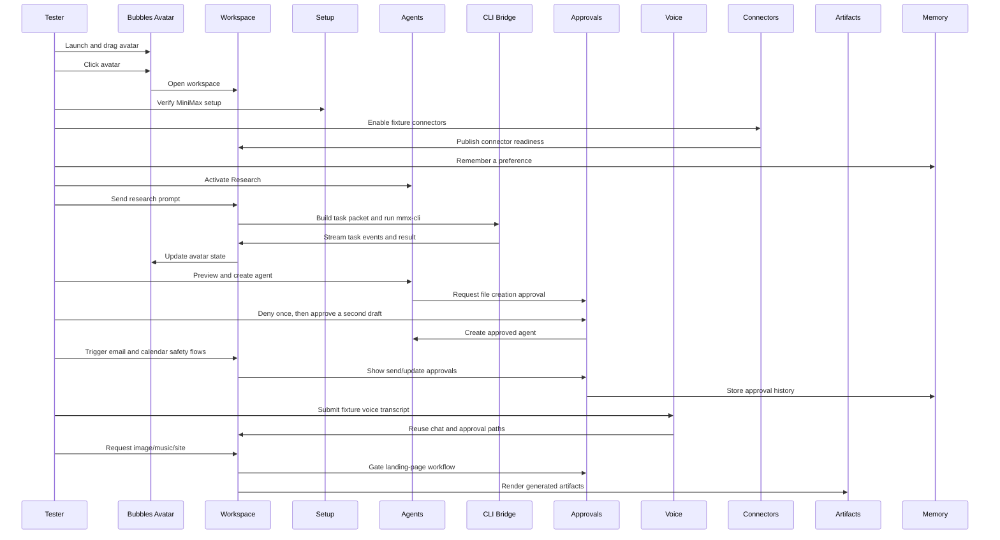

# MVP Integrated Mock Test

This test is a single end-to-end rehearsal that exercises the main Bubbles MVP capabilities with controlled prompts, visible fixture/degraded branches, and approval-safe actions. It is designed for buildathon validation where real MiniMax setup should be used when available, while email/calendar connector actions stay safe and preview-based.

The original 14-phase script is the baseline that passed at commit `35d0fc0`. The current codebase has advanced with voice controls/IPC, native macOS speech playback, spoken approval decisions, Google Workspace connector staging, fixture Gmail/Calendar parity, creative media artifacts, C7 landing-page sandboxing, and observability traces. Phases 15-18 cover those post-mock additions and should be marked separately from the original baseline evidence.

## Goal

Validate that Bubbles feels like one integrated desktop assistant: the floating pet opens the workspace, setup gates live work, agents route tasks, CLI events stream, approvals protect sensitive actions, connectors expose readiness, memory persists preferences, voice and captions feed the same task path, artifacts render in chat, and the avatar reflects task state.

## Integrated Flow

## Preconditions

- [ ] Repository root is `/Users/dev/Documents/GitHub/bubbles-MVP`.
- [ ] App can be started with `corepack pnpm --filter @bubbles/desktop dev`.
- [ ] A MiniMax General API key is available for setup and agent preview.
- [ ] A MiniMax Token Plan Key is available for CLI task execution.
- [ ] Record the current commit with `git rev-parse --short HEAD`.
- [ ] Record feature flags used for the run: `BUBBLES_VOICE_ENABLED`, `BUBBLES_VOICE_APPROVALS_ENABLED`, `BUBBLES_CONNECTORS_GMAIL_REAL`, `BUBBLES_CONNECTORS_CALENDAR_REAL`, `BUBBLES_CREATIVE_IMAGE`, `BUBBLES_CREATIVE_MUSIC`, `BUBBLES_CODING_LANDING_PAGE`, and `BUBBLES_MINIMAX_MEDIA_FIXTURE`.
- [ ] Keep `BUBBLES_MINIMAX_MEDIA_FIXTURE` unset or true for deterministic artifact QA; set it to `false` only for live MiniMax image/music checks.
- [ ] No real email or calendar send/update will be performed during the baseline mock test. Use fixture mode unless the test plan explicitly includes real Google Workspace OAuth.
- [ ] Voice QA uses the preload/test harness fixture transcript path. Current code validates voice IPC, caption state, and native speech playback; live microphone STT is pending until a real STT provider is wired.
- [ ] The tester has a stopwatch or notes area for evidence.

## Mock Persona and Test Data

- User preference: `I like short plans with clear next actions`
- Research prompt: `Research the safest MVP path for connecting MCP tools to a desktop assistant. Give me a short summary.`
- Planning prompt: `Help me plan the next buildathon demo for Bubbles in five bullets.`
- Agent birth prompt: `Create a QA agent for manually testing this Bubbles MVP.`
- Email approval prompt: `Reply that I can join tomorrow at 2 PM.`
- Calendar approval prompt: `Move my demo prep meeting tomorrow to 4 PM.`
- Creative prompt: `Generate a voice intro for the Bubbles demo.`
- Voice fixture prompt: `Help me plan my day`
- Gmail setup prompt: `Connect Gmail fixture`
- Calendar setup prompt: `Connect Calendar fixture`
- Image prompt: `Generate an image for the Bubbles demo`
- Music prompt: `Generate a music track for the Bubbles demo`
- Landing-page prompt: `Build a landing page for the Bubbles demo`

## Phase 1. Launch and Workspace

- [ ] Start the app.
- [ ] Confirm only the floating avatar appears first.
- [ ] Drag Bubbles to a new desktop position.
- [ ] Click Bubbles.
- [ ] Confirm the assistant workspace opens as a separate window.
- [ ] Confirm Bubbles stays above the workspace.
- [ ] Confirm the workspace shows chat, agents, task drawer, approvals area, voice controls, connectors, memory, and settings.

Expected result: Bubbles feels like a compact desktop pet with a larger summoned workspace, not a normal dashboard that always starts open.

## Phase 2. Setup Gate

- [ ] If setup is already ready, record `MiniMax ready` and continue.
- [ ] If setup is not ready, enter the General API key.
- [ ] Confirm setup advances to Token Plan key entry.
- [ ] Enter the Token Plan Key.
- [ ] If prompted, click `Install MiniMax CLI`.
- [ ] Use `Recheck CLI` until the setup status reports ready.
- [ ] Confirm chat composer is enabled only after ready state.

Expected result: both keys and a working CLI are required before live chat tasks can run.

## Phase 3. Fixture Connector Readiness

- [ ] In Connectors, enable fixture mode for Web Search.
- [ ] Enable fixture mode for Local Files.
- [ ] Enable fixture mode for Email.
- [ ] Enable fixture mode for Calendar.
- [ ] Click health check for each enabled connector.
- [ ] Confirm each enabled ready connector becomes healthy.
- [ ] Confirm readiness no longer reports those fixture connectors as unconfigured.
- [ ] Confirm Gmail and Calendar real setup actions show Google Workspace scope summaries when available.

Expected result: the UI clearly labels fixture mode and readiness; fixture mode is not misrepresented as a real account connection. Real Gmail/Calendar setup remains `needs_auth` until an OAuth token path exists, or downgrades to fixture when the real connector feature flag is off.

## Phase 4. Memory Seed

- [ ] Send: `Remember I like short plans with clear next actions`.
- [ ] Confirm Bubbles replies: `I'll remember: I like short plans with clear next actions`.
- [ ] Confirm avatar moves to a success/celebrating state.
- [ ] Confirm the Memory panel shows the saved preference.
- [ ] Confirm Timeline shows `Memory saved`.

Expected result: explicit memory works before the larger task flow and can be used as context for later task packets.

## Phase 5. Agent Switching

- [ ] Activate the Research agent.
- [ ] Confirm the avatar badge changes to `Research`.
- [ ] Confirm a timeline event records the agent activation.
- [ ] Activate the Code agent, then return to Research.
- [ ] Confirm the badge updates each time.

Expected result: agent identity changes behavior context and badge only; avatar visuals do not change.

## Phase 6. Live CLI Research Task

- [ ] With Research active, send the research prompt.
- [ ] Confirm chat adds the user message.
- [ ] Confirm Task Drawer shows `task.received`.
- [ ] Confirm avatar moves through `thinking` or `working`.
- [ ] Wait for task completion.
- [ ] Confirm Task Drawer shows a final `task.result`.
- [ ] Confirm Bubbles posts a concise research answer in chat.
- [ ] Confirm Memory or Timeline records task completion.

Expected result: Bubbles routes a real prompt through the CLI bridge and surfaces the result through chat, task events, memory/timeline, and avatar state.

If MiniMax CLI is unavailable: the task should fail gracefully, the setup status should become actionable, and no secret should be displayed.

## Phase 7. General Planning Task Uses the Same System

- [ ] Activate Bubbles or the General agent.
- [ ] Send the planning prompt.
- [ ] Confirm the task runs through the same Task Drawer pipeline.
- [ ] Confirm the final response is short and action-oriented.
- [ ] Check whether the saved preference appears in recent memory context or memory panel evidence.

Expected result: general planning and research use the same integrated CLI event path while respecting current agent context.

## Phase 8. Agent Birth Approval Safety

- [ ] In Agent Birth, enter the agent birth prompt.
- [ ] Click `Preview agent`.
- [ ] Confirm preview shows a QA-style agent profile, role, skills path, and `skills.md`.
- [ ] Click create.
- [ ] Confirm Bubbles shows a pending agent file creation approval.
- [ ] Deny the approval.
- [ ] Confirm no new QA agent appears in the agent list.
- [ ] Repeat the preview and create step.
- [ ] Approve the second approval.
- [ ] Confirm the new QA agent appears in the agent list and becomes active.
- [ ] Confirm Timeline records agent creation.

Expected result: Bubbles can generate agent identity, but file creation happens only after explicit approval.

## Phase 9. Email Safety Flow

- [ ] Send: `Read my last email`.
- [ ] Confirm Bubbles returns a friendly blocked connector message if no ready email connector is connected.
- [ ] If Email fixture mode is enabled, confirm Bubbles reads the latest fixture email instead of claiming a real inbox connection.
- [ ] Send the email approval prompt.
- [ ] Confirm an approval card appears for `Send email`.
- [ ] Confirm the preview contains recipient, subject, and body fields.
- [ ] Confirm connected fixture mode creates a draft id before approval.
- [ ] Confirm the preview is redacted if any token-like text is present.
- [ ] Deny the approval.
- [ ] Confirm the approval disappears from pending approvals.
- [ ] Confirm Timeline or Memory records the denied approval.

Expected result: email read is connector-gated, and email send/reply is approval-gated. The baseline mock test must not send any real email; fixture approval execution may be tested as a safe post-mock extension.

## Phase 10. Calendar Safety Flow

- [ ] Send: `Check my calendar tomorrow`.
- [ ] Confirm Bubbles returns a friendly blocked connector message if no ready calendar connector is connected.
- [ ] If Calendar fixture mode is enabled, confirm Bubbles lists fixture events instead of claiming a real calendar connection.
- [ ] Send the calendar approval prompt.
- [ ] Confirm an approval card appears for `Update calendar`.
- [ ] Confirm preview includes the requested calendar change.
- [ ] Confirm connected fixture mode suggests a time before asking approval.
- [ ] Cancel the approval.
- [ ] Confirm no calendar update is applied.
- [ ] Confirm Timeline or Memory records the cancelled approval.

Expected result: calendar read is connector-gated, and calendar changes are approval-gated. The baseline mock test must not update a real calendar; fixture approval execution may be tested as a safe post-mock extension.

## Phase 11. Creative MiniMax Surface

- [ ] Activate Creative.
- [ ] Send the creative prompt.
- [ ] Confirm Bubbles routes to the creative surface message.
- [ ] Confirm the response explains voice/media readiness when final artifact generation is unavailable.
- [ ] Confirm the voice control accurately reports `Voice ready` or `Voice off` based on `BUBBLES_VOICE_ENABLED`.

Expected result: the creative agent path is discoverable and honest about what is connected in the MVP UI.

## Phase 12. Task Cancellation Branch

- [ ] Start a longer CLI prompt, such as: `Research three options for long-running desktop assistant testing and compare them`.
- [ ] While the task is active, click the Task Drawer cancel button.
- [ ] Confirm a `task.cancelled` event appears.
- [ ] Confirm Bubbles says the task was cancelled.
- [ ] Confirm active task controls clear.
- [ ] Confirm avatar returns to a neutral state.

Expected result: Bubbles can stop an active CLI task without leaving stale state behind.

## Phase 13. Redaction Check

- [ ] Send a harmless message containing a fake key: `Remember my fake test key is sk-cp-1234567890abcdef`.
- [ ] Inspect chat, memory, task drawer, and approval previews.
- [ ] Export redacted logs.
- [ ] Confirm real keys are never visible.
- [ ] Confirm fake key-like strings are redacted in logs and security-sensitive previews/errors.

Expected result: security-sensitive surfaces redact credentials. If explicit memory stores the fake key verbatim, record it as a privacy bug because durable memory should not keep secrets.

## Phase 14. Restart Persistence

- [ ] Close the app.
- [ ] Start the app again.
- [ ] Open the workspace.
- [ ] Confirm setup still reflects the expected ready or recoverable state.
- [ ] Confirm connector fixture settings persisted.
- [ ] Confirm saved memory and timeline entries are still visible.
- [ ] Confirm resolved approval history remains visible in memory/timeline evidence.
- [ ] Confirm the latest active/default agent state is reasonable.

Expected result: persistent MVP state survives restart without exposing secrets.

## Phase 15. Voice IPC and Spoken Approval Extension

- [ ] With voice enabled, confirm the voice control starts in push-to-talk mode and shows `Voice ready`.
- [ ] Click the mic button and confirm the voice state changes to listening and the avatar maps to `listening`.
- [ ] Submit a fixture partial transcript through preload/test harness and confirm the caption updates without creating a chat turn.
- [ ] Submit the fixture final transcript: `Help me plan my day`.
- [ ] Confirm the transcript creates the same user chat turn as typed input.
- [ ] Confirm the Bubbles reply is captioned and spoken through native macOS speech playback.
- [ ] While Bubbles is speaking, use barge-in and confirm speech stops and the UI returns to listening.
- [ ] Create a pending approval, submit fixture voice transcript `approve`, and confirm the approval resolves.
- [ ] Repeat with `deny`, `cancel`, and two unclear attempts; confirm unclear attempts fall back to visible approval buttons.
- [ ] With `BUBBLES_VOICE_ENABLED=false`, confirm the control shows `Voice off`, is disabled, and typed chat remains usable.

Expected result: voice is a safe alternate input/output path for the existing chat and approval flows. Record live microphone STT as `Blocked` unless a real STT provider has been added.

## Phase 16. Fixture Connector Parity Extension

- [ ] Send: `Connect Gmail fixture`.
- [ ] Confirm Email becomes enabled, fixture, ready, and healthy.
- [ ] Send: `Read my last email`.
- [ ] Confirm Bubbles reads the fixture email with visible fixture context.
- [ ] Send the email approval prompt again.
- [ ] Approve the fixture `Send email` approval.
- [ ] Confirm Bubbles posts the safe fixture-send completion message.
- [ ] Send: `Connect Calendar fixture`.
- [ ] Confirm Calendar becomes enabled, fixture, ready, and healthy.
- [ ] Send: `Check my calendar tomorrow`.
- [ ] Confirm Bubbles lists fixture calendar events.
- [ ] Send the calendar approval prompt again.
- [ ] Approve the fixture `Update calendar` approval.
- [ ] Confirm Bubbles posts the safe fixture calendar creation message.
- [ ] Try real Gmail or Calendar setup without OAuth token env and confirm the connector remains `needs_auth` or unhealthy with a helpful error.

Expected result: fixture connector reads and approval-gated writes are safe to demonstrate, while real Google Workspace remains honest about missing OAuth setup.

## Phase 17. Creative Artifacts and C7 Landing Page Extension

- [ ] Send the image prompt.
- [ ] Confirm Bubbles returns an image artifact in chat. In default fixture mode, this should be a deterministic SVG under app user-data artifacts.
- [ ] Send the music prompt.
- [ ] Confirm Bubbles returns a playable audio artifact in chat. In default fixture mode, this should be a deterministic WAV under app user-data artifacts.
- [ ] Confirm image and audio artifacts render through `bubbles-artifact://local/...`.
- [ ] Send the landing-page prompt.
- [ ] Confirm Bubbles creates a `Generate landing page` approval with action type `shell_command`.
- [ ] Deny or cancel one landing-page approval and confirm no site is generated or served.
- [ ] Repeat the landing-page prompt and approve it.
- [ ] Confirm files are generated only under Electron app user-data artifacts.
- [ ] Confirm the workflow runs the allowlisted accessibility check and Vite build.
- [ ] Confirm a localhost URL opens on `127.0.0.1`, starting at port `4173` or the next available port.
- [ ] Confirm the chat contains a site artifact with the local URL.

Expected result: creative image/music artifacts render in chat, and C7 landing-page generation is gated by approval before sandbox file writes, command execution, local serving, or browser opening.

## Phase 18. Observability and Post-Mock Security Extension

- [ ] Export redacted logs after voice, connector, media, and landing-page checks.
- [ ] Confirm `task-logs/observability.ndjson` exists when traceable events were emitted.
- [ ] Confirm trace events include correlation ids such as `traceId`, and where applicable `voiceTurnId`, `taskId`, `approvalId`, and `ttsId`.
- [ ] Confirm trace event fields record lengths, statuses, command labels, payload keys, and artifact ids instead of raw transcripts, audio, email bodies, calendar payloads, OAuth tokens, or MiniMax keys.
- [ ] Confirm artifact opening rejects local paths outside the app user-data artifact root.
- [ ] Confirm landing-page sandbox path checks reject paths outside the sandbox root.
- [ ] Confirm landing-page command allowlist rejects commands outside `node scripts/accessibility-check.mjs` and Vite build.

Expected result: the post-mock feature layer keeps the same privacy posture as the original MVP flow.

## Pass Criteria

- [ ] Floating avatar and workspace behavior pass.
- [ ] MiniMax setup reaches ready or fails with clear recovery guidance.
- [ ] At least one live CLI task completes or fails gracefully with categorized setup guidance.
- [ ] Agent switching is visible through badges and timeline.
- [ ] Agent Birth requires approval before file creation.
- [ ] Email and calendar risky operations require approval and do not execute during mock testing.
- [ ] Connector readiness and fixture status are visible.
- [ ] Memory and timeline capture important events.
- [ ] Avatar states track task progress, approvals, success, errors, and cancellation.
- [ ] Voice fixture turns, captions, native speech playback, and spoken approval decisions pass or are marked with a precise blocker.
- [ ] Image/music/site artifacts render in chat or are marked with the missing feature flag/provider.
- [ ] Landing-page generation is approval-gated and sandboxed.
- [ ] No real secret appears in UI, memory, timeline, approvals, or exported logs.

## Known MVP-Limit Expectations

- Email read and calendar read are expected to show blocked connector messages unless a ready fixture or real connector is available.
- Fixture connector mode validates readiness UI, fixture reads, and approval-gated fixture writes; it does not prove real Gmail, Outlook, Google Calendar, or MCP service execution.
- Real Google Workspace MCP execution is pending until OAuth/token configuration is available and exercised.
- Live microphone STT is pending until a real STT provider is wired. Current voice coverage is IPC, fixture transcript submission, captions, native speech playback, and approval voice decisions.
- Creative image/music generation defaults to deterministic fixture artifacts unless `BUBBLES_MINIMAX_MEDIA_FIXTURE=false` and live `mmx` media commands are exercised.
- Agent Birth depends on the MiniMax General API key because previews are generated through MiniMax JSON.
