# CLI-First Bubbles Buildathon MVP Full Plan

## Current Build Status

- Integrated MVP mock test status: all 14 phases in `docs/MVP-Mock-Test.md` passed in the live Electron app. Results and evidence are tracked in `docs/MVP-Mock-Test-Status.md`.
- Desktop shell is implemented: Electron desktop shell, draggable always-on-top avatar window, separate assistant workspace, shared main-process app state, PixiJS sprite-sheet avatar, chat, task drawer, approvals, connectors, memory, timeline, settings, and visible avatar state changes.
- MiniMax setup is implemented and verified: required General API key plus Token Plan Key, separate Keychain storage, app-local `mmx-cli` install approval, CLI auth/status/quota/text verification, and no API-only completion path.
- CLI Agent Bridge is implemented and verified: Bubbles sends structured task packets through Electron main, runs the app-local MiniMax CLI, normalizes CLI/MiniMax output into task events, streams those events into the Task Drawer, maps lifecycle events to avatar state, handles cancellation/timeouts/errors, and writes redacted task logs.
- Agent identity and Agent Birth are implemented and verified: generated drafts are normalized from MiniMax JSON, previewed before file writes, gated by `agent_file_create` approval, and only persisted after explicit approval.
- Safety surfaces are implemented and verified: email/calendar actions remain approval-preview only, fixture connectors stay labeled, memory/timeline persist across restart, and token-like strings are redacted before durable storage, logs, previews, and chat echoes.
- Current next work is hardening and expansion, not MVP completion: keep fixture behavior stable while adding real connector providers, voice/media generation, packaging/signing, and broader automated coverage.

## 1. Product Definition

Bubbles is not just a chatbot and not just a desktop pet. Bubbles is an emotional desktop interface that lets normal users access the power of CLI agents, MiniMax, MCP tools, memory, and agent workflows without touching a terminal.

> Bubbles is an emotional desktop pet interface for powerful CLI AI agents, allowing nontechnical users to speak or type tasks while Bubbles routes work to the CLI, manages memory and permissions, and returns results through a friendly visual, voice, and chat experience.

The core gap this product solves:

- Most users cannot productively use CLI agents, MCP servers, coding tools, API keys, prompts, and `skills.md` files.
- Bubbles hides this complexity behind a natural desktop companion.
- The CLI does the heavy work.
- Bubbles makes the work safe, personal, understandable, memorable, and emotionally alive.

In this new direction, Bubbles is the visible body and relationship layer for an invisible CLI agent system.

```txt
User talks to Bubbles
  -> Bubbles understands intent and context
  -> Bubbles adds memory, active agent identity, and safety policy
  -> Bubbles sends the task to the CLI agent
  -> CLI agent uses MiniMax, MCP tools, files, and connectors
  -> CLI agent returns events, results, diffs, errors, and tool outputs
  -> Bubbles explains the result with voice, chat, avatar emotion, and memory updates
```

This means users do not need to learn terminal commands, MiniMax CLI commands, MCP configuration, prompt engineering, or coding-agent workflows. They can simply speak or type:

- "Read my last email."
- "Reply that I can join."
- "Research the best way to build this."
- "Create a coding agent for this project."
- "Plan my MVP."
- "Generate a voice intro for my demo."
- "Check my calendar tomorrow."

Bubbles handles the translation between human intention and CLI-agent execution.

## 2. Architecture Shift

The original plan treated the CLI as one backend tool used by Bubbles. The updated plan makes the CLI agent the primary worker brain, while Bubbles owns the user experience, emotional layer, memory, permissions, onboarding, and explanation.

### Old Model

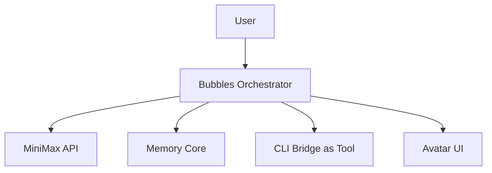

In the old model, Bubbles was the main orchestrator and the CLI was a specialized execution tool.

### New Model

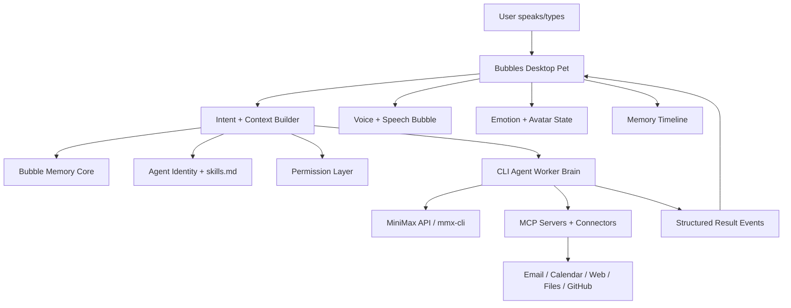

### Final Architecture Principle

> Bubbles owns the user experience, memory, safety, and identity. The CLI owns deep work, tool use, execution, and agent reasoning.

This creates a cleaner MVP because Bubbles does not need to rebuild every agent capability internally. Instead, it wraps CLI-agent power with a product experience that normal users can understand.

## 3. MiniMax Capability Layer

MiniMax is the primary AI and multimodal provider for the MVP.

Based on the current MiniMax documentation:

- `mmx-cli` supports text, image generation, video generation, speech synthesis, music generation, vision/image understanding, and web search.
- MiniMax M2.7 supports agentic tool use and interleaved thinking.
- MiniMax MCP currently supports web search and image understanding.
- Other user services such as Gmail, calendar, GitHub, Slack, Notion, and local app actions need their own MCP servers or connectors.

### Recommended Split

Use a MiniMax General API key for direct MiniMax APIs:

- Fast chat responses.
- Agent birth generation.
- `skills.md` generation.
- Memory extraction.
- Short summaries.
- Intent classification.
- User-facing response rewriting.

Use a MiniMax Token Plan Key for `mmx-cli`:

- Multimodal tasks.
- Speech generation.
- Image generation.
- Video generation.
- Music generation.
- Vision/image understanding.
- Web search.
- CLI-agent workflows.
- Tasks where a terminal-oriented agent is already strong.

The app treats these as two required credentials. The General API key is never used for `mmx auth login`, and the Token Plan Key is never used for direct API verification. Setup is complete only after both credentials verify and CLI checks pass.

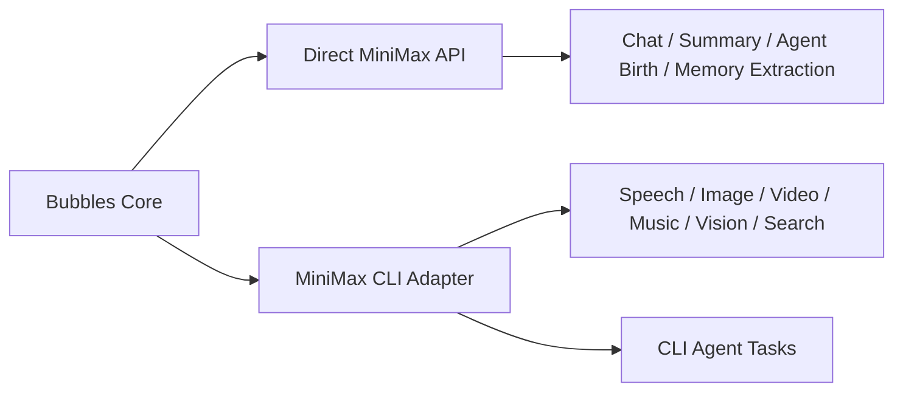

### MiniMax References

- MiniMax CLI: `https://platform.minimax.io/docs/token-plan/minimax-cli`
- MiniMax API Overview: `https://platform.minimax.io/docs/api-reference/api-overview`
- MiniMax Tool Use: `https://platform.minimax.io/docs/guides/text-m2-function-call`
- MiniMax MCP Guide: `https://platform.minimax.io/docs/token-plan/mcp-guide`

## 4. First-Run Setup Flow

Bubbles should provide a guided setup instead of expecting users to configure MiniMax manually.

The setup should feel like waking up the pet for the first time.

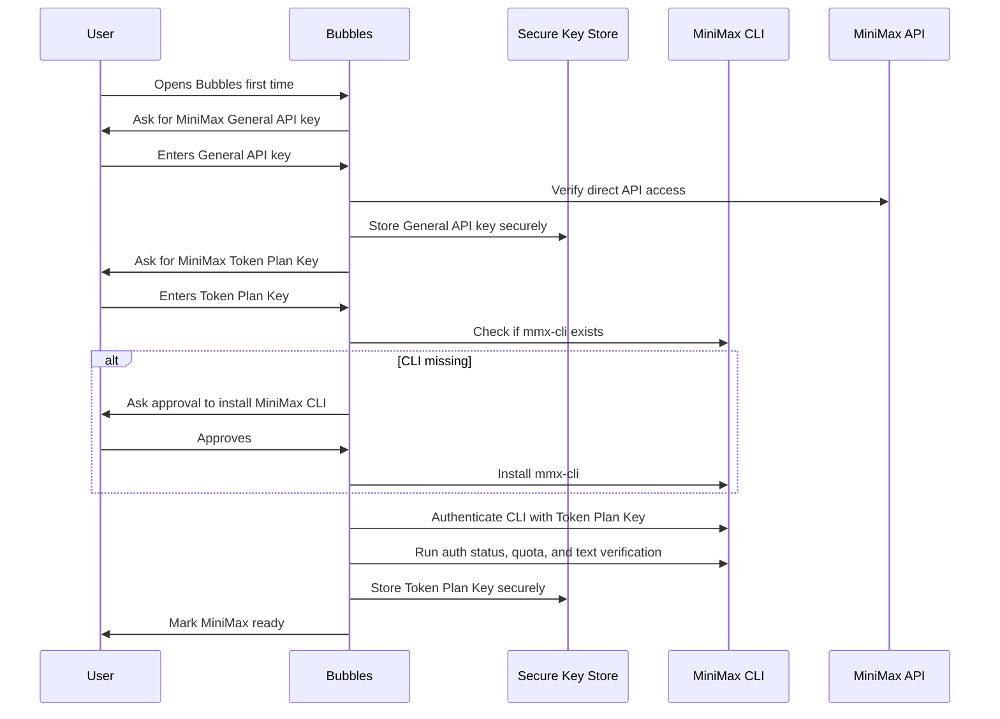

### Required Setup Decisions

- Store the MiniMax General API key and Token Plan Key as separate macOS Keychain entries for the buildathon MVP.
- Never store raw keys in SQLite, setup status JSON, logs, memory, timeline, chat history, or agent files.
- CLI install must require explicit user approval.
- Bubbles should detect whether `mmx` exists before offering install.
- Bubbles should authenticate the CLI with the Token Plan Key only.
- Bubbles should verify direct MiniMax API access with the General API key only.
- If CLI install fails, Bubbles should keep setup incomplete because full MVP setup requires both MiniMax keys and working CLI verification.
- If General API verification fails, Bubbles should show a friendly setup error and keep setup incomplete.
- If Token Plan or CLI verification fails, Bubbles should show a friendly setup error and keep setup incomplete.

### Setup States

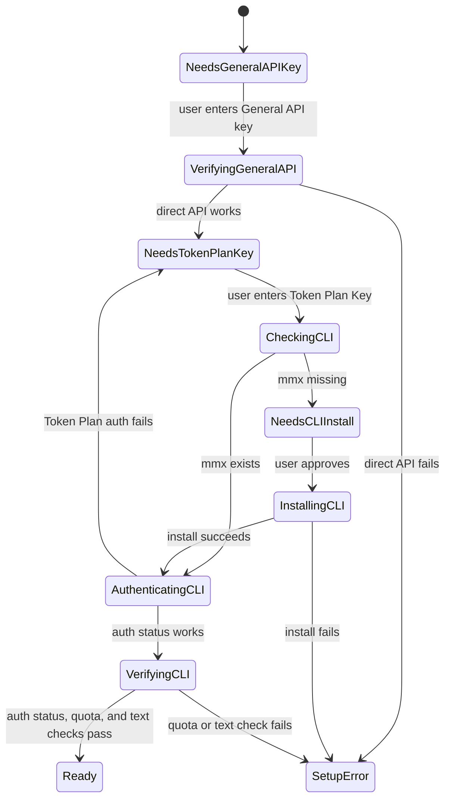

## 5. Hybrid MCP Strategy

The MVP should use a hybrid MCP strategy.

Bubbles owns:

- Connector setup UI.
- Connector status.
- Tool permission policy.
- Human-readable approval previews.
- Audit history.
- Which active agent can use which tool.
- Safe fallback behavior when a connector is unavailable.

The CLI agent owns:

- Tool reasoning.
- Tool call sequencing.
- Using approved MCP tools for real work.
- Returning structured summaries, errors, and results.

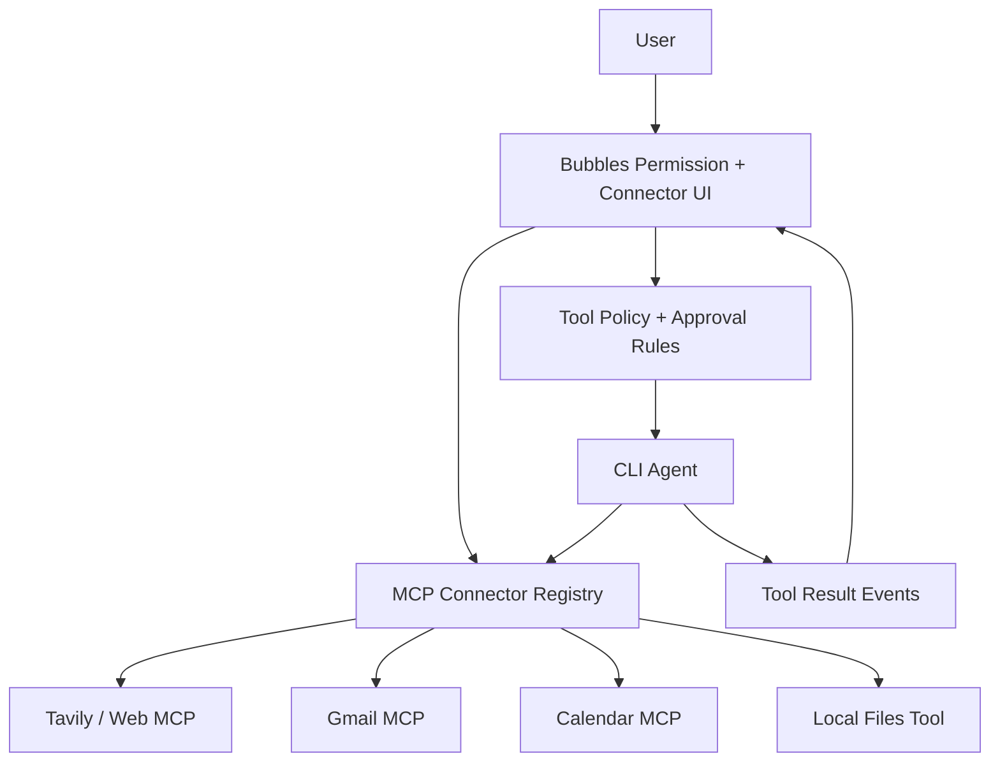

### Buildathon Connector Priorities

Prioritize:

- Web research through Tavily MCP or MiniMax search.
- Local files and project folders.
- Email through Gmail or Outlook MCP if authentication is available.
- Calendar through Google Calendar or Outlook Calendar MCP if authentication is available.

Fallback:

- If email or calendar authentication is too slow for the buildathon, use mock inbox and mock calendar fixtures behind the same MCP-shaped interface.
- The UI should not care whether a connector is real or mocked.
- The approval flow should be identical for real and mock actions.

## 6. Core MVP Subsystems

### Floating Avatar Shell

The desktop app should be a macOS-first Electron app where Bubbles is a floating desktop presence, not a dashboard with an avatar inside it.

Default state:

- Transparent always-on-top avatar window sized around the Bubbles sprite.
- Pixel or 2D animated Bubbles avatar as the primary surface.
- Draggable avatar/window that can be placed anywhere on the desktop.
- Compact pet label showing `Bubbles`; avatar mood text is not shown under the pet.
- Drag-and-drop target behavior for future file, folder, text, and image task handoff.

Click/open state:

- Clicking Bubbles opens a larger assistant workspace in a second Electron window anchored near the avatar.
- The panel should feel like a desktop Codex/Claude interface: conversations, active chat, history, settings, task status, memory/timeline, connector status, and approvals.
- The assistant workspace can be dragged by its header but must stay visually behind the floating avatar window.
- Closing the panel returns Bubbles to the compact floating avatar state.
- The avatar remains visible and emotionally stateful while the panel is open.
- The avatar window and workspace window share one app state from Electron main: current avatar animation, chat messages, speech bubble text, task status, and panel open/closed state.
- Bubbles click toggles the workspace: click once opens the workspace, click again closes it.
- The workspace must be a separate window rather than a resized transparent avatar window, so there is no invisible bridge or clickable transparent layer between Bubbles and the panel.

Task state surfaces:

- Speech bubble appears near the avatar for short responses and uses a clean solid style with subtle highlight/shadow, not a transparent glass overlay.
- Task drawer appears as an expandable panel section, not a permanent default sidebar.
- Approval previews appear as focused cards/panels near Bubbles.
- Memory, settings, connectors, and setup are panel tabs or sections, not always-on chrome.

### MVP Avatar Scope

The buildathon MVP uses one universal Bubbles sprite sheet. Agents do not change avatar colors, costumes, props, sprite sheets, or chat panel theme.

Required sprite animations:

- `idle`: 6 frames.
- `listening`: 6 frames.
- `thinking`: 8 frames.
- `working`: 8 frames.
- `waiting_approval`: 6 frames.
- `confused`: 6 frames.
- `concerned`: 6 frames.
- `celebrating`: 8 frames.
- `sleeping`: 6 frames.

Task state changes the sprite animation. Agent identity changes badge/name, voice, personality, `skills.md`, tools, memory rules, and response behavior only.

### Emotion Engine

The Emotion Engine maps real events to avatar behavior.

Inputs:

- User interaction.
- CLI task status.
- Tool status.
- Approval requirements.
- Agent personality.
- Memory context.
- Errors and uncertainty.

Outputs:

- Emotion state.
- Animation state.
- Voice tone.
- Speech style.
- UI accent.
- Status badge text.

### Voice + Chat Layer

The MVP should support both voice and typed chat.

Voice input:

- Use platform speech recognition or a speech-to-text provider if available.
- Keep typed chat as the reliable fallback.

Voice output:

- Use MiniMax TTS when configured.
- Allow voice to be disabled.
- Agent voice style should come from `agent.json`.

### CLI Agent Bridge

The CLI Agent Bridge sends structured task packets to the CLI and receives lifecycle events.

Current implementation supports:

- Real app-local MiniMax CLI mode.
- Fixture command mode for automated tests only.
- Shared Electron-main lifecycle for chat messages, active task id, task events, and avatar state.
- MiniMax setup preflight before task execution.
- Streaming status.
- Cancellation.
- Approval interruption event handling.
- Error capture.
- Stalled command timeouts.
- Redacted task logs.
- Output normalization for plain stdout, structured task JSON, MiniMax pretty JSON assistant responses, and MiniMax JSON errors.

Phase 3 runtime tasks execute the app-local `mmx` binary under Electron `userData` to avoid leaking global CLI auth or configuration into Bubbles.

### Agent Identity System

Each agent has:

- `agent.json`.
- `skills.md`.
- Name.
- Role.
- Badge/name.
- Personality.
- Voice style.
- Allowed tools.
- Memory rules.
- Safety rules.
- Response style.

Agents are not separate apps. They are minds inside the same Bubbles body: identities that shape how Bubbles packages work for the CLI and how Bubbles presents the response to the user.

### Bubble Memory Core

Memory stores:

- User preferences.
- Project context.
- Connector context.
- Task summaries.
- Decisions.
- Agent history.
- Relationship memory.
- Useful facts from research.
- Approval history.

Memory is used before sending tasks to the CLI and after receiving results.

### Permission Layer

Permission previews are required before:

- Sending email.
- Editing calendar events.
- Creating or editing files.
- Running shell commands.
- Installing tools.
- Updating agent files.
- Sending sensitive/private data to external APIs.

### Connector/MCP Registry

The registry tracks:

- Connector name.
- Connector type.
- Real or mock mode.
- Auth status.
- Allowed agents.
- Required approval level.
- Last health check.
- Last error.

## 7. Emotional Interaction Flow

Emotions must reflect real system state. Bubbles should not randomly fake feelings. The emotional layer is a user-friendly status system with character.

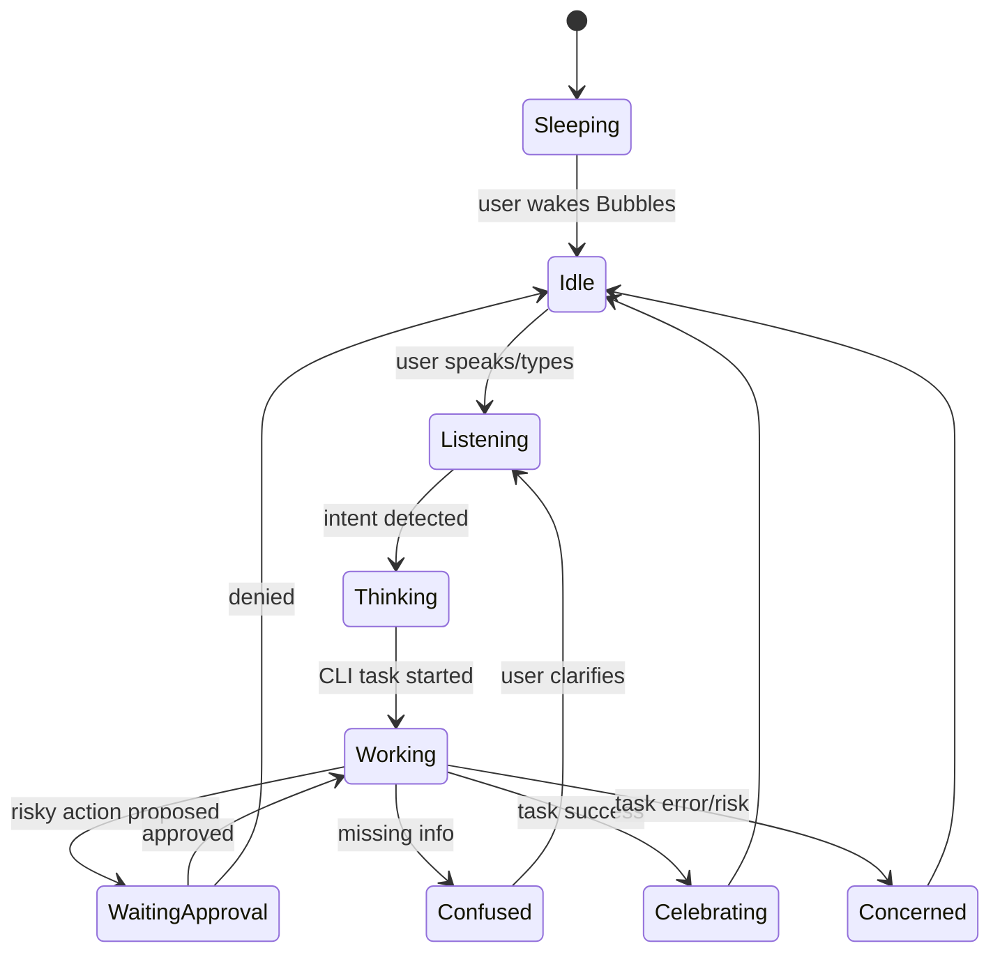

### Emotion Rules

- `thinking` means the CLI/API is processing.
- `working` means a tool, connector, or CLI task is active.
- `waitingApproval` means user permission is required.
- `confused` means the task needs clarification.
- `concerned` means there is an error, risk, blocked connector, or failed tool call.
- `celebrating` means the task completed successfully.
- Agent personality changes how the emotion is expressed, not the underlying truth.

Example:

```txt
Same backend event: CLI command failed

Coding Agent:
"The build failed, but I found the first place to inspect."

Research Agent:
"The source path failed. I can try another route and mark uncertainty."

General Assistant:
"Something did not work, but I saved where we were. Want me to retry?"
```

## 8. Main User Flows

### General Task Flow

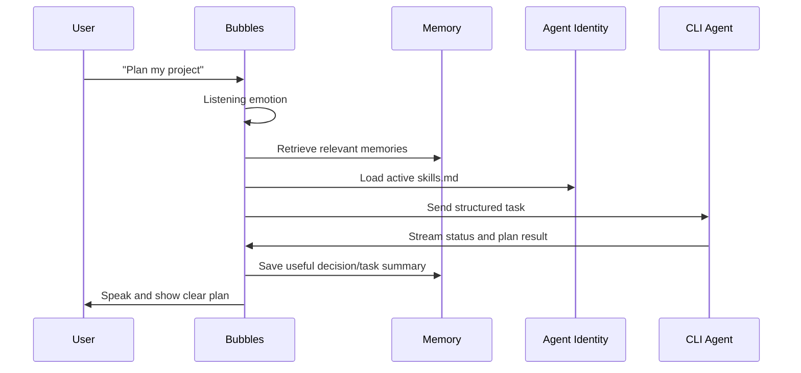

### Email Read + Reply Flow

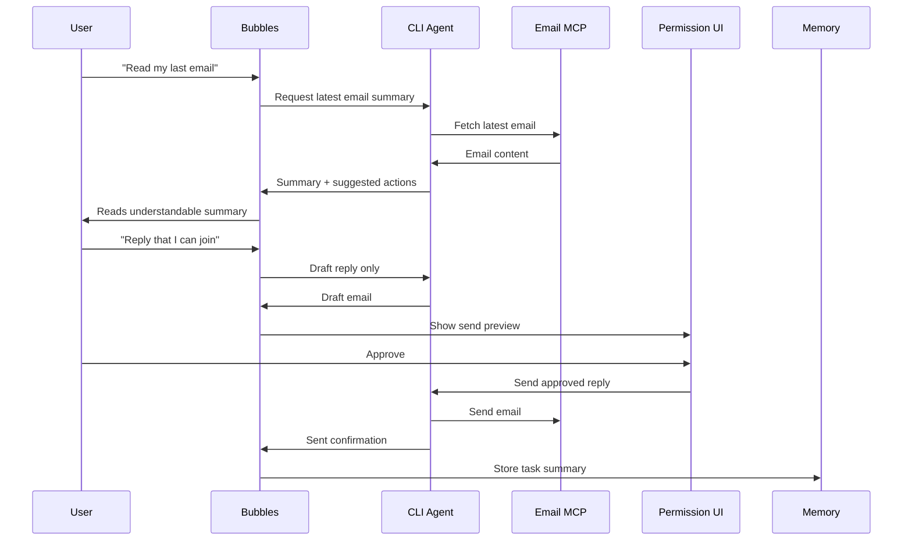

### Research Flow

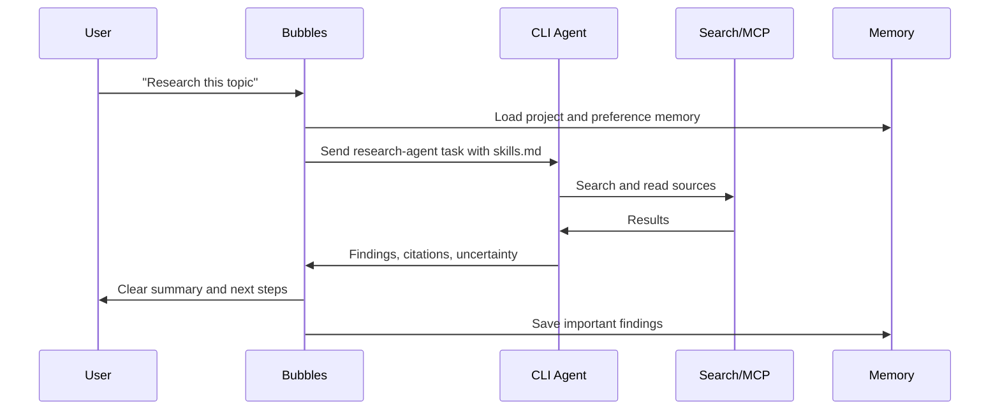

### Coding Flow

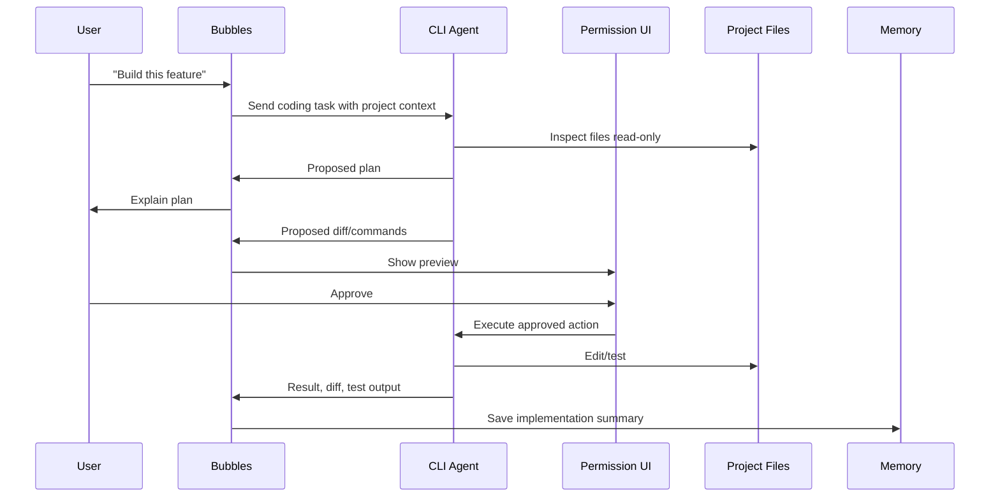

### Calendar Flow

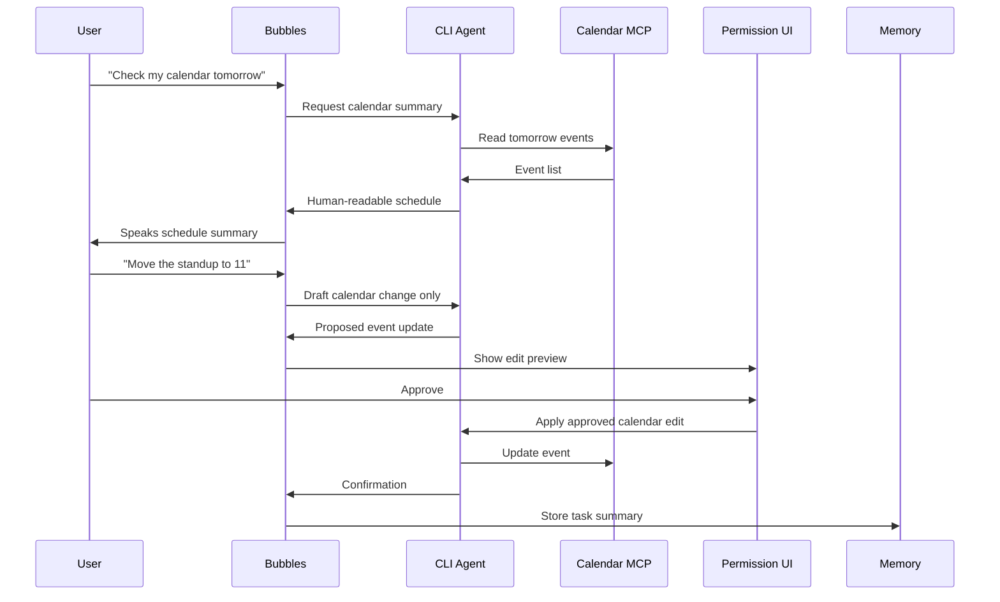

### Agent Birth Flow

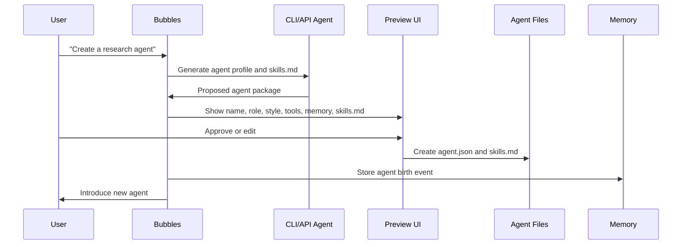

### Creative MiniMax Flow

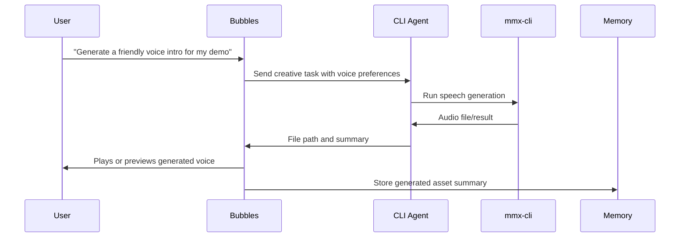

## 9. Structured Task Protocol

Bubbles should communicate with the CLI agent using a structured task packet.

### Minimum Task Packet

```json
{
  "taskId": "task_123",
  "userText": "Read my last email",
  "activeAgentId": "general-assistant",
  "taskType": "email.read",
  "mode": "plan_then_act",
  "memoryContext": [],
  "skillsMarkdown": "...",
  "allowedTools": ["gmail.read"],
  "approvalPolicy": "preview_sensitive_actions",
  "outputPreference": {
    "userLevel": "nontechnical",
    "responseStyle": "clear_spoken_summary",
    "includeTechnicalDetails": false
  }
}
```

### Required CLI Event Types

- `task.received`
- `task.status`
- `task.partial_output`
- `tool.requested`
- `approval.required`
- `approval.accepted`
- `approval.denied`
- `task.result`
- `task.error`
- `task.cancelled`

### Event Flow

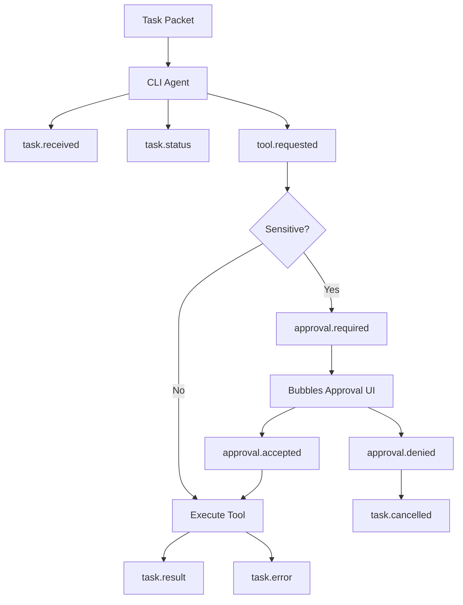

## 10. Buildathon MVP Phases

### Phase 1: Floating Avatar Shell

Build:

- Electron macOS app.
- Transparent always-on-top avatar window.
- Separate assistant workspace window opened from the avatar.
- Draggable floating Bubbles avatar as the default experience.
- Click-to-open assistant panel that resembles Codex/Claude desktop chat.
- Conversation list/history placeholder.
- Active chat view placeholder.
- Settings/status area placeholder.
- Speech bubble connected to chat messages.
- Pet name label showing `Bubbles`.
- Mock emotion states.
- Task drawer placeholder inside the assistant panel.
- Shared Phase 1 state across both Electron windows.

Acceptance:

- User can open Bubbles as a desktop pet.
- User can drag Bubbles anywhere on the desktop.
- Clicking Bubbles opens the assistant panel.
- Clicking Bubbles again closes the assistant panel.
- User can type messages in the assistant panel.
- Assistant panel can be dragged while Bubbles remains in front of it.
- Avatar can change state based on mock events.
- Avatar state changes made in the panel update the visible floating Bubbles avatar.
- Messages sent in the panel update the floating Bubbles speech bubble.
- `celebrating` continues looping until another avatar state is selected.
- Chat panel, conversation history placeholder, settings/status area, task drawer, and speech bubble display correctly.
- Closing the panel returns to the compact floating avatar.

### Phase 2: MiniMax Guided Setup

Build:

- Required dual-key onboarding screen.
- Separate secure storage for General API and Token Plan keys.
- MiniMax CLI detection.
- User-approved CLI install prompt.
- CLI authentication.
- Direct API verification.
- CLI auth status, quota, and text verification.
- Incomplete setup state when CLI verification fails.

Acceptance:

- User can enter both the MiniMax General API key and MiniMax Token Plan Key.
- Both keys are stored securely.
- Direct API verification uses only the General API key.
- CLI authentication uses only the Token Plan Key.
- Bubbles detects whether `mmx` is available.
- Bubbles does not install CLI without approval.
- Bubbles does not reach ready until CLI is available and verified.

### Phase 3: CLI Agent Bridge

Build:

- Structured task packet.
- Event parser.
- Real app-local MiniMax CLI mode.
- Shared Electron-main chat/task/avatar lifecycle.
- Setup preflight and setup-health updates for CLI auth/network/quota failures.
- Task cancellation.
- Stalled command timeout handling.
- Redacted task logs.
- Plain stdout, structured task JSON, MiniMax pretty JSON response, and MiniMax JSON error normalization.
- Task Drawer event display.

Acceptance:

- Bubbles can send a user task to the app-local MiniMax CLI when setup is ready.
- Bubbles packages user text, active agent, skills, memory context, allowed tools, approval policy, and output preference into a structured task packet.
- Chat, active task state, Task Drawer events, and avatar state stay synchronized through Electron main.
- Task Drawer streams status, partial output, errors, cancellation, and result events.
- CLI errors are visible in chat/task drawer and do not crash the app.
- CLI auth/network/quota failures can mark setup unhealthy for recheck without deleting stored keys.
- Avatar state follows task lifecycle: `thinking`, `working`, `waiting_approval`, `confused`, `concerned`, `celebrating`, or `idle`.
- Chat stays disabled until MiniMax setup reaches `ready`.

### Phase 4: Memory + Timeline

Build:

- SQLite memory store.
- Relationship memory.
- Task summaries.
- Timeline UI.
- Memory recall before task dispatch.

Acceptance:

- Bubbles stores user preference memories.
- Bubbles recalls preferences in later tasks.
- Timeline shows task and memory events.

### Phase 5: Emotion Engine

Build:

- Event-to-emotion mapper.
- Agent-specific expression rules.
- Voice/chat response shaping.
- Status badge mapping.

Acceptance:

- Avatar state matches real task state.
- Approval requests show waiting emotion.
- Errors show concerned emotion.
- Completed tasks show celebrating emotion.

### Phase 6: MCP/Connector Registry

Build:

- Hybrid connector registry.
- Web/local file connector.
- Email connector or mock fallback.
- Calendar connector or mock fallback.
- Connector health/status UI.

Acceptance:

- Bubbles can route a research task to web search.
- Bubbles can read local/project context when approved.
- Email and calendar flows work with real or mock connectors.

### Phase 7: Demo Agent Capabilities

Build default agents:

- General Assistant.
- Research Agent.
- Coding Agent.
- Email/Calendar Assistant.
- Creative MiniMax Helper.

Acceptance:

- Each agent has an `agent.json`.
- Each agent has a `skills.md`.
- Active agent changes badge/name, voice style, response style, `skills.md`, memory rules, and allowed tools; it does not change avatar art or chat panel theme.

### Phase 8: Permission Previews

Build approval previews for:

- Sending email.
- Calendar edits.
- File edits.
- Shell commands.
- CLI installs.
- Agent file creation.

Acceptance:

- Bubbles never sends email without approval.
- Bubbles never edits calendar without approval.
- Bubbles never writes files without approval.
- Bubbles never installs CLI without approval.

### Phase 9: Buildathon Demo Polish

Build:

- One guided demo flow.
- Stable mock data for email/calendar fallback.
- Smooth transitions between avatar states.
- Short, understandable spoken responses.
- Clean failure states.

Acceptance:

- The demo can run even if real email/calendar auth fails.
- The demo clearly proves the product idea.

## 11. Buildathon Demo Script

Use this exact demo path:

1. User opens Bubbles and sees only the floating avatar.
2. User drags Bubbles to a comfortable desktop position.
3. User clicks Bubbles to open the Codex/Claude-style assistant panel.
4. Bubbles asks for the MiniMax General API key and Token Plan Key, then verifies setup.
5. User says: "Hey Bubbles, help me plan my Bubbles MVP."
6. Bubbles sends the task to CLI and returns a spoken plan.
7. User says: "Research the best way to connect MCP tools."
8. Bubbles uses the research agent and shows sources.
9. User says: "Create a coding agent for this project."
10. Bubbles previews the new agent and `skills.md`, then creates it after approval.
11. User says: "Read my last email."
12. Bubbles uses real or mock email connector and summarizes it naturally.
13. User says: "Reply that I can join."
14. Bubbles drafts the reply and asks approval before sending.
15. User says: "Check my calendar for tomorrow."
16. Bubbles reads calendar through connector or mock and summarizes.
17. User says: "Remember I like short plans."
18. Bubbles stores relationship memory.
19. User asks another planning question.
20. Bubbles recalls the preference and gives a shorter answer.

### Demo Story Arc

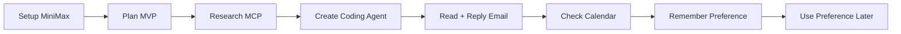

## 12. Test Plan

### Setup Tests

- First-run setup succeeds with both MiniMax keys.
- First-run setup handles missing CLI.
- First-run setup stays incomplete if CLI install fails.
- Setup cannot complete with only one MiniMax key.
- General API key is never sent to CLI auth.
- Token Plan Key is never sent to direct API verification.
- MiniMax keys are never stored in plain text.
- MiniMax keys are redacted from logs, timeline, and memory.

### Interaction Tests

- Voice input produces a task packet.
- Typed chat produces a task packet.
- Bubbles can respond through speech bubble.
- Bubbles can respond through the click-open assistant panel.
- Bubbles can show conversation history, active chat, settings/status, and task drawer placeholders inside the panel.
- Floating avatar can be dragged and remains usable when the panel is closed.
- Voice output can be toggled off.

### Research Tests

- Research task returns summary, sources, and uncertainty.
- Research agent uses source-aware response style.
- Web connector unavailable state shows a graceful fallback.

### Email Tests

- Email read flow summarizes correctly.
- Email reply flow drafts before sending.
- Email reply flow never sends without approval.
- Denied email approval prevents sending.

### Calendar Tests

- Calendar read flow summarizes events.
- Calendar edit flow previews changes.
- Calendar task never edits without approval.
- Denied calendar approval prevents changes.

### Coding Tests

- Coding task sends project context to CLI.
- File edits are previewed before writing.
- Shell commands require approval.
- CLI errors are surfaced clearly.

### Agent Tests

- Agent creation previews `agent.json` and `skills.md`.
- Approved agent creation stores files.
- Active agent changes allowed tools and response style.
- Agent birth is saved in memory timeline.

### Memory Tests

- Memory saves user preference.
- Memory recalls preference in later conversation.
- Task summaries are stored.
- Timeline displays task, memory, and approval events.

### Emotion Tests

- Emotion state changes match real task events.
- Waiting approval state only appears when approval is required.
- Concerned state appears on tool error or risk.
- Celebrating state appears after task success.

## 13. Security and Privacy Defaults

- Local-first storage by default.
- Secure key storage through macOS Keychain for MVP.
- No raw API keys in files, SQLite, logs, memory, or timeline.
- Sensitive actions require explicit approval.
- Private data sent to external APIs must be visible in the preview when practical.
- Email sending, calendar editing, file writing, command execution, and tool installation are never silent.
- Mock connectors are clearly marked in settings but should feel identical in the main demo flow.
- Users can clear memory.
- Users can disable voice.
- Users can disconnect connectors.

## 14. Assumptions

- Create a new file: `docs/full_plan_v2.md`.
- Keep the existing `docs/full_plan.md` unchanged.
- Target platform is macOS first.
- MVP interaction is voice + chat.
- First-run setup uses guided MiniMax General API key and Token Plan Key entry, secure storage, CLI detection, user-approved CLI install, and verification.
- Architecture is CLI-first: CLI agent is the primary worker brain; Bubbles is the GUI, emotion, memory, permission, onboarding, and explanation layer.
- MCP strategy is hybrid: Bubbles owns connector UX and permissions, while the CLI agent uses approved tools.
- Buildathon connectors include web, local files, email, and calendar, with mock fallback allowed for email/calendar if real auth is too slow.
- MiniMax is the primary AI provider, using direct APIs plus `mmx-cli`.
- General assistant, research, coding, email/calendar, and creative MiniMax helper agents are enough for the first buildathon MVP.
- MVP uses one universal Bubbles sprite sheet and no agent-specific visual customization.
- Future versions may add palettes, accessories, props, or custom agent skins after the buildathon MVP.
- The implementation may use fixture CLI commands for automated tests and mock connector modes for demo stability as long as the real architecture remains the same.
