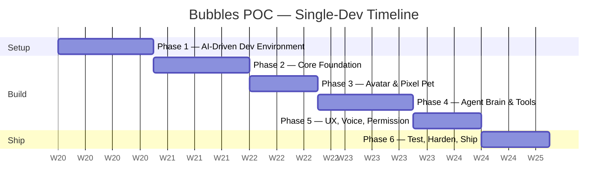
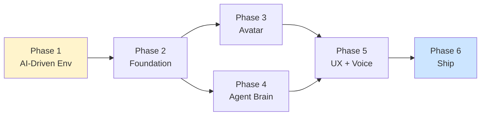
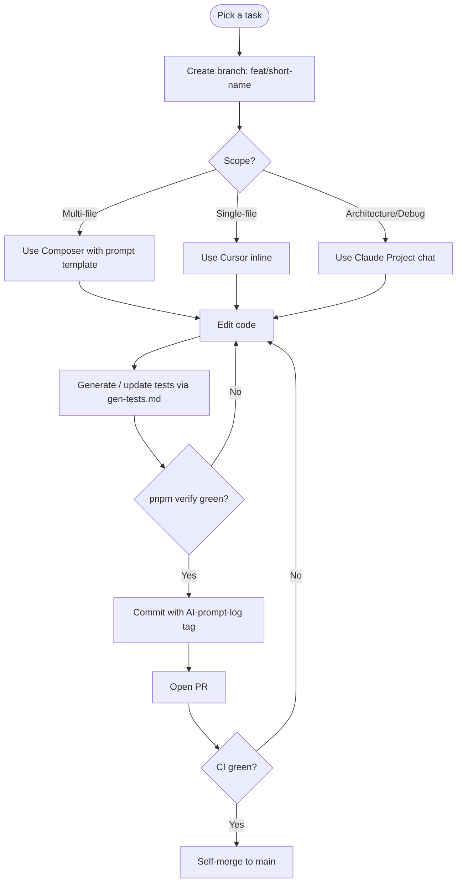
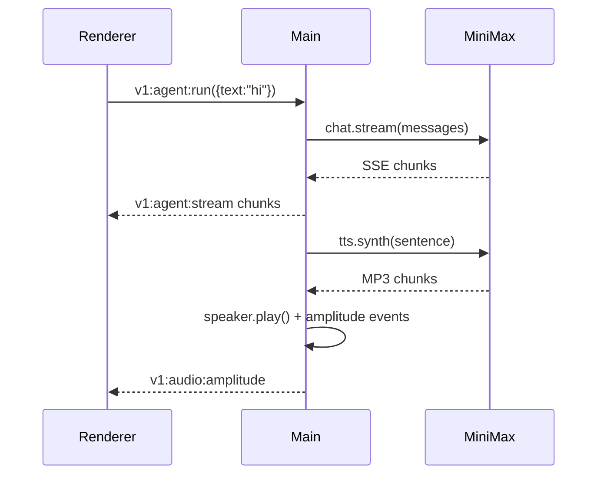
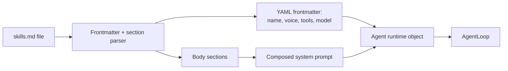
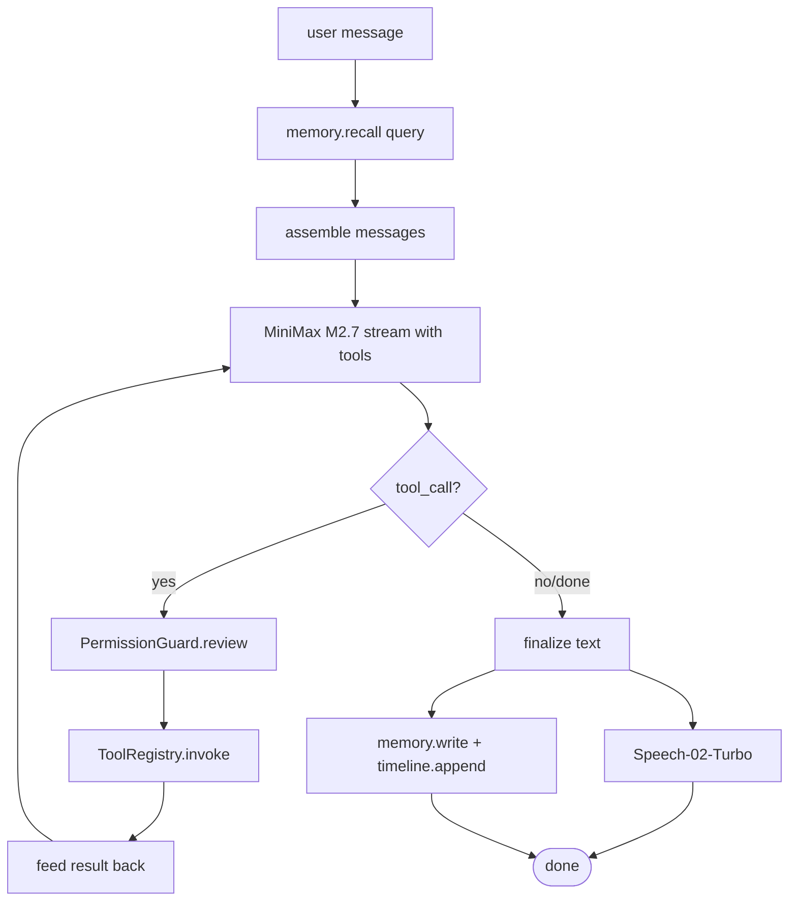
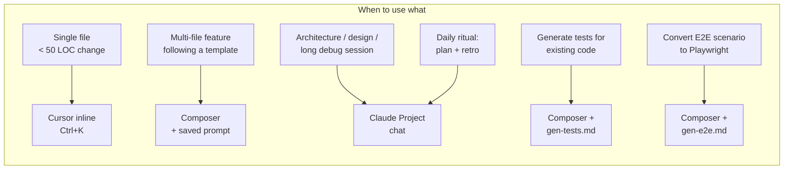

# Bubbles — POC Dev Plan (Single Developer, AI-Driven)

> **File name when saving locally**: `Poc-Dev-Plan.md`
> Source-of-truth scope: matches the existing POC plan (3 preset agents, MiniMax stack, Foundation Enablers). The difference here: **one developer**, optimised end-to-end for **Cursor + Claude + Composer** workflows.

## Context

Building Bubbles solo means the AI tooling **is** the second developer. Every architectural and process choice in this plan is graded on one question: *does it make Cursor / Claude / Composer faster and more accurate?* The single biggest predictor of solo-dev velocity is how well the repo is set up for AI to navigate, edit, and verify itself — so **Phase 1 is dedicated entirely to that setup** before a single line of feature code.

**Stack** (locked, identical to POC plan): Electron + React + TypeScript + Vite, PixiJS for sprites, SQLite (better-sqlite3 — with V1 headroom), MiniMax for all AI (M2.7 chat, Speech-02-Turbo TTS), local-only runtime.

**Goal**: ship the same POC Definition-of-Done as the 2-dev plan, but solo. Estimated 6 weeks (vs 5 for the duo) — the extra week is Phase 1's environment investment, paid back through Phases 2–6.

---

## Phase Map (6 Weeks)





---

# Phase 1 — AI-Driven Dev Environment (Week 1)

**Goal**: end the week with a repo where Claude/Cursor/Composer can scaffold a new package, generate tests, and open a PR with minimal hand-holding. Zero Bubbles features yet — pure tooling.

## 1.1 Cursor IDE Setup (Day 1, ½ day)

- Install **Cursor** (latest); sign in with Claude account.
- Pin **Claude Opus 4.7** as default chat model; **Claude Sonnet 4.6** for inline fast-edits.
- Enable **Composer** (multi-file agent mode).
- Configure **Cursor Indexing**: include all of `apps/`, `packages/`, `tests/`, `scripts/`, `assets/`. Exclude `node_modules`, `dist`, `out`, `.turbo`, `*.png`, `*.mp3`.
- Add **MCP servers** to Cursor (so Claude inside Cursor can read live docs):
  - Filesystem (workspace root)
  - GitHub (your `bubbles` repo, read-only initially)
  - Tavily / web-search (for MiniMax docs lookup)

## 1.2 `.cursorrules` (Day 1, 1 hour)

Single project-wide file at repo root. Keep it short — the per-package `CLAUDE.md` files do the detailed lifting.

```
# .cursorrules — Bubbles
- Stack: Electron 32+, React 19, TypeScript 5.6, Vite 6, Tailwind 4, pnpm 9, Turborepo 2.
- Files < 250 lines. Prefer many small modules over a few big ones.
- Co-locate tests: Foo.ts ↔ Foo.test.ts.
- Zod-first: every IPC channel, MiniMax payload, agent shape has a zod schema.
- No `any`. No `console.log` — use the `logger` from `packages/shared-logger`.
- Renderer never imports Node modules. Always use IPC bridge.
- All MiniMax calls go through `packages/minimax-client`.
- All file writes go through `packages/permission-guard`.
- All DB access goes through `packages/memory-core/dao`.
- Before writing code in a package, read its `CLAUDE.md` first.
- For multi-file changes: use Composer. For single-file edits: use inline.
- Tests first. If you change a public API, update its test in the same edit.
```

## 1.3 `CLAUDE.md` Hierarchy (Day 1–2, 1 day)

Two layers:
- **Root `CLAUDE.md`** — repo overview, package list with one-liner each, "where to find things," common commands.
- **Per-package `CLAUDE.md`** — purpose, public exports, invariants, forbidden patterns, how to run that package's tests. Drop one in every `packages/*` and `apps/*` directory at scaffold time.

Template for per-package:
```markdown
# <package-name>

## Purpose
One sentence.

## Public exports
- `funcA(x)` — what it does.
- `ClassB` — what it represents.

## Invariants
- Rule 1 (e.g. "all DB writes use the dao module").

## Forbidden
- Pattern 1 (e.g. "no direct fetch — use minimax-client").

## Run tests
`pnpm --filter <package-name> test`
```

## 1.4 Claude Project (Day 2, 1 hour)

In Claude.ai, create a Project called "Bubbles":
- **Knowledge files**: drop in `Poc-Dev-Plan.md`, the full plan, MiniMax API quick reference, current `package.json`.
- **Custom instructions**: "You are pair-programming on Bubbles, a desktop pet AI agent app. Follow `.cursorrules` and the per-package `CLAUDE.md`. Default to small, testable diffs."
- Use this project for **planning, debugging long stack traces, and architectural questions** — anything too big for Cursor's context window.

## 1.5 Composer Prompt Library (Day 2, ½ day)

Save reusable prompts as `.cursor/prompts/*.md`. Examples:

| Prompt file | When to use |
|---|---|
| `new-package.md` | Scaffold a new monorepo package with CLAUDE.md, vitest config, index.ts, sample test |
| `new-ipc-channel.md` | Add a typed IPC channel touching: zod schema (shared-types) + main handler + preload bridge + renderer hook |
| `new-tool.md` | Add a new built-in agent tool: implement Tool interface + register + add to permission policy + write test |
| `new-agent-preset.md` | Add a preset agent: skills.md + sprites/ folder + register in agent-runtime |
| `gen-tests.md` | Generate vitest suite for a given file from JSDoc + types |
| `gen-e2e.md` | Convert a `tests/e2e/scenarios.md` entry into a Playwright spec |

Each prompt encodes the chain of files to touch — Composer follows it deterministically.

## 1.6 Repo Scaffold (Day 3, 1 day)

Use Composer with `new-package.md` to bootstrap the structure.

```
bubbles/
├── .cursor/prompts/             # Composer prompt library
├── .cursorrules
├── CLAUDE.md                    # root
├── apps/
│   ├── desktop/                 # Electron main + preload
│   └── renderer/                # React UI
├── packages/
│   ├── shared-types/            # zod IPC + agent + message schemas
│   ├── shared-logger/           # pino with correlation IDs
│   ├── agent-runtime/
│   ├── memory-core/
│   ├── minimax-client/
│   ├── tool-kit/
│   ├── permission-guard/
│   └── cost-meter/
├── assets/sprites/
├── tests/
│   ├── e2e/                     # Playwright + scenarios.md
│   ├── agent-eval/              # rubric dataset + judge harness
│   └── visual/                  # snapshot baselines
├── scripts/
│   ├── seed-presets.ts
│   └── eval-judge.ts
├── pnpm-workspace.yaml
├── turbo.json
├── tsconfig.base.json
└── package.json
```

Each package starts with: `package.json`, `tsconfig.json`, `vitest.config.ts`, `src/index.ts`, `src/index.test.ts`, `CLAUDE.md`.

## 1.7 Tooling Baseline (Day 3, ½ day)

- **TypeScript** strict everywhere; project references for fast incremental builds.
- **Biome** for lint + format (faster than ESLint+Prettier, simpler config — better for AI to reason about).
- **Vitest** for unit; **Playwright with Electron** for E2E.
- **electron-vite** for the Electron build.
- **better-sqlite3** + migrations dir from day one.
- **pino** for structured logging with `turnId` correlation IDs.
- **zod** + `zod-to-json-schema` (needed for MiniMax tool definitions).
- **execa** for child processes (MCP later).

## 1.8 AI-Driven Testing Infrastructure (Day 4, 1 day)

Three layers wired up before Phase 2 starts so every feature ships with tests.

### Layer 1 — Unit (Vitest, AI-generated)
- `pnpm test` runs all packages.
- `gen-tests.md` Composer prompt: dev writes signature + 1 example, Claude generates the rest.
- Coverage target: 70% on `packages/*` (don't chase 100%).

### Layer 2 — E2E (Playwright + Electron, AI-scripted)
- `tests/e2e/scenarios.md` lists journeys in plain English.
- `gen-e2e.md` prompt converts each to a Playwright spec.
- Re-generated on UI change; humans review the diff.

### Layer 3 — LLM-as-Judge (agent quality)
- `tests/agent-eval/dataset.jsonl` — prompts + rubric criteria per agent.
- `pnpm eval` runs each prompt through real agent loop, second M2.7 call scores 1–5.
- Nightly CI; fail if avg drops > 0.5 vs. last green. Cost ~$0.50/run.

### Layer 4 — Visual regression
- Playwright snapshots of avatar at 4 moods × 3 agents (12 images).
- Pixel-diff on PR; manual review of any diff.

## 1.9 CI/CD (Day 4, ½ day)

GitHub Actions:

| Job | Triggers | Does |
|---|---|---|
| `verify` | every PR | typecheck + lint + unit tests + coverage report comment |
| `e2e` | every PR | Playwright on Windows runner (POC is Windows-only) |
| `visual` | every PR | snapshot diff |
| `eval-nightly` | cron 02:00 UTC | LLM-judge against last main; alert on regression |
| `release-windows` | tag `v*` | electron-builder → signed `.exe` artifact |

## 1.10 Workflow Conventions (Day 5, ½ day)



- **Branch naming**: `feat/`, `fix/`, `chore/`, `infra/`.
- **PR template** includes 1-line "AI prompt log" + tag (`ai-pair`, `ai-solo`, `human-only`).
- **Self-merge** allowed but every merge tagged in commit message with phase number (`[P3]`).
- **Daily ritual**: 30 min morning planning in Claude Project, 30 min end-of-day review (what worked, what AI got wrong — refine `.cursorrules` if a pattern emerges).

## 1.11 Phase 1 Deliverables Checklist

- [ ] Cursor configured + indexed + MCP servers connected
- [ ] `.cursorrules` written
- [ ] Root + 8 package `CLAUDE.md` files
- [ ] Claude Project created with knowledge files
- [ ] `.cursor/prompts/` with 6+ saved Composer prompts
- [ ] Monorepo scaffold + 8 packages bootstrapped
- [ ] Vitest, Playwright-Electron, Biome, electron-vite all running on a "hello world" test
- [ ] GitHub Actions: verify + e2e + visual + eval-nightly + release-windows
- [ ] PR template with AI-prompt-log field
- [ ] Successfully scaffolded a 9th throwaway package via Composer in < 5 minutes (workflow validation)

---

# Phase 2 — Core Foundation (Week 2)

**Goal**: Electron app boots, IPC works, MiniMax M2.7 returns a streaming response from Node, SQLite reads/writes through DAO. No UI yet beyond a debug window.

## 2.1 Electron Boot (Day 1)
- `apps/desktop/src/main/index.ts` — entry, single window, dev/prod paths.
- `apps/desktop/src/preload/bridge.ts` — `contextBridge` exposing typed `window.bubbles` API surface.
- electron-vite hot reload working for both main and renderer.

## 2.2 Shared Types + IPC (Day 2)
- `packages/shared-types/src/{ipc,agent,message,memory}.ts` — zod schemas for everything that crosses the IPC boundary.
- Versioned channel naming: `v1:agent:run`, `v1:memory:query` (Foundation Enabler #8).
- IPC bridge validates both sides at runtime — bad shapes fail loud.

## 2.3 Memory Core (Day 3)
- `packages/memory-core/src/schema.sql` — full V1-headroom schema (Enabler #2): `projects`, `agents`, `conversations`, `messages`, `memories` (with `embedding BLOB NULL`), `timeline_events`, `permissions`, `cost_events`, `files`.
- Migrations directory + runner (auto-apply on app start).
- DAO layer (no raw SQL outside this package).
- Vitest suite generated by Composer using `gen-tests.md`.

## 2.4 MiniMax Client — Chat (Day 4)
- `packages/minimax-client/src/auth.ts` — reads key from Electron `safeStorage`.
- `packages/minimax-client/src/chat.ts` — M2.7 streaming chat with tool calls. SSE parser. `BackoffQueue` for 429s.
- `packages/cost-meter/src/index.ts` — every chat call writes to `cost_events` (Enabler #5).
- `packages/shared-logger` — `pino` with `turnId` correlation IDs (Enabler #10).
- Test: hardcoded prompt → assert non-empty streamed reply + cost row written.

## 2.5 MiniMax Client — TTS (Day 5)
- `packages/minimax-client/src/tts.ts` — Speech-02-Turbo, returns MP3 stream.
- `apps/desktop/src/main/audio.ts` — plays via `node-speaker`; emits amplitude events for lip-sync.
- Debug renderer: button → "say hello" → audible reply.



## 2.6 Phase 2 Exit Gate
- `pnpm dev` boots Electron in < 3s.
- Click button in debug renderer → see streaming text + hear MP3 reply.
- SQLite has rows for the conversation + messages + cost_events.
- Coverage ≥ 70% on `memory-core`, `minimax-client`, `shared-types`.

---

# Phase 3 — Avatar & Pixel Pet (Week 3, 5 days)

**Goal**: a transparent always-on-top avatar window that shows Bubbles idling/blinking/thinking/talking on the desktop.

## 3.1 Transparent Always-on-Top Window (Day 1)
- `apps/desktop/src/main/windows/avatar.ts` — frameless, transparent, `alwaysOnTop:true`, no taskbar entry.
- Alpha hit-test: forward mouse events except where sprite alpha > threshold (use a small forwarder window pattern or mouse polling + `setIgnoreMouseEvents`).
- Multi-monitor placement persisted via `electron-store`.
- System tray icon + right-click menu (Quit, Settings, Show/Hide).

## 3.2 PixiJS Sprite Engine (Day 2)
- `apps/renderer/src/avatar/SpriteEngine.ts` — PixiJS v8, nearest-neighbour scaling, `roundPixels:true`.
- `apps/renderer/src/avatar/AsepriteLoader.ts` — parses Aseprite JSON sheets → PixiJS atlas + animation frame data.
- `apps/renderer/src/avatar/Character.ts` — `playAnimation(name)`, `setSkin(id)`, `setMood(mood)` with `idle` fallback (Enabler #6).

## 3.3 Hand-Drawn Sprites — Bootstrap (Day 3)
- Author **Bubbles base** in Aseprite at 64×64: idle, blink, talk, think (4 anims × ~6 frames each).
- Author **Coda** and **Sage** as palette swaps + accessory layers of base — saves a day vs full re-draws.
- Optional: AI assist for color palette ideas via Claude Project ("suggest 3 palettes for a research-oriented pixel pet").
- Export → `assets/sprites/{bubbles,coda,sage}/{spritesheet.png, spritesheet.json}`.

## 3.4 Mood Controller + Lip-Sync (Day 4)
- `apps/renderer/src/avatar/MoodController.ts` — subscribes to IPC events from agent runtime, maps `idle | listening | thinking | talking | sleeping` → animation calls.
- `apps/renderer/src/avatar/LipSync.ts` — receives amplitude events from main process; toggles mouth-open frames on threshold crossings.

## 3.5 Filesystem-Loaded Agent Presets (Day 5)
- Foundation Enabler #3: presets live as directories.
- `~/.bubbles/agents/{bubbles,coda,sage}/{config.json, skills.md, sprites/}`.
- `scripts/seed-presets.ts` — runs on first launch if `~/.bubbles/agents` is empty; copies bundled presets out of `assets/`.
- `packages/agent-runtime/src/AgentRegistry.ts` — scans this directory, parses, exposes via IPC.

## 3.6 Phase 3 Exit Gate
- Bubbles appears on desktop, idles + blinks on a loop.
- Click-through verified: clicking on the transparent area lands on the window behind.
- Manually trigger `setMood('thinking')` from devtools → animation changes within 100ms.
- 3 preset directories on disk; switcher UI not built yet but registry returns them.

---

# Phase 4 — Agent Brain & Tools (Week 4)

**Goal**: agents can reason, call tools, and persist state. End-to-end "type → think → tool → reply" works.

## 4.1 SkillsCompiler (Day 1)
- `packages/agent-runtime/src/SkillsCompiler.ts` — parses `skills.md` (frontmatter + sections) into the `Agent` runtime object (Enabler #11).
- Composes system prompt from `# Personality`, `# Capabilities`, `# Rules` sections.
- Handles `version` field for forward compatibility.



## 4.2 Tool Interface + Built-ins (Day 2)
- `packages/tool-kit/src/Tool.ts` — interface `{name, schema (zod), invoke(args, ctx), requiresApproval}` (Enabler #1).
- `packages/tool-kit/src/registry.ts` — name → Tool map; `forAgent(agent)` filters by `toolWhitelist`.
- `packages/tool-kit/src/readFile.ts` — auto-allowed inside project root.
- `packages/tool-kit/src/writeFile.ts` — `requiresApproval: true`.
- Tool definitions exported as JSON schema (via `zod-to-json-schema`) for MiniMax's tools array.

## 4.3 Permission Guard (Day 3)
- `packages/permission-guard/src/Guard.ts` — `review(call) → Promise<Decision>`.
- Logs every decision to `permissions` table (Enabler #4).
- Policy cascade: whitelist → preview-and-approve → remember.
- Approval blocks via Promise resolved by IPC from renderer modal.

## 4.4 AgentLoop (Day 4–5)
- `packages/agent-runtime/src/AgentLoop.ts` — ReAct loop with `AbortController` (Enabler #9).



- Token-budget enforcer: when context > 80% of M2.7 window, summarise oldest 30%.
- Streaming chunks emitted via `v1:agent:stream:<turnId>` IPC events.

## 4.5 3 Preset skills.md (Day 5)
- `Bubbles` (general assistant, all tools), `Coda` (coding, file tools + plan_mode), `Sage` (research, web_search not yet — defer to V1, use chat-only for POC).
- For POC, web_search isn't shipped — Sage uses M2.7's general knowledge. (Avoids MCP scope creep.)

## 4.6 Phase 4 Exit Gate
- Type "what's 2+2?" → text reply persisted to DB.
- Type "make hello.txt with my name" via Coda → permission preview blocks → approve in CLI/devtools → file appears on disk.
- LLM-judge baseline run with ~10 prompts/agent → all pass minimum rubric.

---

# Phase 5 — UX, Voice, Permission UI (Week 5, 5 days)

**Goal**: polished user-facing surface. A stranger could now operate the app without devtools.

## 5.1 Chat Panel + Speech Bubble (Day 1–2)
- `apps/renderer/src/chat/ChatPanelWindow.tsx` — anchored to avatar, slides out on click.
- `apps/renderer/src/chat/SpeechBubble.tsx` — streaming text with type-on animation, dismiss on click.
- Attach-file button (read-only in POC, used as context).
- Keyboard shortcut to focus input (`Ctrl+Space`).

## 5.2 Agent Switcher (Day 2)
- `apps/renderer/src/agents/Switcher.tsx` — dropdown showing 3 presets with sprite thumbnails.
- On select → IPC `v1:agent:switch` → AgentRegistry sets active → sprite skin + voice + system prompt all swap within 300ms.

## 5.3 Permission Preview Modal (Day 3)
- `apps/renderer/src/permission/PreviewWindow.tsx` — separate modal-style window.
- Monaco diff viewer for file writes; raw payload preview for other tool kinds.
- Approve / Deny / Approve-and-remember (data already logged via Enabler #4).

## 5.4 First-Run Wizard (Day 4)
- 3 steps: welcome → MiniMax API key → pick project folder.
- Key stored via Electron `safeStorage` (DPAPI on Windows).
- Validates key by making a tiny M2.7 call before continuing.
- Skips on subsequent launches.

## 5.5 Daily Cost Cap (Day 4)
- Setting (default $5/day). When hit, agents reply *"I've hit today's spend cap"* instead of calling out.
- Spend dashboard inside Settings: today / 7-day / 30-day from `cost_events` (Enabler #5).

## 5.6 Polish (Day 5)
- App icon, installer icon, splash.
- Friendlier error states (network down, MiniMax 5xx, MCP later).
- Keyboard shortcuts cheatsheet in tray menu.

## 5.7 Phase 5 Exit Gate
- All 7 Definition-of-Done steps work end-to-end *manually* (formal tests in Phase 6).
- No devtools needed.

---

# Phase 6 — Test, Harden, Ship (Week 6, 5 days)

**Goal**: green CI, signed Windows installer, recorded demo.

## 6.1 E2E Suite (Day 1)
- Author 5 scenarios in `tests/e2e/scenarios.md`.
- Composer with `gen-e2e.md` → 5 Playwright specs.
- All run on Windows GitHub Actions runner.

## 6.2 Agent Eval Dataset (Day 2)
- 30 prompts × 3 agents = 90 prompts in `tests/agent-eval/dataset.jsonl`.
- Rubric criteria per agent (e.g. *"Coda must propose code OR ask one clarifying question, never both"*).
- `pnpm eval` baseline run; assert avg ≥ 4.0/5.

## 6.3 Visual Regression Baselines (Day 2)
- Capture 12 baseline images (4 moods × 3 agents).

## 6.4 Hardening (Day 3)
- Retry/backoff on all MiniMax calls.
- Graceful degradation if TTS fails (text-only fallback).
- Crash recovery: AgentLoop wrapped in try/catch with user-facing toast.
- Memory query timeouts.

## 6.5 Packaging (Day 4)
- electron-builder → Windows NSIS installer.
- Code signing setup (cert + GitHub Actions secret).
- Auto-update channel scaffolded (used in V1, dormant in POC).
- Installer < 200 MB; first-launch latency < 3s.

## 6.6 Demo + Docs (Day 5)
- 2-minute screen recording hitting all 7 Definition-of-Done steps.
- README with install instructions + first-run guide.
- `docs/` with architecture overview + extension points (sets up V1 contributors).

## 6.7 Phase 6 Exit Gate (POC Definition of Done)
A stranger can:
1. Install Windows installer (< 200 MB).
2. Enter MiniMax API key in first-run wizard.
3. See Bubbles appear.
4. Type "hi" → spoken, lip-synced reply within 2s of first token.
5. Switch to Coda → ask "make hello.txt with my name" → approve preview → file on disk.
6. Switch to Sage → thoughtful reply in Sage's voice.
7. Quit, relaunch, see prior conversation.

Verification: `pnpm dev` < 3s • `pnpm test` green ≥ 70% coverage • `pnpm e2e` 5/5 pass • `pnpm eval` ≥ 4.0/5 • `pnpm package:win` produces signed `.exe`.

---

# AI Workflow Reference Card

Pin this somewhere visible.



## Per-Phase AI Time Allocation (rough guide)

| Phase | Composer % | Inline Cursor % | Claude Project % | Manual % |
|---|---|---|---|---|
| 1 — Setup | 50 | 10 | 20 | 20 |
| 2 — Foundation | 60 | 15 | 15 | 10 |
| 3 — Avatar | 30 | 30 | 10 | 30 (sprite art) |
| 4 — Agent brain | 50 | 20 | 20 | 10 |
| 5 — UX | 40 | 35 | 10 | 15 |
| 6 — Ship | 30 | 25 | 15 | 30 (manual QA + recording) |

---

# Risks (Single-Dev Specific)

| Risk | Mitigation |
|---|---|
| AI generates plausible-but-wrong code in unfamiliar areas | LLM-judge eval catches behavioural regressions; pair with Claude Project for architecture |
| Composer drift on small changes | Use inline Cursor for < 50 LOC; reserve Composer for templated multi-file work |
| Solo means no code review | PR template requires reading-aloud the diff; weekly self-review session in Claude Project |
| Burnout / context switching | Single phase active at a time; Phase exit gates prevent leaking work between phases |
| MiniMax API drift | All calls in `minimax-client`; quarterly run of MiniMax doc-diff via Tavily MCP |
| Sprite art bottleneck (you're not an artist) | Bubbles base = simple shape (egg/blob); Coda/Sage = palette swap + 1 accessory each — keeps scope tractable |

---

# Foundation Enablers Recap (Same as POC Plan, Reinforced for Solo)

These cost ~3 dev-days across Phases 2–4 and unblock V1/V2 weeks of refactor:

1. Tool interface + registry → MCP later is a swap, not a rewrite
2. Memory schema headroom (`projects`, `timeline_events`, `permissions`, `embedding BLOB NULL`)
3. Agent registry from filesystem (not hardcoded constants)
4. Permission decision logging
5. Cost meter from day one
6. Animation extensibility (open mood enum)
7. Voice ID per agent (not hardcoded)
8. Versioned IPC channels (`v1:*`)
9. AbortController on AgentLoop
10. Structured logger with correlation IDs
11. Real SkillsCompiler (not stub)
12. Streaming tool-call protocol

---

# What Comes After POC

Once Phase 6 ships, the **Post-POC Phased Roadmap** (V1 → V2 → V3) from the parent plan applies unchanged. Solo pacing for those phases:

- **V1** (MCP + Birth + Vector Memory + Voice Cloning + Projects): ~10 weeks solo (vs 7 in 2-dev plan).
- **V2** (Coordinator + Timeline + Self-Improve + STT): ~12 weeks solo (vs 8 in 2-dev plan).
- **V3** (platform features): pick based on user feedback after V2 launch.

Phase gates remain identical to the parent plan — don't advance until the gate's Definition of Done passes.
